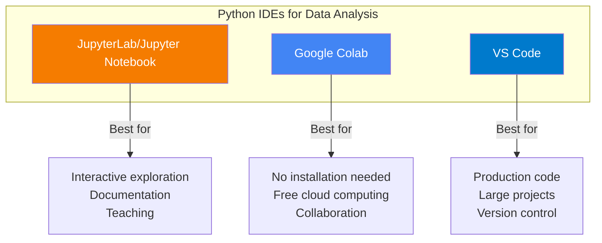
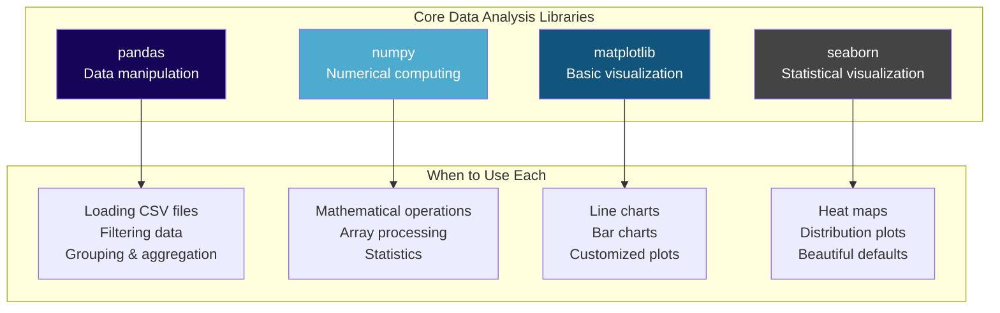
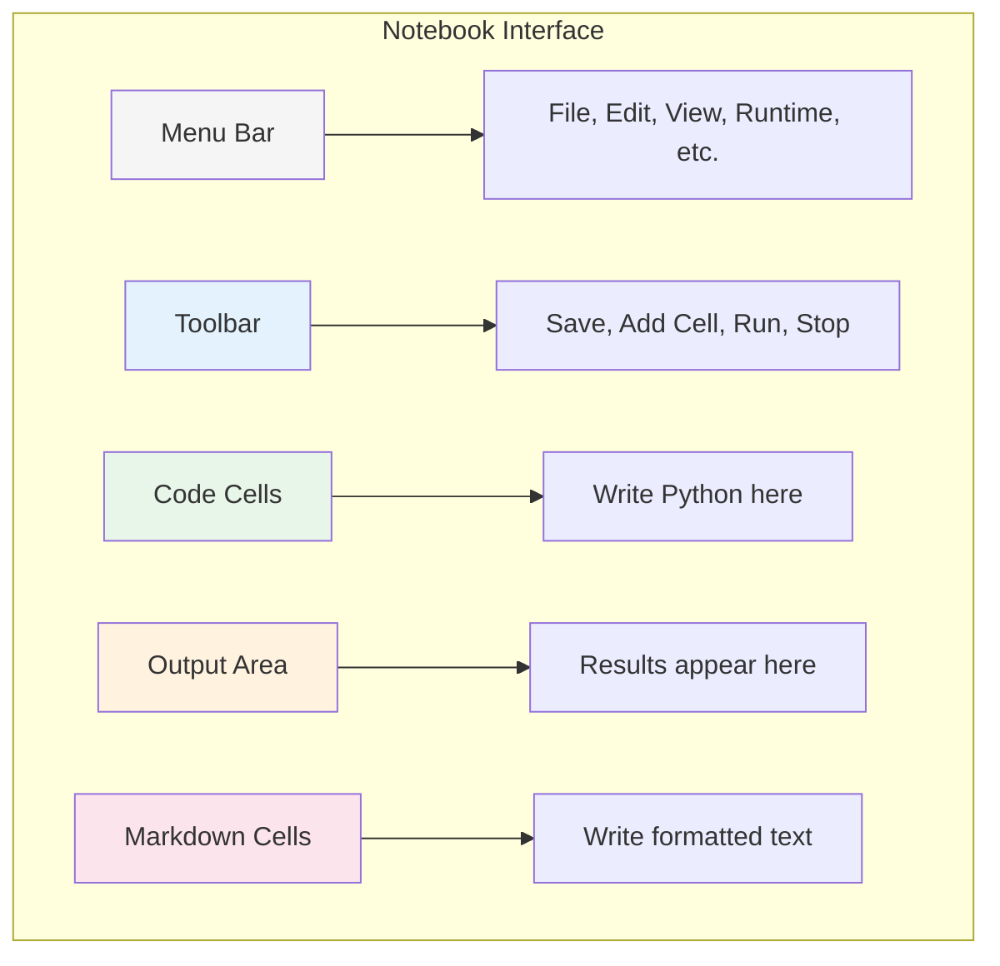
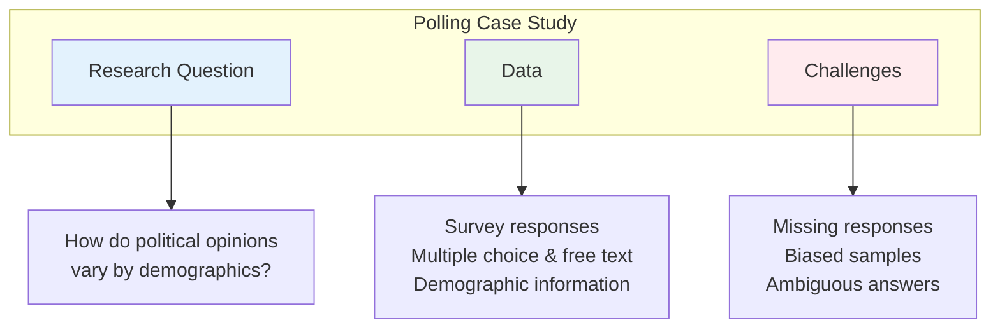
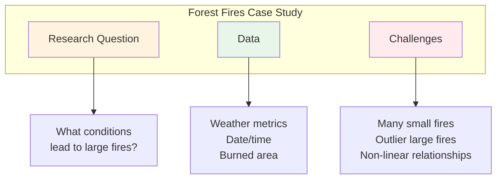
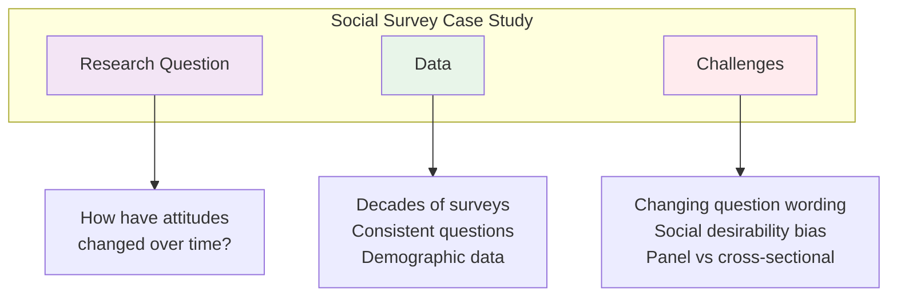
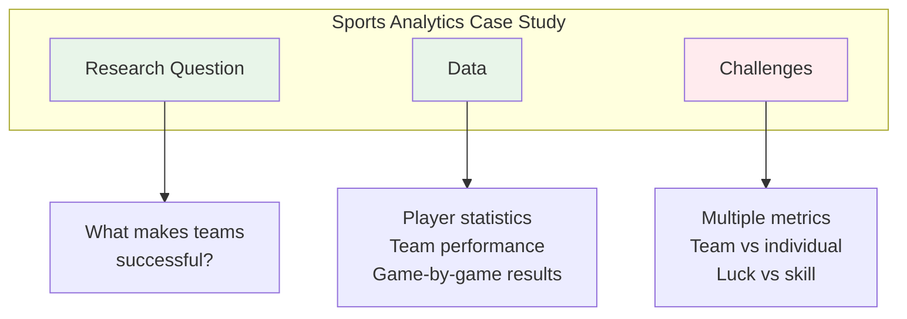

# Chapter 1: Introduction to Python for Data Analysis

---

## Welcome to Your Data Analysis Journey

Imagine you're standing in Bayside Marketplace on a busy Saturday afternoon. Around you, thousands of people are walking, shopping, eating, and taking photos of the Miami skyline. Now imagine you could somehow capture every single detail about this scene—how many people passed by each store, what languages they spoke, what they bought, when they bought it, and how long they stayed.

That flood of information? That's **data**.

But raw data by itself is like having all the ingredients for a perfect Cuban sandwich scattered across your kitchen—you've got the ham, the roasted pork, the Swiss cheese, the pickles, the mustard, and the Cuban bread, but until you put them together in the right way and press them on the plancha, you don't have a sandwich. You just have... stuff.

**Data analysis** is the art and science of turning that "stuff" into something meaningful—something that helps you make decisions, tell stories, and understand the world around you.

And **Python**? Python is your plancha, your chef's knife, your entire kitchen. It's the tool that helps you transform raw ingredients into something delicious.

---

## Learning Objectives

After completing this chapter, you will be able to:

**Applied Skills:**
- Write Python statements that import a module
- Call and chain methods
- Use slices, lists, tuples, dictionaries, and list comprehensions
- Use JupyterLab/Colab to open, create, edit, and run Notebooks
- Create and modify headings in a Notebook using Markdown
- Use Tab completion and tooltip features
- Use Magic Commands to time statements and display current variables

**Knowledge:**
- Describe data analysis and data visualization
- List the five phases of data analysis and visualization
- Describe the Pandas and Seaborn modules
- Distinguish between runtime errors and syntax errors

---

## 1.1 Introduction to Data Analysis

### What Data Analysis Is

Let's start with a simple definition:

> **Data analysis** is the process of inspecting, cleaning, transforming, and modeling data to discover useful information, draw conclusions, and support decision-making.

That's the textbook answer. But let me give you a more practical way to think about it.

**Data analysis is asking questions and letting the data answer them.**

Think about questions you encounter every day:
- "Why is traffic so bad on the Palmetto Expressway at 5 PM?"
- "Which Publix has the shortest checkout lines on Sunday mornings?"
- "Why do some restaurants in Little Havana thrive while others close within a year?"

Behind each of these questions is data—traffic sensor readings, checkout timestamps, sales records, customer reviews. A data analyst knows how to gather that data, clean it up, and extract answers.

**Data visualization** is the companion to data analysis. While analysis helps you *find* patterns in data, visualization helps you *communicate* those patterns to others. A well-designed chart or graph can convey insights in seconds that would take paragraphs to explain in words.

Think of it this way: data analysis is like being a detective who solves the mystery, while data visualization is like being the journalist who tells the story to the public.

#### A Day in the Life: Maria's Food Truck Decision

Let me tell you about Maria.

Maria runs a food truck called "Tostones & Dreams" that serves modern twists on traditional Cuban food. She's been parking near Florida International University for two years, but lately, sales have been inconsistent. Some days she sells out by 1 PM; other days, she goes home with half her inventory.

Maria has a decision to make: Should she move her truck to a new location? Maybe try Wynwood? Or Brickell?

Without data analysis, Maria would have to guess. Maybe she'd ask a few friends. Maybe she'd go with her gut.

But Maria is smart. She's been keeping records—a simple spreadsheet with the date, location, weather, day of the week, and total sales. She also downloaded food truck permit data from Miami-Dade County's open data portal.

By analyzing her data, Maria discovers something surprising: her worst days aren't random at all. They happen when FIU is on break—spring break, summer sessions, holidays. Her best days? Tuesdays and Wednesdays when the weather is partly cloudy (not too hot, not rainy).

Armed with this insight, Maria doesn't need to move her truck permanently. She just needs a backup location for those slow periods and a better understanding of the academic calendar.

That's data analysis in action: **transforming uncertainty into informed decisions**.

### The Five Phases of Data Analysis and Visualization

Data analysis isn't something you do in one step. It's a journey with distinct phases. Think of it like planning a quinceañera—you don't just wake up one day with a party happening. There's a process.

```mermaid
flowchart LR
    A[📥 Get Data] --> B[🧹 Clean Data]
    B --> C[🔍 Analyze Data]
    C --> D[📊 Visualize Data]
    D --> E[📋 Present Results]
    
    style A fill:#e1f5fe
    style B fill:#fff3e0
    style C fill:#e8f5e9
    style D fill:#fce4ec
    style E fill:#f3e5f5
```



Let's break down each phase:

#### Phase 1: Get Data (Acquisition)

Before you can analyze anything, you need data. This might sound obvious, but getting data is often the hardest part.

Data can come from:
- **Databases** (company records, government systems)
- **APIs** (Application Programming Interfaces—like asking Twitter or Weather.com to send you information)
- **Files** (spreadsheets, CSVs, PDFs)
- **Web scraping** (extracting information from websites)
- **Sensors and IoT devices** (traffic sensors, fitness trackers, smart home devices)
- **Surveys and manual entry** (the old-fashioned way)

**Example**: To analyze traffic patterns in Miami, you might pull data from Florida's 511 traffic system, combine it with accident reports from the Miami-Dade Police, and supplement it with crowd-sourced data from Waze.

#### Phase 2: Clean Data (Preparation)

Here's a secret that nobody tells you in the movies about data science: **80% of your time will be spent cleaning data**.

Real-world data is messy. It has:
- **Missing values** (someone forgot to fill in a field)
- **Duplicates** (the same record appears twice)
- **Inconsistencies** (one column says "Miami" while another says "MIAMI" and a third says "miami, FL")
- **Errors** (typos, wrong values, impossible numbers)
- **Different formats** (dates written as "01/15/2024" vs "January 15, 2024" vs "2024-01-15")

Data cleaning (also called "data wrangling" or "data munging") is the process of fixing these issues. It's not glamorous, but it's essential. Analyzing dirty data is like trying to navigate Miami using a map from 1950—you'll get lost and make wrong turns.

**Example**: You download restaurant inspection data from Miami-Dade County, but you notice that some restaurant names are in ALL CAPS, others are in Title Case, and some have extra spaces. Before you can analyze which neighborhoods have the most health code violations, you need to standardize these names.

#### Phase 3: Analyze Data (Exploration and Modeling)

Now the fun begins. With clean data, you can start asking questions and finding patterns.

Analysis might involve:
- **Descriptive statistics** (What's the average? The minimum? The maximum?)
- **Grouping and aggregation** (What's the total sales by neighborhood?)
- **Correlation** (Do higher temperatures lead to more ice cream sales?)
- **Trend analysis** (Are housing prices going up or down over time?)
- **Predictive modeling** (Based on past data, what might happen next?)

**Example**: After cleaning Maria's food truck data, she calculates that her average daily sales are $847, but this jumps to $1,203 on cloudy Tuesdays and drops to $412 during university breaks.

#### Phase 4: Visualize Data (Communication Through Graphics)

Numbers alone can be hard to understand. Visualization turns data into pictures that tell stories.

Common visualizations include:
- **Bar charts** (comparing categories)
- **Line charts** (showing trends over time)
- **Scatter plots** (showing relationships between two variables)
- **Heat maps** (showing intensity across geography or time)
- **Pie charts** (showing proportions—use sparingly!)

**Example**: Maria creates a heat map showing her sales by day of week and time of year. The pattern jumps out immediately—dark red squares (high sales) cluster around the academic semester, while pale blue squares (low sales) align with breaks.

#### Phase 5: Present Results (Storytelling)

Data analysis without communication is like cooking a beautiful meal and eating it alone in the dark. The final phase is presenting your findings in a way that others can understand and act upon.

This might be:
- A written report
- A slide presentation
- An interactive dashboard
- A simple email summary

The key is knowing your audience. A presentation for executives should focus on insights and recommendations. A presentation for other analysts might dive deep into methodology.

**Example**: Maria puts together a one-page summary for her small business advisor, showing her key finding (sales correlate with the FIU calendar) and her proposed action (establish a Brickell backup location during breaks).

### The IDEs for Python Data Analysis

An **IDE** (Integrated Development Environment) is the software you use to write and run your code. Think of it like Microsoft Word, but for programming.

For data analysis, you'll most commonly encounter three IDEs:



#### JupyterLab and Jupyter Notebooks

Jupyter Notebooks are the most popular choice for data analysis and what we'll focus on in this course. The name "Jupyter" comes from three programming languages: **Ju**lia, **Pyt**hon, and **R**.

What makes Jupyter special:
- **Cell-based execution**: You write code in chunks (cells) and run them one at a time
- **Inline output**: Results, including charts, appear right below your code
- **Markdown support**: You can mix code with formatted text, equations, and images
- **Interactive exploration**: Perfect for "what if?" scenarios

#### Google Colab

Google Colab is essentially Jupyter Notebooks running in the cloud, provided free by Google. This is what we'll use in this course.

Advantages of Colab:
- **Zero installation**: Works in your browser
- **Free GPU/TPU access**: Great for machine learning
- **Google Drive integration**: Easy file access
- **Collaboration**: Multiple people can work on the same notebook

#### VS Code (Visual Studio Code)

VS Code is a general-purpose code editor that can handle Jupyter Notebooks too. Many professional developers prefer it because:
- **Multi-language support**: Great for projects that use multiple languages
- **Extensions**: Thousands of plugins available
- **Git integration**: Built-in version control
- **Performance**: Fast, even with large files

For this course, we'll use **Google Colab** because it eliminates installation headaches and ensures everyone has the same environment.

---

## 1.2 The Python Skills You Need for Data Analysis

Now that you understand what data analysis is and what tools you'll use, let's talk about Python itself. Don't worry—you don't need to be a programming expert. Data analysis uses a specific subset of Python skills, and you'll pick them up as we go.

### How to Install and Import the Python Modules for Data Analysis

Python's power comes from its **libraries** (also called **modules** or **packages**). Think of libraries like apps on your phone—Python is the operating system, and libraries are the specialized tools you install to do specific tasks.

For data analysis, you'll use these core libraries constantly:



#### The Pandas Module

**Pandas** is the most important library for data analysis in Python. The name comes from "Panel Data," a term from econometrics. Think of pandas as Excel on steroids—it can do everything a spreadsheet does, but faster, with more data, and programmatically.

What pandas provides:
- **DataFrame**: A two-dimensional table with rows and columns (like a spreadsheet)
- **Series**: A single column of data
- **Reading/writing files**: Load data from CSV, Excel, JSON, databases, and more
- **Data manipulation**: Filter, sort, group, merge, reshape data
- **Missing data handling**: Find and fill or remove missing values
- **Time series support**: Work with dates and times easily

Here's a quick preview of what pandas can do:

```python
import pandas as pd

# Load a CSV file into a DataFrame
sales = pd.read_csv('food_truck_sales.csv')

# Show the first 5 rows
print(sales.head())

# Get summary statistics
print(sales.describe())

# Filter to only high-sales days
good_days = sales[sales['revenue'] > 1000]

# Group by day of week and calculate average
sales.groupby('day_of_week')['revenue'].mean()
```

#### The Seaborn Module

**Seaborn** is a data visualization library built on top of matplotlib. While matplotlib gives you complete control over every pixel of your chart, seaborn gives you beautiful, publication-ready visualizations with minimal code.

Think of it this way: matplotlib is like painting a picture from scratch with individual brushstrokes. Seaborn is like having pre-made templates that you can customize. For data analysis, seaborn often gets you 90% of the way there in one line of code.

What seaborn provides:
- **Statistical plots**: Automatically adds regression lines, confidence intervals
- **Categorical plots**: Bar plots, box plots, violin plots for comparing groups
- **Distribution plots**: Histograms, density plots, ECDF plots
- **Matrix plots**: Heatmaps for correlation matrices
- **Multi-plot grids**: Create small multiples easily
- **Aesthetic defaults**: Professional color palettes and styling out of the box

Here's a preview:

```python
import seaborn as sns
import matplotlib.pyplot as plt

# Load example dataset
tips = sns.load_dataset('tips')

# Create a beautiful scatter plot with one line
sns.scatterplot(data=tips, x='total_bill', y='tip', hue='day')

# Show the plot
plt.show()
```

#### Installing Libraries

In Google Colab, the major libraries come pre-installed. But sometimes you need to install something new. Use the `pip` command:

```python
# Install a library (run this in a code cell)
!pip install pandas
!pip install numpy
!pip install matplotlib
!pip install seaborn

# Install a specific version
!pip install pandas==2.0.0

# Install multiple libraries at once
!pip install pandas numpy matplotlib seaborn
```

The exclamation mark `!` at the beginning tells Colab to run this as a system command rather than Python code.

#### Importing Libraries

Before you can use a library, you need to import it. This is like opening an app on your phone.

```python
# Basic import
import pandas

# Now you can use pandas functions like this:
pandas.read_csv('myfile.csv')
```

But typing `pandas` over and over gets tedious. That's why we use **aliases**:

```python
# Import with an alias (nickname)
import pandas as pd
import numpy as np
import matplotlib.pyplot as plt
import seaborn as sns

# Now you can write:
pd.read_csv('myfile.csv')  # Much shorter!
```

These aliases are **conventions** that almost everyone uses. When you see `pd` in data analysis code, you can assume it means pandas.

#### The Standard Import Block

Most data analysis notebooks start with the same imports. Here's a template you'll use constantly:

```python
# Standard imports for data analysis
import pandas as pd
import numpy as np
import matplotlib.pyplot as plt
import seaborn as sns

# Optional: Make plots appear in the notebook
%matplotlib inline

# Optional: Improve plot appearance
plt.style.use('seaborn-v0_8-whitegrid')

# Optional: Set display options
pd.set_option('display.max_columns', None)  # Show all columns
pd.set_option('display.max_rows', 100)      # Show up to 100 rows
```

### How to Call and Chain Methods

In Python, a **method** is a function that belongs to an object. Don't worry if that sounds abstract—let's see it in action.

#### Calling Methods

```python
# Create a simple string
name = "miami"

# Call a method on the string
upper_name = name.upper()
print(upper_name)  # Output: MIAMI

# The pattern is: object.method()
```

The dot `.` is the key. It says "take this object and do this thing to it."

Here's another example with pandas:

```python
import pandas as pd

# Create a simple DataFrame (think of it as a table)
data = pd.DataFrame({
    'City': ['Miami', 'Orlando', 'Tampa'],
    'Population': [450000, 280000, 390000]
})

# Call methods on the DataFrame
print(data.head())      # Show first 5 rows
print(data.describe())  # Show statistics
print(data.info())      # Show structure
```

#### Method Chaining

One of the most powerful techniques in Python is **method chaining**—calling multiple methods in sequence.

Think of it like this: imagine you're at Versailles Restaurant on Calle Ocho, and you order a cafecito. The barista:
1. Takes a cup
2. Adds espresso
3. Adds sugar
4. Stirs it
5. Serves it to you

Each step transforms the cup into something new. That's method chaining.

```python
# Without chaining (verbose)
name = "  MIAMI BEACH  "
name = name.strip()        # Remove extra spaces
name = name.lower()        # Make lowercase
name = name.replace(' ', '-')  # Replace space with hyphen
print(name)  # Output: miami-beach

# With chaining (elegant)
name = "  MIAMI BEACH  "
name = name.strip().lower().replace(' ', '-')
print(name)  # Output: miami-beach
```

Both approaches give the same result, but chaining is cleaner and shows the transformation as a single flow.

Here's a data analysis example:

```python
import pandas as pd

# Load data and chain multiple operations
result = (pd.read_csv('restaurants.csv')
          .dropna()                           # Remove missing values
          .query('city == "Miami"')           # Filter to Miami only
          .groupby('cuisine')['rating']       # Group by cuisine type
          .mean()                             # Calculate average rating
          .sort_values(ascending=False)       # Sort highest to lowest
         )

print(result)
```

This single chain of methods reads a file, cleans it, filters it, groups it, calculates an average, and sorts the results. Beautiful, right?

### The Coding Basics for Python Data Analysis

Let's cover the fundamental building blocks you'll use every day.

#### Variables and Data Types

A **variable** is a name that refers to a value. Think of it like labeling containers in your refrigerator.

```python
# Numbers
temperature = 85  # Integer (whole number)
humidity = 0.78   # Float (decimal number)

# Strings (text)
city = "Miami"
greeting = 'Hola mundo'

# Booleans (True/False)
is_sunny = True
is_raining = False
```

#### Lists: Ordered Collections You Can Change

A **list** is an ordered collection of items. Lists are **mutable**, meaning you can add, remove, or change items after creating the list.

Think of a list like a shopping list—you can add items, cross them off, or rearrange them.

```python
# Create a list of Miami neighborhoods
neighborhoods = ["Brickell", "Wynwood", "Little Havana", "Coral Gables"]

# Access items by position (index starts at 0!)
print(neighborhoods[0])   # Output: Brickell (first item)
print(neighborhoods[1])   # Output: Wynwood (second item)
print(neighborhoods[-1])  # Output: Coral Gables (last item)
print(neighborhoods[-2])  # Output: Little Havana (second to last)

# Modify a list
neighborhoods.append("Doral")       # Add to the end
neighborhoods.insert(0, "Downtown") # Add at specific position
neighborhoods.remove("Wynwood")     # Remove specific item
popped = neighborhoods.pop()        # Remove and return last item

# Check list properties
print(len(neighborhoods))           # Number of items
print("Brickell" in neighborhoods)  # Check if item exists: True
```

#### Tuples: Ordered Collections You Cannot Change

A **tuple** is like a list, but **immutable**—once created, it cannot be changed. Use tuples when you have data that shouldn't be modified, like coordinates or database records.

Think of a tuple like your birthdate—it's fixed and doesn't change.

```python
# Create a tuple (use parentheses instead of brackets)
coordinates = (25.7617, -80.1918)  # Miami's latitude and longitude

# Access items the same way as lists
print(coordinates[0])  # Output: 25.7617 (latitude)
print(coordinates[1])  # Output: -80.1918 (longitude)

# Tuples cannot be modified - this would cause an error:
# coordinates[0] = 26.0  # TypeError: 'tuple' object does not support item assignment

# Common use: Multiple return values from a function
def get_city_info():
    return "Miami", "Florida", 450000  # Returns a tuple

city, state, population = get_city_info()  # Unpack the tuple
print(f"{city}, {state} has {population} people")

# Tuples can be used as dictionary keys (lists cannot)
location_data = {
    (25.7617, -80.1918): "Miami",
    (28.5383, -81.3792): "Orlando"
}
```

**When to use lists vs tuples:**
- Use **lists** when you need to add, remove, or modify items
- Use **tuples** when data should stay constant (coordinates, database rows, function returns)

#### Dictionaries: Key-Value Pairs

A **dictionary** stores data as key-value pairs. Think of it like a real dictionary—you look up a word (key) to find its definition (value).

In Miami terms, think of a dictionary like the menu at a restaurant: each dish name (key) has a price (value).

```python
# Create a dictionary with curly braces
restaurant = {
    "name": "Versailles",
    "cuisine": "Cuban",
    "rating": 4.5,
    "neighborhood": "Little Havana",
    "open_late": True
}

# Access values by key
print(restaurant["name"])      # Output: Versailles
print(restaurant["rating"])    # Output: 4.5

# Safer access with .get() (returns None if key doesn't exist)
print(restaurant.get("address"))        # Output: None
print(restaurant.get("address", "N/A")) # Output: N/A (default value)

# Add or modify entries
restaurant["address"] = "3555 SW 8th St"  # Add new key
restaurant["rating"] = 4.6                 # Update existing key

# Remove entries
del restaurant["open_late"]               # Delete a key
removed_value = restaurant.pop("cuisine") # Remove and return value

# Check what's in the dictionary
print(restaurant.keys())    # All keys
print(restaurant.values())  # All values
print(restaurant.items())   # All key-value pairs

# Check if a key exists
if "name" in restaurant:
    print("Restaurant has a name!")

# Loop through a dictionary
for key, value in restaurant.items():
    print(f"{key}: {value}")
```

**Nested dictionaries** are common when working with complex data:

```python
# A dictionary containing dictionaries
food_trucks = {
    "tostones_dreams": {
        "owner": "Maria",
        "cuisine": "Cuban Fusion",
        "locations": ["FIU", "Brickell", "Wynwood"]
    },
    "taco_loco": {
        "owner": "Carlos",
        "cuisine": "Mexican",
        "locations": ["Downtown", "Doral"]
    }
}

# Access nested data
print(food_trucks["tostones_dreams"]["owner"])  # Output: Maria
print(food_trucks["tostones_dreams"]["locations"][0])  # Output: FIU
```

#### Slices: Extracting Portions of Sequences

**Slicing** lets you extract a portion of a list, tuple, or string. It's like cutting a slice of tres leches cake—you specify where to start and stop cutting.

The syntax is: `sequence[start:stop:step]`
- `start`: Where to begin (inclusive, defaults to 0)
- `stop`: Where to end (exclusive, defaults to end)
- `step`: How many items to skip (defaults to 1)

```python
# Let's work with a list of sales figures (Monday through Sunday)
daily_sales = [850, 920, 780, 1100, 1250, 1400, 950]
#              0     1     2     3      4      5     6   (positive indices)
#             -7    -6    -5    -4     -3     -2    -1   (negative indices)

# Basic slicing: [start:stop]
print(daily_sales[0:3])   # Output: [850, 920, 780] (Mon-Wed)
print(daily_sales[1:4])   # Output: [920, 780, 1100] (Tue-Thu)
print(daily_sales[4:7])   # Output: [1250, 1400, 950] (Fri-Sun)

# Omit start or stop
print(daily_sales[:3])    # Output: [850, 920, 780] (first 3)
print(daily_sales[4:])    # Output: [1250, 1400, 950] (from index 4 to end)
print(daily_sales[:])     # Output: entire list (makes a copy)

# Negative indices (count from the end)
print(daily_sales[-3:])   # Output: [1250, 1400, 950] (last 3)
print(daily_sales[:-2])   # Output: [850, 920, 780, 1100, 1250] (all but last 2)
print(daily_sales[-4:-1]) # Output: [1100, 1250, 1400] (Thu-Sat)

# Using step
print(daily_sales[::2])   # Output: [850, 780, 1250, 950] (every other day)
print(daily_sales[1::2])  # Output: [920, 1100, 1400] (every other, starting at 1)
print(daily_sales[::-1])  # Output: [950, 1400, 1250, 1100, 780, 920, 850] (reversed!)

# Slicing works on strings too!
restaurant = "Versailles Cuban Restaurant"
print(restaurant[0:10])   # Output: Versailles
print(restaurant[:10])    # Output: Versailles
print(restaurant[-10:])   # Output: Restaurant
print(restaurant[::2])    # Output: Vralscbnsauat (every other character)
```

**Practical example with data analysis:**

```python
import pandas as pd

# When you have a DataFrame, slicing is incredibly useful
# (We'll cover DataFrames in depth in Chapter 2)

# Example: Get the first 10 rows
df_sample = df[:10]

# Example: Get rows 100-200
df_subset = df[100:200]
```

#### List Comprehensions: Elegant Data Transformation

A **list comprehension** is a concise way to create a new list by transforming or filtering an existing list. It's one of Python's most powerful features for data work.

Think of it like a food assembly line: ingredients go in one end, get processed, and finished products come out the other end.

**Basic syntax:** `[expression for item in iterable]`

```python
# Traditional way (using a loop)
numbers = [1, 2, 3, 4, 5]
squared = []
for n in numbers:
    squared.append(n ** 2)
print(squared)  # Output: [1, 4, 9, 16, 25]

# List comprehension way (same result, one line)
squared = [n ** 2 for n in numbers]
print(squared)  # Output: [1, 4, 9, 16, 25]
```

**With conditions (filtering):**

```python
# Get only the even numbers, squared
numbers = [1, 2, 3, 4, 5, 6, 7, 8, 9, 10]
even_squared = [n ** 2 for n in numbers if n % 2 == 0]
print(even_squared)  # Output: [4, 16, 36, 64, 100]

# Real-world example: Filter and transform neighborhood names
neighborhoods = ["  brickell  ", "WYNWOOD", "little havana", "CORAL GABLES"]

# Clean up all names in one line
clean_names = [name.strip().title() for name in neighborhoods]
print(clean_names)  # Output: ['Brickell', 'Wynwood', 'Little Havana', 'Coral Gables']

# Filter to only names starting with 'C' or 'c'
c_neighborhoods = [name.strip().title() for name in neighborhoods 
                   if name.strip().lower().startswith('c')]
print(c_neighborhoods)  # Output: ['Coral Gables']
```

**Practical data analysis examples:**

```python
# Convert temperatures from Celsius to Fahrenheit
celsius = [20, 25, 30, 35, 40]
fahrenheit = [(c * 9/5) + 32 for c in celsius]
print(fahrenheit)  # Output: [68.0, 77.0, 86.0, 95.0, 104.0]

# Extract specific data from a list of dictionaries
restaurants = [
    {"name": "Versailles", "rating": 4.5},
    {"name": "La Carreta", "rating": 4.2},
    {"name": "Sushi Maki", "rating": 4.0}
]

# Get just the names
names = [r["name"] for r in restaurants]
print(names)  # Output: ['Versailles', 'La Carreta', 'Sushi Maki']

# Get names of highly-rated restaurants
top_rated = [r["name"] for r in restaurants if r["rating"] >= 4.3]
print(top_rated)  # Output: ['Versailles']

# Create a formatted string for each restaurant
formatted = [f"{r['name']}: {r['rating']} stars" for r in restaurants]
print(formatted)
# Output: ['Versailles: 4.5 stars', 'La Carreta: 4.2 stars', 'Sushi Maki: 4.0 stars']
```

**Dictionary comprehensions work too:**

```python
# Create a dictionary from two lists
cities = ["Miami", "Orlando", "Tampa"]
populations = [450000, 280000, 390000]

city_pop = {city: pop for city, pop in zip(cities, populations)}
print(city_pop)  # Output: {'Miami': 450000, 'Orlando': 280000, 'Tampa': 390000}

# Transform dictionary values
prices = {"cafecito": 1.50, "cortadito": 2.00, "colada": 4.00}
prices_with_tax = {item: round(price * 1.07, 2) for item, price in prices.items()}
print(prices_with_tax)  # Output: {'cafecito': 1.61, 'cortadito': 2.14, 'colada': 4.28}
```

#### Basic Operations

```python
# Arithmetic
total = 100 + 50     # Addition: 150
difference = 100 - 50  # Subtraction: 50
product = 10 * 5     # Multiplication: 50
quotient = 100 / 4   # Division: 25.0
remainder = 10 % 3   # Modulo (remainder): 1
power = 2 ** 3       # Exponentiation: 8

# String operations
full_name = "Maria" + " " + "Garcia"  # Concatenation: "Maria Garcia"
repeated = "Ha" * 3                    # Repetition: "HaHaHa"
```

#### Conditional Logic (If Statements)

Conditional logic lets your code make decisions.

```python
# Basic if statement
temperature = 95

if temperature > 90:
    print("It's too hot! Stay inside with the AC.")
elif temperature > 75:
    print("Perfect Miami weather!")
else:
    print("Is the AC broken? Why is it cold?")
```

#### Loops

Loops let you repeat actions.

```python
# For loop - iterate through a list
neighborhoods = ["Brickell", "Wynwood", "Doral", "Kendall"]

for neighborhood in neighborhoods:
    print(f"Welcome to {neighborhood}!")

# For loop with range
for i in range(5):
    print(f"Count: {i}")  # Prints 0, 1, 2, 3, 4

# While loop
count = 0
while count < 3:
    print(f"Attempt {count + 1}")
    count += 1
```

#### Functions

Functions are reusable blocks of code.

```python
# Define a function
def calculate_tip(bill_amount, tip_percentage=0.20):
    """
    Calculate tip for a restaurant bill.
    Default tip is 20%.
    """
    tip = bill_amount * tip_percentage
    total = bill_amount + tip
    return tip, total  # Returns a tuple!

# Use the function
my_tip, my_total = calculate_tip(50)
print(f"Tip: ${my_tip:.2f}")      # Tip: $10.00
print(f"Total: ${my_total:.2f}")  # Total: $60.00

# Use with different percentage
my_tip, my_total = calculate_tip(50, 0.25)  # 25% tip
print(f"Total with 25% tip: ${my_total:.2f}")  # Total: $62.50
```

---

## 1.3 How to Use JupyterLab as Your IDE

Even though we're using Google Colab for this course, understanding JupyterLab is valuable because:
1. The interface is almost identical
2. Many companies use JupyterLab locally
3. The concepts transfer to all notebook environments

### How to Start JupyterLab and Work with a Notebook

#### Starting Google Colab (Our Choice)

1. Go to [colab.research.google.com](https://colab.research.google.com)
2. Sign in with your Google account
3. Click "New Notebook" or upload an existing `.ipynb` file
4. You're ready to code!

#### Opening an Existing Notebook

In Google Colab:
1. Click "File" → "Open notebook"
2. Choose from:
   - **Recent**: Notebooks you've worked on lately
   - **Google Drive**: Your saved notebooks
   - **GitHub**: Notebooks from repositories
   - **Upload**: Upload a `.ipynb` file from your computer

In JupyterLab:
1. Use the file browser on the left side
2. Navigate to your notebook file (`.ipynb` extension)
3. Double-click to open

#### The Notebook Interface

When you open a notebook, you'll see:



### How to Edit and Run the Cells in a Notebook

Notebooks are made of **cells**. There are two main types:

1. **Code cells**: Contain Python code that can be executed
2. **Markdown cells**: Contain formatted text for documentation

#### Running Code Cells

```python
# This is a code cell
# Press Shift+Enter to run it and move to the next cell
# Press Ctrl+Enter to run it and stay on this cell
# Press Alt+Enter to run it and create a new cell below

print("Hello, Miami!")

# Output appears directly below:
# Hello, Miami!
```

#### Essential Keyboard Shortcuts

| Action | Shortcut |
|--------|----------|
| Run cell and move to next | Shift + Enter |
| Run cell and stay | Ctrl + Enter |
| Run cell and insert below | Alt + Enter |
| Insert cell above | A (in command mode) |
| Insert cell below | B (in command mode) |
| Delete cell | D, D (press D twice in command mode) |
| Convert to Markdown | M (in command mode) |
| Convert to Code | Y (in command mode) |
| Enter edit mode | Enter |
| Enter command mode | Escape |

#### Cell Execution Order Matters!

This is crucial to understand. Notebooks run code in the order you execute it, not the order cells appear on the page.

```python
# Cell 1 - Run this first
x = 10

# Cell 2 - Run this second
y = x + 5
print(y)  # Output: 15

# Cell 3 - Run this third (but what if you run Cell 2 again?)
x = 100

# If you go back and run Cell 2 again now, y will be 105!
```

**Pro tip**: If your notebook gets confusing, go to Runtime > Restart and run all to start fresh.

### How to Create and Modify Headings in a Notebook

Headings help organize your notebook and make it readable. You create headings in **Markdown cells**.

#### Creating a Markdown Cell

1. Click on a cell or create a new one
2. Change it to Markdown:
   - In Colab: Click the dropdown that says "Code" and select "Text"
   - In JupyterLab: Press `M` in command mode, or use the dropdown
3. Type your Markdown content
4. Run the cell (Shift+Enter) to render it

#### Heading Levels

Markdown uses `#` symbols to create headings. More `#` symbols = smaller heading.

```markdown
# Heading 1 (Largest - for main title)

## Heading 2 (For major sections)

### Heading 3 (For subsections)

#### Heading 4 (For sub-subsections)

##### Heading 5 (Rarely used)

###### Heading 6 (Smallest)
```

#### Example: Well-Organized Notebook Structure

```markdown
# Sales Analysis: Q1 2024
## Data Loading and Cleaning
### Import Libraries
### Load the Dataset
### Handle Missing Values
## Exploratory Data Analysis
### Summary Statistics
### Visualizations
## Conclusions and Recommendations
```

This creates a clear table of contents that Colab will automatically display in the left sidebar.

#### Modifying Headings

To change a heading:
1. Double-click the Markdown cell to enter edit mode
2. Modify the text or change the number of `#` symbols
3. Run the cell to see the updated rendering

### How to Use the Tab Completion and Tooltip Features

These features will save you hours of typing and searching.

#### Tab Completion

Start typing and press Tab to see suggestions:

```python
import pandas as pd

# Type 'pd.re' and press Tab
# You'll see: read_csv, read_excel, read_json, read_sql, etc.

# Type 'df.drop' and press Tab
# You'll see: drop, dropna, drop_duplicates, etc.
```

Tab completion works for:
- Library names and functions
- Variable names you've defined
- Method names on objects
- File paths (when inside quotes)

#### Tooltips (Shift+Tab)

Place your cursor inside a function's parentheses and press Shift+Tab to see documentation:

```python
# Put cursor here and press Shift+Tab
pd.read_csv()
# ^--- cursor

# A popup appears showing:
# - Function signature
# - Parameters
# - Description
```

In Google Colab, you can also:
- Hover over a function name to see a tooltip
- Type `?` after a function name: `pd.read_csv?`

```python
# Example: Understanding function parameters
data = pd.read_csv(
    'file.csv',     # filepath
    sep=',',        # separator (comma by default)
    header=0,       # row number for column names
    encoding='utf-8'  # file encoding
)
```

### How Syntax and Runtime Errors Work

Errors are a normal part of coding. Don't be afraid of them—they're teachers.

#### Syntax Errors

**Syntax errors** happen when Python can't understand your code because you've violated the rules of the language. It's like a grammatical error in a sentence—the computer can't even start to execute the code because it doesn't make sense.

Python catches syntax errors **before** running any code.

```python
# Missing closing parenthesis
print("Hello, Miami"
# SyntaxError: unexpected EOF while parsing

# Missing colon after if statement
if temperature > 90
    print("Hot!")
# SyntaxError: invalid syntax

# Mismatched quotes
name = "Maria'
# SyntaxError: EOL while scanning string literal

# Incorrect indentation
if True:
print("This should be indented")
# IndentationError: expected an indented block
```

**How to identify syntax errors:**
- Python tells you the line number where it got confused
- The error message often points to or near the problem
- Look for typos, missing characters, or mismatched brackets/quotes

#### Runtime Errors

**Runtime errors** (also called **exceptions**) happen when the code is syntactically correct, but something goes wrong while it's running. The code starts executing but encounters a problem it can't handle.

```python
# NameError - variable doesn't exist
print(age)  # If you never defined 'age'
# NameError: name 'age' is not defined

# TypeError - wrong type of data
result = "Miami" + 305  # Can't add string and number
# TypeError: can only concatenate str (not "int") to str

# ZeroDivisionError - impossible math
result = 100 / 0
# ZeroDivisionError: division by zero

# KeyError - dictionary key doesn't exist
restaurant = {"name": "Versailles"}
print(restaurant["rating"])
# KeyError: 'rating'

# IndexError - list index doesn't exist
neighborhoods = ["Brickell", "Wynwood"]
print(neighborhoods[5])  # Only indices 0 and 1 exist!
# IndexError: list index out of range

# FileNotFoundError - file doesn't exist
data = pd.read_csv('nonexistent_file.csv')
# FileNotFoundError: [Errno 2] No such file or directory
```

#### Key Difference: Syntax vs Runtime

| Aspect | Syntax Error | Runtime Error |
|--------|--------------|---------------|
| **When detected** | Before code runs | While code is running |
| **Cause** | Code violates Python's grammar rules | Code is valid but encounters a problem |
| **Examples** | Missing colon, mismatched quotes | Division by zero, missing file |
| **How to fix** | Check spelling, brackets, indentation | Add error handling, fix logic |

#### Reading Error Messages

Let's decode an error message:

```
---------------------------------------------------------------------------
KeyError                                  Traceback (most recent call last)
<ipython-input-5-abc123> in <module>
      1 restaurant = {"name": "Versailles", "cuisine": "Cuban"}
----> 2 print(restaurant["rating"])

KeyError: 'rating'
```

Breaking it down:
- **KeyError**: The type of error
- **Traceback**: Shows the path to the error
- **----> 2**: The arrow points to line 2, where the error occurred
- **'rating'**: The specific key that wasn't found

### How to Use Markdown Language

Markdown cells let you add formatted text, making your notebooks readable and professional.

#### Basic Markdown Syntax

```markdown
# Heading 1 (largest)
## Heading 2
### Heading 3

**Bold text**
*Italic text*
***Bold and italic***

- Bullet point
- Another bullet
  - Nested bullet

1. Numbered list
2. Second item
3. Third item

> This is a blockquote

`inline code`

```python
# Code block with syntax highlighting
print("Hello!")
```

[Link text](https://example.com)


---  (horizontal line)
```

#### Tables in Markdown

```markdown
| City | Population | County |
|------|------------|--------|
| Miami | 450,000 | Miami-Dade |
| Orlando | 280,000 | Orange |
| Tampa | 390,000 | Hillsborough |
```

#### Practical Example

Here's a markdown cell you might put at the top of a data analysis notebook:

```markdown
# Sales Analysis: Tostones & Dreams Food Truck
## Q1 2024 Performance Review

**Analyst:** Maria Garcia  
**Date:** March 15, 2024

### Objective
Analyze daily sales data to identify patterns and optimize location strategy.

### Data Sources
- Sales records (January 1 - March 15, 2024)
- Weather data from NOAA
- FIU academic calendar

### Key Questions
1. What day/time combinations produce highest sales?
2. How does weather impact sales?
3. How do university breaks affect revenue?
```

### How to Get Reference Information

Don't memorize everything—learn how to find answers quickly.

#### Built-in Help

```python
# Use help() function
help(pd.read_csv)

# Use ? (Jupyter magic)
pd.read_csv?

# Use ?? for source code
pd.read_csv??
```

#### Useful Documentation Sites

1. **Official Documentation**
   - pandas: [pandas.pydata.org/docs](https://pandas.pydata.org/docs)
   - NumPy: [numpy.org/doc](https://numpy.org/doc)
   - Matplotlib: [matplotlib.org/stable](https://matplotlib.org/stable)
   - Seaborn: [seaborn.pydata.org](https://seaborn.pydata.org)

2. **Community Resources**
   - Stack Overflow: For specific questions
   - Real Python: For tutorials
   - Towards Data Science: For articles

3. **Quick References (Cheat Sheets)**
   - Search for "pandas cheat sheet PDF"
   - Keep these handy during the course

---

## 1.4 Two More Skills for Working with JupyterLab

### How to Split the Screen Between Two Notebooks

Sometimes you need to reference one notebook while working on another. Or you might want to compare two datasets side by side.

#### In Google Colab

Unfortunately, Colab doesn't support true split-screen within the interface. Workarounds:
1. **Two browser windows**: Open the same Colab in two windows and resize them
2. **Browser tabs**: Modern browsers let you split tabs (right-click tab > Move to other window)

#### In JupyterLab

JupyterLab has built-in split-screen support:
1. Right-click on a tab
2. Select "New View for Notebook"
3. Drag the new tab to the side of the window

This creates two synchronized views of the same notebook, or you can open different notebooks side by side.

### How to Use Magic Commands

Magic commands are special commands that start with `%` (line magic) or `%%` (cell magic). They provide shortcuts for common tasks.

#### Timing Code Execution

One of the most useful magic commands is timing—it helps you understand how long your code takes to run.

```python
# Time a single line with %time
%time result = sum(range(1000000))
# Output: CPU times: user 50 ms, sys: 0 ns, total: 50 ms
#         Wall time: 51.2 ms

# Time a single line multiple times for accuracy with %timeit
%timeit result = sum(range(1000))
# Output: 10.2 µs ± 95.3 ns per loop (mean ± std. dev. of 7 runs, 100000 loops each)

# Time an entire cell with %%timeit
%%timeit
total = 0
for i in range(1000):
    total += i
# Output: 35.9 µs ± 452 ns per loop
```

**The difference between `%time` and `%timeit`:**
- `%time`: Runs code once, shows exact time
- `%timeit`: Runs code many times, shows average time (more accurate)

#### Displaying Current Variables

These commands help you keep track of what's in memory:

```python
# List all variable names
%who
# Output: data  df  neighborhoods  result  temperature

# List variables of a specific type
%who list
# Output: neighborhoods

%who int
# Output: temperature

# Get detailed variable information
%whos
# Output: 
# Variable        Type         Data/Info
# --------------------------------------
# data            DataFrame    3 rows × 2 columns
# neighborhoods   list         n=4
# result          int          499500
# temperature     int          85
```

#### Other Useful Magic Commands

```python
# Show matplotlib plots inline (usually at the start of a notebook)
%matplotlib inline

# Run an external Python file
%run my_script.py

# Load content from a file into a cell
%load my_script.py

# Write cell content to a file
%%writefile my_script.py
print("Hello from script!")

# Show current directory
%pwd
# Output: /content

# List files in directory
%ls

# Change directory
%cd /content/drive/MyDrive

# Set environment variables
%env MY_API_KEY=secret123

# Show command history
%history

# Reset all variables (clear memory)
%reset
```

#### Example: Comparing Performance

```python
# Let's compare two approaches to summing numbers

# Approach 1: For loop
%%timeit
total = 0
for i in range(10000):
    total += i
# Output: 803 µs ± 13.9 µs per loop

# Approach 2: Built-in sum
%timeit sum(range(10000))
# Output: 137 µs ± 849 ns per loop

# Approach 3: NumPy
import numpy as np
%timeit np.sum(np.arange(10000))
# Output: 12.9 µs ± 119 ns per loop

# NumPy is ~60x faster than the for loop!
```

This demonstrates why we use specialized libraries—they're optimized for performance.

---

## 1.5 Introduction to the Case Studies

Throughout this course, we'll work with four real-world case studies. These aren't made-up examples—they're based on actual datasets and real questions that data analysts face.

### The Polling Case Study



#### What You'll Learn
- Handling categorical data (multiple choice responses)
- Dealing with missing values
- Cross-tabulation and pivot tables
- Visualizing survey results

#### Real-World Connection

Think about political polling in Florida—a crucial swing state. Pollsters need to understand not just *what* people think, but *who* thinks it and *why*. Is support for a particular policy stronger in Miami-Dade versus the Panhandle? Among younger voters versus retirees? Among recent immigrants versus native-born residents?

This case study will teach you to slice and dice survey data to uncover these patterns.

```python
# Preview: What polling data analysis looks like
import pandas as pd

# Load survey data
survey = pd.read_csv('political_survey.csv')

# Cross-tabulate: Opinion by Age Group
pd.crosstab(survey['age_group'], survey['policy_position'],
            normalize='index')  # Show percentages
```

### The Forest Fires Case Study



#### What You'll Learn
- Working with numerical data
- Handling outliers and skewed distributions
- Correlation analysis
- Time series patterns

#### Real-World Connection

While we don't have many forest fires in South Florida (too wet!), we definitely understand extreme weather events. The analytical skills you'll learn—predicting severity based on conditions, identifying high-risk patterns—apply to hurricanes, flooding, and other natural disasters.

This dataset comes from northeastern Portugal, where researchers tracked over 500 fires along with temperature, humidity, wind speed, and other conditions.

```python
# Preview: What fire data analysis looks like
import pandas as pd
import seaborn as sns

# Load fire data
fires = pd.read_csv('forestfires.csv')

# Look at the distribution of fire sizes
# Most fires are small, but some burn hundreds of hectares
fires['area'].describe()

# Correlation: Does temperature relate to fire size?
fires[['temp', 'wind', 'area']].corr()
```

### The Social Survey Case Study



#### What You'll Learn
- Longitudinal data analysis (tracking changes over time)
- Filtering and subsetting data
- Dealing with coded responses (1=Strongly Agree, 2=Agree, etc.)
- Trend visualization

#### Real-World Connection

The General Social Survey (GSS) has asked Americans the same questions for over 50 years. How have views on family, work, religion, and government changed? This data helps sociologists, politicians, and businesses understand shifting cultural values.

For Miami's diverse community, understanding these trends is especially relevant. How do attitudes differ between generations? Between those who immigrated and those born here?

```python
# Preview: What social survey analysis looks like
import pandas as pd

# Load GSS data
gss = pd.read_csv('gss_data.csv')

# Track how trust in government changed over decades
trust_by_year = gss.groupby('year')['trust_gov'].mean()

# Compare attitudes by generation
gss.groupby('generation')['social_media_use'].mean()
```

### The Sports Analytics Case Study



#### What You'll Learn
- Multi-dimensional data analysis
- Creating calculated fields
- Ranking and percentiles
- Comparative analysis

#### Real-World Connection

Miami has the Heat, the Dolphins, Inter Miami, and the Marlins. Every game generates mountains of data—shots attempted, yards gained, possession time, pitch velocities. Teams that analyze this data well gain competitive advantages.

Beyond professional sports, these skills apply to fantasy leagues, sports betting analysis, and even business scenarios (comparing sales team performance, for example).

```python
# Preview: What sports analytics looks like
import pandas as pd

# Load team statistics
teams = pd.read_csv('nba_teams.csv')

# Calculate offensive efficiency
teams['off_efficiency'] = teams['points'] / teams['possessions'] * 100

# Rank teams by efficiency
teams.nlargest(10, 'off_efficiency')[['team', 'off_efficiency']]

# Compare home vs away performance
teams.groupby('home_away')['win_pct'].mean()
```

---

## Chapter Summary

Let's recap what we've covered:

```mermaid
flowchart TD
    subgraph Chapter1["Chapter 1 Summary"]
        A[Data Analysis Defined] --> A1[Five Phases:<br/>Get → Clean → Analyze → Visualize → Present]
        
        B[Tools] --> B1[Google Colab<br/>JupyterLab<br/>pandas, numpy, matplotlib, seaborn]
        
        C[Python Basics] --> C1[Variables, Functions, Methods<br/>Lists, Tuples, Dictionaries<br/>Slices, List Comprehensions]
        
        D[Notebook Skills] --> D1[Code vs Markdown cells<br/>Tab completion, Tooltips<br/>Syntax vs Runtime errors<br/>Magic commands]
        
        E[Case Studies] --> E1[Polling, Forest Fires,<br/>Social Survey, Sports Analytics]
    end
    
    style A fill:#e1f5fe
    style B fill:#fff3e0
    style C fill:#e8f5e9
    style D fill:#fce4ec
    style E fill:#f3e5f5
```



### Key Takeaways

1. **Data analysis is asking questions and letting data answer them.** It's a structured process with five distinct phases: Get, Clean, Analyze, Visualize, and Present.

2. **Pandas and Seaborn are your essential tools.** Pandas handles data manipulation (loading, cleaning, transforming), while Seaborn creates beautiful statistical visualizations with minimal code.

3. **Python data structures each have their purpose:**
   - **Lists**: Ordered, changeable collections
   - **Tuples**: Ordered, unchangeable collections
   - **Dictionaries**: Key-value pairs for labeled data

4. **Slices and list comprehensions** make data transformation elegant and efficient.

5. **Method chaining** lets you write readable, flowing data transformations.

6. **Notebooks combine code and documentation.** Use Markdown headings to organize your analysis.

7. **Syntax errors vs runtime errors:**
   - Syntax errors: Python can't understand your code (caught before running)
   - Runtime errors: Code is valid but fails during execution

8. **Magic commands save time:** Use `%timeit` to measure performance and `%who`/`%whos` to track variables.

### Looking Ahead

In the next chapter, we'll dive into pandas and learn how to load, explore, and manipulate datasets. You'll get hands-on practice with real data and start building the foundation for everything else in this course.

Remember Maria and her food truck? By the end of this course, you'll have all the skills she used to transform her business—and then some.

¡Vamos! Let's analyze some data.

---

## Practice Exercises

### Exercise 1: Environment Setup
1. Open Google Colab
2. Create a new notebook
3. Import pandas, numpy, matplotlib, and seaborn with standard aliases
4. Use `%who` to verify the imports are loaded
5. Use `%whos` to see detailed information about each import

### Exercise 2: Lists and Slices
```python
# Given this list of daily temperatures (Mon-Sun):
temps = [82, 85, 88, 91, 89, 84, 80]

# Write code to:
# 1. Get the temperature for Wednesday (index 2)
# 2. Get the temperatures for the workweek (Mon-Fri)
# 3. Get the weekend temperatures (Sat-Sun)
# 4. Get every other day starting from Monday
# 5. Reverse the list
```

### Exercise 3: Tuples and Dictionaries
```python
# 1. Create a tuple with Miami's coordinates (25.7617, -80.1918)
# 2. Try to modify the first element (observe the error)
# 3. Create a dictionary for a restaurant with: name, cuisine, rating, location
# 4. Add a new key for "price_range"
# 5. Use .get() to safely access a key that doesn't exist
```

### Exercise 4: List Comprehensions
```python
# Given this list of restaurant names:
restaurants = ["  versailles  ", "LA CARRETA", "sergio's", "HAVANA HARRY'S"]

# Write list comprehensions to:
# 1. Clean all names (strip whitespace, convert to title case)
# 2. Filter to only restaurants whose cleaned names start with a vowel
# 3. Create a list of name lengths
```

### Exercise 5: Method Chaining
Given the string `"  LITTLE HAVANA RESTAURANT  "`, use method chaining to:
1. Remove leading/trailing spaces
2. Convert to title case
3. Replace spaces with underscores

Result should be: `"Little_Havana_Restaurant"`

### Exercise 6: Markdown Practice
Create a markdown cell that includes:
1. A level-1 heading for a project title
2. A level-2 heading for "Data Sources"
3. A bulleted list of at least 3 data sources
4. **Bold** and *italic* text
5. A link to a website
6. A simple table with 3 columns and 3 rows

### Exercise 7: Error Detective
The following code has errors. Identify whether each is a **syntax error** or **runtime error**, then fix them:

```python
# Error 1
print("Welcome to Miami'

# Error 2
neighborhoods = ["Brickell", "Wynwood"]
print(neighborhoods[5])

# Error 3
temperature = 85
message = "It is " + temperature + " degrees"

# Error 4
if temperature > 90
    print("Too hot!")

# Error 5
import panda as pd
```

### Exercise 8: Magic Commands
1. Use `%timeit` to compare the speed of:
   - Summing numbers 1-10000 with a for loop
   - Summing with Python's built-in `sum(range(10000))`
   
2. Create several variables of different types, then use `%whos` to display them all

---

## Glossary

| Term | Definition |
|------|------------|
| **API** | Application Programming Interface; a way for programs to communicate with each other |
| **Cell** | A unit of code or text in a Jupyter notebook |
| **DataFrame** | A two-dimensional data structure in pandas (like a spreadsheet) |
| **Dictionary** | A Python data structure that stores key-value pairs |
| **IDE** | Integrated Development Environment; software for writing and running code |
| **Library** | A collection of pre-written code that provides useful functions |
| **List** | An ordered, mutable collection of items in Python |
| **List Comprehension** | A concise way to create lists by transforming/filtering other sequences |
| **Magic Command** | Special commands in Jupyter that start with % or %% |
| **Markdown** | A simple formatting language for creating styled text |
| **Method** | A function that belongs to an object |
| **Method Chaining** | Calling multiple methods in sequence on the same object |
| **Module** | Another word for library or package |
| **Pandas** | The primary Python library for data manipulation and analysis |
| **Runtime Error** | An error that occurs while code is executing |
| **Seaborn** | A Python library for statistical data visualization |
| **Slice** | A portion of a sequence extracted using [start:stop:step] notation |
| **Syntax Error** | An error in code structure that prevents execution |
| **Tuple** | An ordered, immutable collection of items in Python |

---

## Quick Reference: Chapter 1 Code Patterns

```python
# === IMPORTS ===
import pandas as pd
import numpy as np
import matplotlib.pyplot as plt
import seaborn as sns

# === LISTS ===
my_list = [1, 2, 3, 4, 5]
my_list[0]           # First item
my_list[-1]          # Last item
my_list.append(6)    # Add to end
len(my_list)         # Length

# === TUPLES ===
my_tuple = (1, 2, 3)
my_tuple[0]          # Access (same as list)
# my_tuple[0] = 99   # ERROR! Tuples are immutable

# === DICTIONARIES ===
my_dict = {"key": "value", "name": "Miami"}
my_dict["key"]       # Access by key
my_dict.get("key")   # Safe access
my_dict["new"] = 1   # Add/modify

# === SLICES ===
data = [0, 1, 2, 3, 4, 5, 6, 7, 8, 9]
data[2:5]            # [2, 3, 4]
data[:3]             # [0, 1, 2]
data[7:]             # [7, 8, 9]
data[::2]            # [0, 2, 4, 6, 8]
data[::-1]           # Reversed

# === LIST COMPREHENSIONS ===
[x**2 for x in range(5)]              # [0, 1, 4, 9, 16]
[x for x in range(10) if x % 2 == 0]  # [0, 2, 4, 6, 8]

# === METHOD CHAINING ===
"  HELLO  ".strip().lower().replace(" ", "_")

# === MAGIC COMMANDS ===
%timeit sum(range(1000))   # Time a line
%who                       # List variables
%whos                      # Detailed variable info
```

---

*"Data is the new oil. It's valuable, but if unrefined, it cannot really be used."* — Clive Humby
