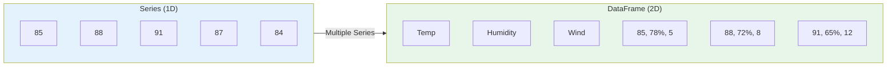
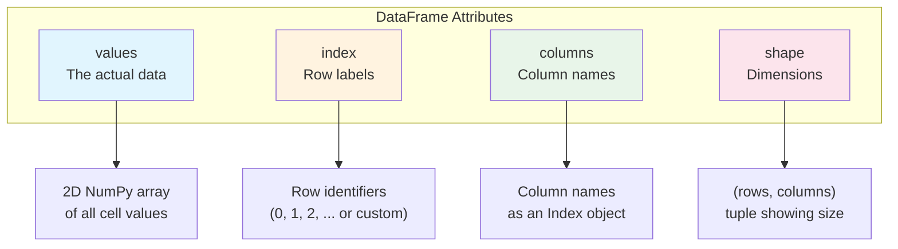
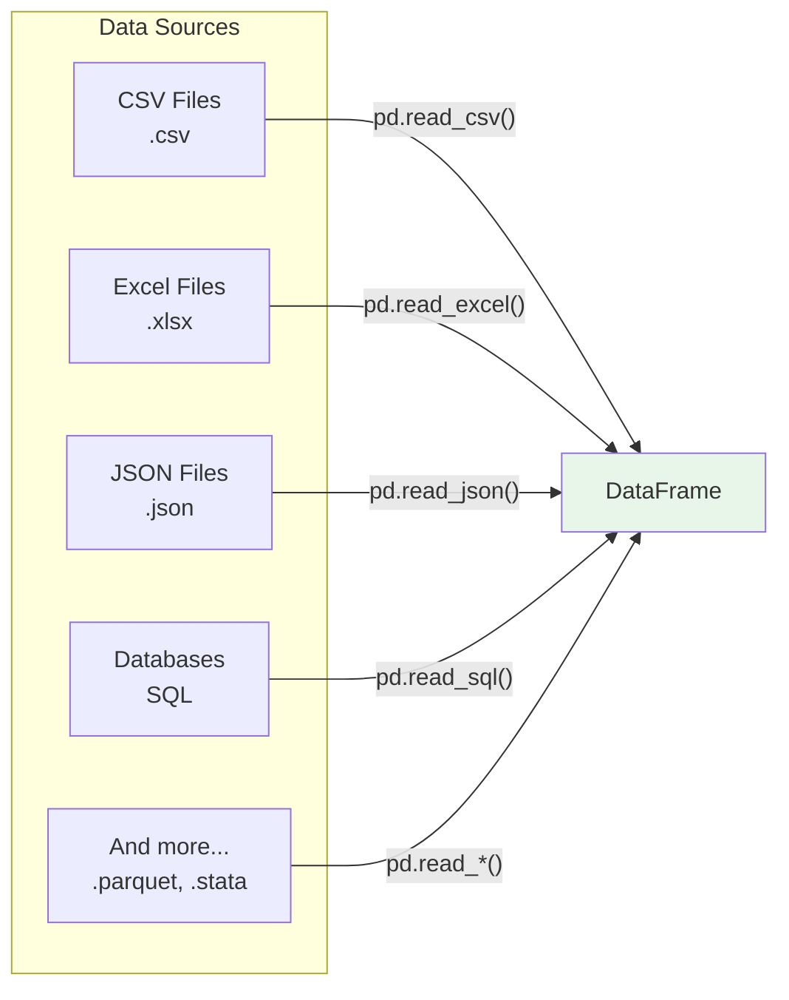
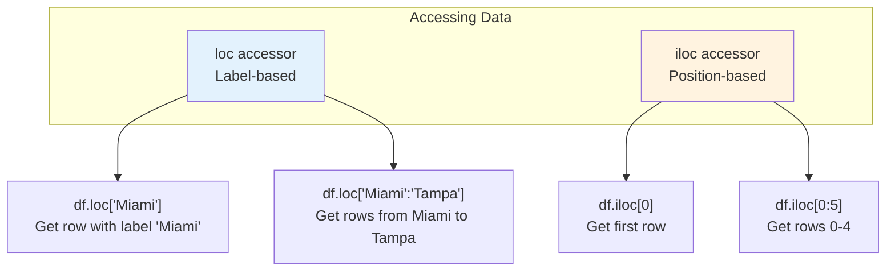
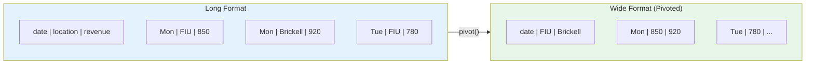
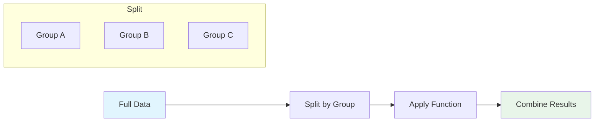
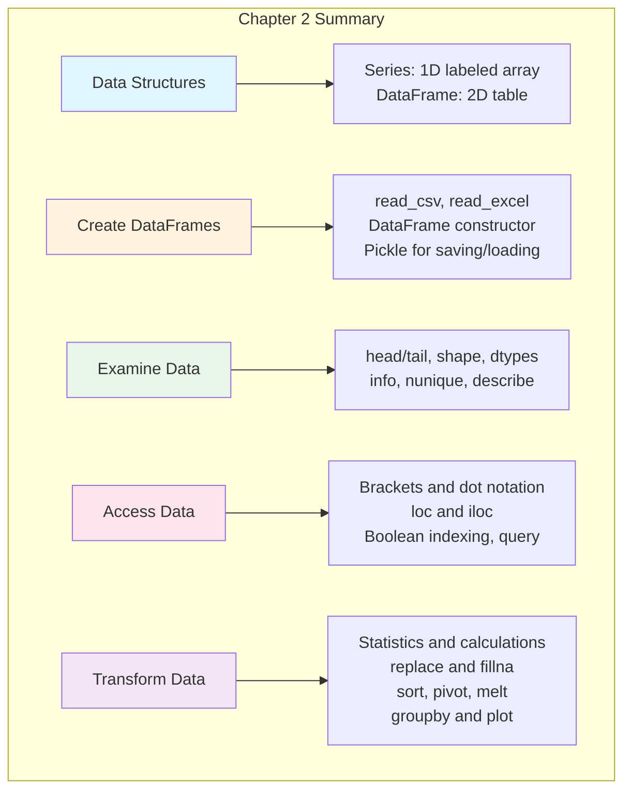

# Chapter 2: The Pandas Essentials for Data Analysis

---

## Welcome to Pandas: Your Data Analysis Superpower

In Chapter 1, we talked about data analysis being like making a Cuban sandwich—you need the right ingredients and the right tools. Well, if Python is your kitchen, then **Pandas** is your most important appliance. It's the industrial-grade plancha that can handle anything you throw at it.

Pandas (short for "Panel Data") is a Python library that makes working with structured data fast, easy, and expressive. Think of it as Excel on steroids—it can do everything a spreadsheet does, but with millions of rows, complex transformations, and complete automation.

By the end of this chapter, you'll be able to load data, explore it, clean it, transform it, and extract insights from it. These are the foundational skills that every data analyst uses every single day.

Let's dive in.

---

## Learning Objectives

After completing this chapter, you will be able to:

**Applied Skills:**
- Create a DataFrame by reading data from a file or by using the DataFrame constructor
- Save a DataFrame to disk as a pickle file, and restore the DataFrame by reading the pickle file
- Examine the data in a DataFrame by displaying the data and its attributes
- Examine the data in a DataFrame by using the info(), nunique(), and describe() methods
- Access columns, rows, or a subset of columns and rows using dot notation, brackets, the query() method, and the loc[] or iloc[] accessor
- Use Pandas methods to get statistics for the columns of a DataFrame
- Use Python to do calculations on the data in the columns of a DataFrame
- Use the Pandas or Python replace() method to replace data in a DataFrame or Series
- Sort rows, set and reset an index, pivot data, melt data, group and aggregate data, and plot data

**Knowledge:**
- Distinguish between a Series and a DataFrame
- Describe these attributes of a DataFrame: values, index, columns, shape

---

## 2.1 Introduction to Pandas Data Structures

Before we start loading and manipulating data, let's understand the two fundamental building blocks of Pandas: **Series** and **DataFrames**.

### The Difference Between a Series and a DataFrame

Think about a spreadsheet. A single column of data—like a list of temperatures for each day of the week—is a **Series**. The entire spreadsheet with multiple columns—temperatures, humidity, wind speed, and dates—is a **DataFrame**.



#### Series: A Single Column of Data

A **Series** is a one-dimensional array with labels (called an index). It's like a single column in Excel, but with a name tag on each value.

```python
import pandas as pd

# Create a Series from a list
temperatures = pd.Series([85, 88, 91, 87, 84, 82, 80])
print(temperatures)
```

Output:
```
0    85
1    88
2    91
3    87
4    84
5    82
6    80
dtype: int64
```

Notice two things:
1. Each value has an **index** (0, 1, 2, ...) on the left
2. The Series has a **dtype** (data type) at the bottom

You can also create a Series with custom labels:

```python
# Series with custom index (days of the week)
temperatures = pd.Series(
    [85, 88, 91, 87, 84, 82, 80],
    index=['Mon', 'Tue', 'Wed', 'Thu', 'Fri', 'Sat', 'Sun']
)
print(temperatures)
```

Output:
```
Mon    85
Tue    88
Wed    91
Thu    87
Fri    84
Sat    82
Sun    80
dtype: int64
```

Now you can access values by their label:

```python
print(temperatures['Wed'])  # Output: 91
print(temperatures['Mon':'Wed'])  # Output: Mon through Wed (inclusive!)
```

#### DataFrame: A Table of Data

A **DataFrame** is a two-dimensional table with rows and columns—like a spreadsheet or a SQL table. Each column is a Series, and they all share the same index.

```python
import pandas as pd

# Create a DataFrame from a dictionary
weather = pd.DataFrame({
    'temperature': [85, 88, 91, 87, 84],
    'humidity': [78, 72, 65, 70, 75],
    'wind_speed': [5, 8, 12, 7, 6],
    'condition': ['Sunny', 'Sunny', 'Partly Cloudy', 'Sunny', 'Rainy']
})
print(weather)
```

Output:
```
   temperature  humidity  wind_speed      condition
0           85        78           5          Sunny
1           88        72           8          Sunny
2           91        65          12  Partly Cloudy
3           87        70           7          Sunny
4           84        75           6          Rainy
```

The DataFrame has:
- **Rows** (indexed 0, 1, 2, 3, 4)
- **Columns** (temperature, humidity, wind_speed, condition)
- **Values** (the actual data in each cell)

#### Quick Comparison

| Aspect | Series | DataFrame |
|--------|--------|-----------|
| Dimensions | 1D (single column) | 2D (rows and columns) |
| Structure | Like a list with labels | Like a table or spreadsheet |
| Access | By index label or position | By row, column, or both |
| Analogy | A single column in Excel | An entire Excel worksheet |

### The Key Attributes of a DataFrame

Every DataFrame has four essential attributes that help you understand its structure. Think of these as the "vital signs" of your data—the first things you check when you encounter a new dataset.



Let's explore each one:

```python
import pandas as pd

# Create a sample DataFrame
restaurants = pd.DataFrame({
    'name': ['Versailles', 'La Carreta', 'Sergio\'s', 'Havana Harry\'s'],
    'cuisine': ['Cuban', 'Cuban', 'Cuban', 'Cuban'],
    'rating': [4.5, 4.2, 4.3, 4.4],
    'reviews': [12500, 8200, 3100, 2800]
})

print(restaurants)
```

Output:
```
             name cuisine  rating  reviews
0      Versailles   Cuban     4.5    12500
1      La Carreta   Cuban     4.2     8200
2        Sergio's   Cuban     4.3     3100
3  Havana Harry's   Cuban     4.4     2800
```

#### The `values` Attribute

The `values` attribute gives you the raw data as a NumPy array—no row labels, no column names, just the data.

```python
print(restaurants.values)
```

Output:
```
array([['Versailles', 'Cuban', 4.5, 12500],
       ['La Carreta', 'Cuban', 4.2, 8200],
       ["Sergio's", 'Cuban', 4.3, 3100],
       ["Havana Harry's", 'Cuban', 4.4, 2800]], dtype=object)
```

This is useful when you need to pass data to other libraries that don't understand DataFrames.

#### The `index` Attribute

The `index` attribute shows the row labels. By default, Pandas uses integers starting from 0.

```python
print(restaurants.index)
```

Output:
```
RangeIndex(start=0, stop=4, step=1)
```

You can set a custom index (we'll cover this later):

```python
restaurants_indexed = restaurants.set_index('name')
print(restaurants_indexed.index)
```

Output:
```
Index(['Versailles', 'La Carreta', "Sergio's", "Havana Harry's"], dtype='object', name='name')
```

#### The `columns` Attribute

The `columns` attribute shows all column names.

```python
print(restaurants.columns)
```

Output:
```
Index(['name', 'cuisine', 'rating', 'reviews'], dtype='object')
```

This is super useful for checking column names, especially when you've loaded data from a file and aren't sure what columns exist.

```python
# Convert to a list for easier viewing
print(list(restaurants.columns))
# Output: ['name', 'cuisine', 'rating', 'reviews']
```

#### Modifying Column Names

The `columns` attribute can also be used to rename columns. This is especially useful when column names have spaces or inconsistent formatting.

```python
# Example: DataFrame with problematic column names
messy_data = pd.DataFrame({
    'First Name': ['Maria', 'Jose'],
    'Last Name': ['Garcia', 'Rodriguez'],
    'Annual Revenue': [85000, 92000]
})

print(messy_data.columns)
# Output: Index(['First Name', 'Last Name', 'Annual Revenue'], dtype='object')

# Remove spaces from all column names
messy_data.columns = messy_data.columns.str.replace(' ', '')
print(messy_data.columns)
# Output: Index(['FirstName', 'LastName', 'AnnualRevenue'], dtype='object')

# Or replace spaces with underscores (more common)
messy_data.columns = messy_data.columns.str.replace(' ', '_')
print(messy_data.columns)
# Output: Index(['First_Name', 'Last_Name', 'Annual_Revenue'], dtype='object')

# Convert to lowercase
messy_data.columns = messy_data.columns.str.lower()
print(messy_data.columns)
# Output: Index(['first_name', 'last_name', 'annual_revenue'], dtype='object')
```

#### The `shape` Attribute

The `shape` attribute returns a tuple showing (rows, columns)—the dimensions of your DataFrame.

```python
print(restaurants.shape)
# Output: (4, 4)
```

This tells us we have 4 rows and 4 columns. It's the first thing most analysts check when loading a new dataset: "How big is this data?"

```python
# You can access rows and columns separately
print(f"This DataFrame has {restaurants.shape[0]} rows and {restaurants.shape[1]} columns")
# Output: This DataFrame has 4 rows and 4 columns
```

#### The `size` Attribute

The `size` attribute returns the total number of elements (rows × columns).

```python
print(restaurants.size)
# Output: 16  (4 rows × 4 columns)
```

#### Viewing All Attributes at Once

Here's a common pattern to quickly understand a DataFrame:

```python
print("Index:  ", restaurants.index)
print("Columns:", restaurants.columns)
print("Shape:  ", restaurants.shape)
print("Size:   ", restaurants.size)
```

---

## 2.2 How to Create a DataFrame

There are several ways to create a DataFrame. The two most common are reading from a file and using the DataFrame constructor directly.

### Creating a DataFrame from a File

In the real world, you'll almost always load data from files. Pandas can read many formats:



#### Reading a CSV File

CSV (Comma-Separated Values) is the most common format for data files. It's simple, universal, and human-readable.

```python
import pandas as pd

# Read a CSV file into a DataFrame
sales = pd.read_csv('food_truck_sales.csv')

# Display the first few rows
print(sales.head())
```

The `read_csv()` function has many useful parameters:

```python
# Common parameters for read_csv()
sales = pd.read_csv(
    'food_truck_sales.csv',    # File path
    sep=',',                    # Separator (comma is default)
    header=0,                   # Row number for column names (0 = first row)
    index_col=None,             # Column to use as index
    usecols=['date', 'revenue', 'location'],  # Only load specific columns
    dtype={'revenue': float},   # Specify data types
    parse_dates=['date'],       # Parse these columns as dates
    encoding='utf-8',           # File encoding
    nrows=1000                  # Only read first 1000 rows
)
```

#### Reading an Excel File

```python
# Read an Excel file
inventory = pd.read_excel('inventory.xlsx')

# Read a specific sheet
inventory = pd.read_excel('inventory.xlsx', sheet_name='Q1_2024')

# Read multiple sheets (returns a dictionary of DataFrames)
all_quarters = pd.read_excel('inventory.xlsx', sheet_name=None)
print(all_quarters.keys())  # Shows all sheet names
```

#### Reading from a URL

Pandas can read directly from the internet:

```python
# Read a CSV from a URL
url = 'https://raw.githubusercontent.com/datasets/covid-19/main/data/countries-aggregated.csv'
covid_data = pd.read_csv(url)
print(covid_data.head())
```

### Creating a DataFrame with the Constructor

Sometimes you need to create a DataFrame from scratch, especially for testing or small datasets.

#### From a Dictionary (Most Common)

Each key becomes a column name, and the values become the column data:

```python
import pandas as pd

# Create from a dictionary of lists
food_trucks = pd.DataFrame({
    'name': ['Tostones & Dreams', 'Taco Loco', 'Pasta on Wheels', 'Sushi Express'],
    'cuisine': ['Cuban Fusion', 'Mexican', 'Italian', 'Japanese'],
    'avg_price': [12.50, 9.00, 14.00, 16.00],
    'location': ['FIU', 'Downtown', 'Brickell', 'Wynwood']
})

print(food_trucks)
```

Output:
```
                name       cuisine  avg_price  location
0  Tostones & Dreams  Cuban Fusion      12.50       FIU
1          Taco Loco       Mexican       9.00  Downtown
2    Pasta on Wheels       Italian      14.00  Brickell
3      Sushi Express      Japanese      16.00   Wynwood
```

#### From a List of Dictionaries

Each dictionary becomes a row:

```python
# Create from a list of dictionaries (each dict is a row)
transactions = pd.DataFrame([
    {'date': '2024-01-15', 'item': 'Tostones', 'quantity': 2, 'price': 8.00},
    {'date': '2024-01-15', 'item': 'Cubano', 'quantity': 1, 'price': 12.00},
    {'date': '2024-01-15', 'item': 'Cafecito', 'quantity': 3, 'price': 4.50},
    {'date': '2024-01-16', 'item': 'Empanadas', 'quantity': 4, 'price': 10.00}
])

print(transactions)
```

#### From a List of Lists (with Column Names)

```python
# Create from a list of lists
data = [
    ['Miami', 'Miami-Dade', 450000],
    ['Fort Lauderdale', 'Broward', 180000],
    ['West Palm Beach', 'Palm Beach', 110000]
]

cities = pd.DataFrame(data, columns=['city', 'county', 'population'])
print(cities)
```

#### From a NumPy Array

```python
import numpy as np
import pandas as pd

# Create from a NumPy array
np_array = np.array([
    [85, 78, 5],
    [88, 72, 8],
    [91, 65, 12]
])

weather = pd.DataFrame(
    np_array,
    columns=['temperature', 'humidity', 'wind_speed'],
    index=['Mon', 'Tue', 'Wed']
)
print(weather)
```

### Saving and Loading DataFrames with Pickle

Once you've cleaned and prepared a DataFrame, you don't want to repeat that work every time. **Pickle** files let you save a DataFrame exactly as it is and reload it later.

Think of pickle like vacuum-sealing leftovers—everything is preserved exactly as you left it.

```python
import pandas as pd

# Create a DataFrame
sales = pd.DataFrame({
    'date': ['2024-01-15', '2024-01-16', '2024-01-17'],
    'revenue': [847.50, 923.00, 1105.25],
    'transactions': [45, 52, 61]
})

# Save to a pickle file
sales.to_pickle('sales_data.pkl')
print("DataFrame saved!")

# Later, load it back
loaded_sales = pd.read_pickle('sales_data.pkl')
print(loaded_sales)
```

**Why use pickle instead of CSV?**

| Aspect | CSV | Pickle |
|--------|-----|--------|
| Data types | Often lost (dates become strings) | Perfectly preserved |
| Speed | Slower for large files | Much faster |
| File size | Larger (text-based) | Smaller (binary) |
| Human-readable | Yes | No |
| Cross-platform | Universal | Python-only |

**Best practice**: Use pickle for intermediate work (saving progress), but use CSV for final outputs that need to be shared.

```python
# Common workflow:
# 1. Load raw data from CSV
raw_data = pd.read_csv('raw_sales.csv')

# 2. Clean and transform (takes time!)
cleaned_data = raw_data.dropna()
cleaned_data['date'] = pd.to_datetime(cleaned_data['date'])
# ... more cleaning ...

# 3. Save cleaned data as pickle (so you don't repeat steps 1-2)
cleaned_data.to_pickle('cleaned_sales.pkl')

# 4. Next session, just load the pickle
data = pd.read_pickle('cleaned_sales.pkl')
# Ready to analyze!
```

---

## 2.3 How to Examine the Data in a DataFrame

When you first load a dataset, you need to explore it before doing any analysis. It's like being a detective—you gather clues about what you're working with.

### Displaying Data and Attributes

#### First Look: head() and tail()

```python
import pandas as pd

# Assume we've loaded a large dataset
# Let's create one for demonstration
np.random.seed(42)
sales = pd.DataFrame({
    'date': pd.date_range('2024-01-01', periods=1000),
    'revenue': np.random.uniform(500, 1500, 1000).round(2),
    'customers': np.random.randint(20, 100, 1000),
    'location': np.random.choice(['FIU', 'Brickell', 'Wynwood', 'Downtown'], 1000)
})

# View first 5 rows (default)
print(sales.head())

# View first 10 rows
print(sales.head(10))

# View last 5 rows
print(sales.tail())

# View last 3 rows
print(sales.tail(3))
```

#### Check the Vital Signs

```python
# Shape: How big is the data?
print(f"Shape: {sales.shape}")
# Output: Shape: (1000, 4)

# Columns: What variables do we have?
print(f"Columns: {list(sales.columns)}")
# Output: Columns: ['date', 'revenue', 'customers', 'location']

# Index: How are rows labeled?
print(f"Index: {sales.index}")
# Output: Index: RangeIndex(start=0, stop=1000, step=1)

# Data types: What type is each column?
print(sales.dtypes)
# Output:
# date         datetime64[ns]
# revenue             float64
# customers             int64
# location             object
# dtype: object
```

### Using info() for a Complete Overview

The `info()` method is your best friend for understanding a DataFrame. It shows everything at once:

```python
sales.info()
```

Output:
```
<class 'pandas.core.frame.DataFrame'>
RangeIndex: 1000 entries, 0 to 999
Data columns (total 4 columns):
 #   Column     Non-Null Count  Dtype         
---  ------     --------------  -----         
 0   date       1000 non-null   datetime64[ns]
 1   revenue    1000 non-null   float64       
 2   customers  1000 non-null   int64         
 3   location   1000 non-null   object        
dtypes: datetime64[ns](1), float64(1), int64(1), object(1)
memory usage: 31.4+ KB
```

**What info() tells you:**
- Total number of rows (1000 entries)
- Number of columns (4)
- Column names and their position
- **Non-null count** (how many values are NOT missing)
- Data types for each column
- Memory usage

The non-null count is crucial—if it's less than the total entries, you have missing data!

### Using nunique() to Count Unique Values

The `nunique()` method tells you how many unique values are in each column:

```python
print(sales.nunique())
```

Output:
```
date         1000
revenue       998
customers      80
location        4
dtype: int64
```

This tells us:
- Every date is unique (1000 dates for 1000 rows)
- Almost every revenue value is unique (makes sense for dollar amounts)
- Customers range across 80 different values
- There are only 4 locations

For categorical columns, you might want to see what those unique values are:

```python
# See the unique values in the location column
print(sales['location'].unique())
# Output: ['Downtown' 'Wynwood' 'FIU' 'Brickell']

# Or with counts
print(sales['location'].value_counts())
# Output:
# FIU         262
# Downtown    253
# Brickell    251
# Wynwood     234
# Name: location, dtype: int64
```

### Using describe() for Statistical Summary

The `describe()` method provides summary statistics for numeric columns:

```python
print(sales.describe())
```

Output:
```
           revenue    customers
count  1000.000000  1000.000000
mean    997.847200    59.422000
std     287.469851    23.025021
min     500.470000    20.000000
25%     752.057500    39.000000
50%     993.475000    59.000000
75%    1244.820000    80.000000
max    1499.680000    99.000000
```

**What describe() tells you:**
- **count**: Number of non-null values
- **mean**: Average value
- **std**: Standard deviation (spread of data)
- **min**: Minimum value
- **25%**: First quartile (25% of data is below this)
- **50%**: Median (middle value)
- **75%**: Third quartile (75% of data is below this)
- **max**: Maximum value

**Transposing describe() for easier reading:**

When you have many columns, the output of `describe()` can be hard to read. Use `.T` to transpose (flip rows and columns):

```python
print(sales.describe().T)
```

Output:
```
           count        mean         std     min      25%      50%       75%      max
revenue   1000.0  997.847200  287.469851  500.47  752.058  993.475  1244.820  1499.68
customers 1000.0   59.422000   23.025021   20.00   39.000   59.000    80.000    99.00
```

This makes it easier to compare statistics across columns.

To include non-numeric columns:

```python
print(sales.describe(include='all'))
```

This adds:
- **unique**: Number of unique values
- **top**: Most common value
- **freq**: Frequency of most common value

### Controlling Display Options

When working with large DataFrames, you can control how much data is shown:

```python
# Temporarily change display settings
with pd.option_context('display.max_rows', 10, 'display.max_columns', None):
    display(large_dataframe)

# Or set options globally
pd.set_option('display.max_rows', 100)
pd.set_option('display.max_columns', None)  # Show all columns
```

---

## 2.4 How to Access Data in a DataFrame

Now that you can examine your data, let's learn how to access specific parts of it. This is where Pandas really shines.

### Accessing Columns

There are two main ways to access a column:

#### Dot Notation

```python
# Access a column using dot notation
print(sales.revenue)

# This returns a Series
print(type(sales.revenue))
# Output: <class 'pandas.core.series.Series'>
```

**Limitation**: Dot notation doesn't work if:
- Column name has spaces: `sales.total revenue` ❌
- Column name starts with a number: `sales.2024_sales` ❌
- Column name matches a DataFrame method: `sales.count` gives the method, not a column

#### Bracket Notation

```python
# Access a column using brackets
print(sales['revenue'])

# This also works for problematic column names
# sales['total revenue']  # Works!
# sales['2024_sales']     # Works!

# Access multiple columns (returns a DataFrame)
print(sales[['date', 'revenue']])

# Store column names in a variable
cols_to_select = ['date', 'revenue', 'location']
print(sales[cols_to_select])
```

### Accessing Rows with loc[] and iloc[]

Pandas provides two main accessors for rows:
- **`loc[]`**: Access by **label** (the index value)
- **`iloc[]`**: Access by **integer position** (0, 1, 2, ...)

Think of it this way:
- **loc** = **l**abel-**o**riented **c**hoice
- **iloc** = **i**nteger-**loc**ation



#### Using iloc[] (Position-Based)

```python
import pandas as pd

# Create a sample DataFrame
restaurants = pd.DataFrame({
    'name': ['Versailles', 'La Carreta', 'Sergio\'s', 'Havana Harry\'s', 'El Palacio'],
    'rating': [4.5, 4.2, 4.3, 4.4, 4.1],
    'reviews': [12500, 8200, 3100, 2800, 1500]
})

# Access by position using iloc[]

# Get first row (returns a Series)
print(restaurants.iloc[0])
# Output:
# name       Versailles
# rating            4.5
# reviews         12500
# Name: 0, dtype: object

# Get first 3 rows (returns a DataFrame)
print(restaurants.iloc[0:3])

# Get last row
print(restaurants.iloc[-1])

# Get specific rows by position
print(restaurants.iloc[[0, 2, 4]])  # Rows 0, 2, and 4

# Get rows and columns by position
print(restaurants.iloc[0:3, 0:2])  # First 3 rows, first 2 columns

# Get a specific cell
print(restaurants.iloc[0, 1])  # First row, second column: 4.5
```

#### Using loc[] (Label-Based)

```python
# With default integer index, loc and iloc work similarly
print(restaurants.loc[0])  # Get row with label 0

# But loc is more powerful with custom indexes
restaurants_indexed = restaurants.set_index('name')
print(restaurants_indexed)
```

Output:
```
                rating  reviews
name                           
Versailles         4.5    12500
La Carreta         4.2     8200
Sergio's           4.3     3100
Havana Harry's     4.4     2800
El Palacio         4.1     1500
```

Now loc[] uses the restaurant names:

```python
# Get row by label
print(restaurants_indexed.loc['Versailles'])
# Output:
# rating       4.5
# reviews    12500
# Name: Versailles, dtype: object

# Get multiple rows by label
print(restaurants_indexed.loc[['Versailles', 'Sergio\'s']])

# Get a range of labels (INCLUSIVE on both ends!)
print(restaurants_indexed.loc['La Carreta':'Havana Harry\'s'])

# Get specific rows and columns
print(restaurants_indexed.loc['Versailles', 'rating'])  # Output: 4.5
print(restaurants_indexed.loc['Versailles':'Sergio\'s', 'rating'])
```

**Important difference**: With `loc[]`, ranges are INCLUSIVE on both ends. With `iloc[]`, ranges are EXCLUSIVE on the end (like standard Python slicing).

```python
# iloc: exclusive end (standard Python)
print(restaurants.iloc[0:2])  # Rows 0 and 1 only

# loc: inclusive end
print(restaurants.loc[0:2])   # Rows 0, 1, AND 2
```

### Accessing Subsets with Boolean Indexing

Boolean indexing lets you filter rows based on conditions. This is one of the most powerful features in Pandas.

```python
import pandas as pd
import numpy as np

# Create a sales DataFrame
np.random.seed(42)
sales = pd.DataFrame({
    'date': pd.date_range('2024-01-01', periods=100),
    'revenue': np.random.uniform(500, 1500, 100).round(2),
    'customers': np.random.randint(20, 100, 100),
    'location': np.random.choice(['FIU', 'Brickell', 'Wynwood', 'Downtown'], 100)
})

# Filter rows where revenue > 1000
high_revenue = sales[sales['revenue'] > 1000]
print(high_revenue.head())

# Filter rows for a specific location
fiu_sales = sales[sales['location'] == 'FIU']
print(fiu_sales.head())

# Multiple conditions (use & for AND, | for OR)
# Important: Each condition must be in parentheses!

# High revenue AND at FIU
great_days = sales[(sales['revenue'] > 1000) & (sales['location'] == 'FIU')]
print(great_days)

# High revenue OR many customers
busy_days = sales[(sales['revenue'] > 1200) | (sales['customers'] > 80)]
print(len(busy_days))

# NOT a condition (use ~)
not_fiu = sales[~(sales['location'] == 'FIU')]
print(not_fiu.head())
```

### Using the query() Method

The `query()` method provides a cleaner syntax for filtering, especially with complex conditions:

```python
# Instead of:
result = sales[(sales['revenue'] > 1000) & (sales['location'] == 'FIU')]

# You can write:
result = sales.query('revenue > 1000 and location == "FIU"')

# More examples
high_rev = sales.query('revenue > 1000')
fiu_or_brickell = sales.query('location == "FIU" or location == "Brickell"')
moderate_days = sales.query('500 < revenue < 1000')

# Using variables in queries (use @)
threshold = 1000
location_filter = 'Wynwood'
result = sales.query('revenue > @threshold and location == @location_filter')
print(result)
```

**query() vs Boolean indexing:**
- `query()`: Cleaner syntax, easier to read
- Boolean indexing: More flexible, works with complex expressions

### Combining Row and Column Selection

You can combine all these methods to access exactly the data you need:

```python
# Select specific columns for filtered rows

# Method 1: Chain operations
high_rev_summary = sales[sales['revenue'] > 1000][['date', 'revenue', 'location']]

# Method 2: Use loc with boolean mask
high_rev_summary = sales.loc[sales['revenue'] > 1000, ['date', 'revenue', 'location']]

# Method 3: Use query then select columns
high_rev_summary = sales.query('revenue > 1000')[['date', 'revenue', 'location']]

print(high_rev_summary.head())
```

---

## 2.5 How to Get Statistics for DataFrame Columns

Pandas makes it easy to calculate statistics. Let's explore the most common statistical methods.

### Basic Statistical Methods

```python
import pandas as pd
import numpy as np

# Create a sales DataFrame
np.random.seed(42)
sales = pd.DataFrame({
    'revenue': [847.50, 923.00, 1105.25, 756.80, 1234.00, 891.50, 1067.25],
    'customers': [45, 52, 61, 38, 72, 48, 58],
    'tips': [84.75, 92.30, 132.63, 60.54, 148.08, 80.24, 106.73]
})

# Calculate statistics for a single column
print(f"Mean revenue: ${sales['revenue'].mean():.2f}")
print(f"Median revenue: ${sales['revenue'].median():.2f}")
print(f"Std dev: ${sales['revenue'].std():.2f}")
print(f"Min revenue: ${sales['revenue'].min():.2f}")
print(f"Max revenue: ${sales['revenue'].max():.2f}")
print(f"Sum of revenue: ${sales['revenue'].sum():.2f}")
print(f"Count: {sales['revenue'].count()}")
```

### All Statistical Methods at a Glance

| Method | Description | Example |
|--------|-------------|---------|
| `mean()` | Average | `df['col'].mean()` |
| `median()` | Middle value | `df['col'].median()` |
| `mode()` | Most common value | `df['col'].mode()` |
| `std()` | Standard deviation | `df['col'].std()` |
| `var()` | Variance | `df['col'].var()` |
| `min()` | Minimum | `df['col'].min()` |
| `max()` | Maximum | `df['col'].max()` |
| `sum()` | Total | `df['col'].sum()` |
| `count()` | Non-null count | `df['col'].count()` |
| `quantile()` | Percentile | `df['col'].quantile(0.75)` |
| `cumsum()` | Cumulative sum | `df['col'].cumsum()` |
| `cumprod()` | Cumulative product | `df['col'].cumprod()` |
| `cummax()` | Cumulative max | `df['col'].cummax()` |
| `cummin()` | Cumulative min | `df['col'].cummin()` |

### Using Quantiles (Percentiles)

The `quantile()` method is particularly useful for understanding distribution:

```python
# Get specific percentiles
print(sales['revenue'].quantile(0.5))   # 50th percentile (median)
print(sales['revenue'].quantile(0.9))   # 90th percentile

# Get multiple percentiles at once
print(sales[['revenue', 'customers']].quantile([0.1, 0.25, 0.5, 0.75, 0.9]))
```

Output:
```
      revenue  customers
0.10   585.23       28.0
0.25   752.06       39.0
0.50   993.48       59.0
0.75  1244.82       80.0
0.90  1385.45       89.0
```

This tells you, for example, that 90% of revenue values are below 1385.45.

### Statistics Across the Entire DataFrame

```python
# Calculate statistics for all numeric columns at once
print(sales.mean())      # Mean of each column
print(sales.sum())       # Sum of each column
print(sales.describe())  # Full summary statistics
```

### The agg() Method for Multiple Statistics

When you need multiple statistics at once, use `agg()`:

```python
# Calculate multiple statistics for one column
print(sales['revenue'].agg(['mean', 'median', 'std', 'min', 'max']))

# Calculate different statistics for different columns
print(sales.agg({
    'revenue': ['mean', 'sum'],
    'customers': ['mean', 'max'],
    'tips': 'sum'
}))
```

Output:
```
        revenue  customers    tips
mean     975.04       53.43     NaN
sum     6825.30        NaN  705.27
max         NaN      72.00     NaN
```

---

## 2.6 How to Do Calculations on DataFrame Columns

Real-world analysis often requires creating new columns based on calculations.

### Arithmetic Operations

Pandas supports standard arithmetic on columns:

```python
import pandas as pd

sales = pd.DataFrame({
    'item': ['Cubano', 'Media Noche', 'Tostones', 'Empanadas'],
    'price': [12.00, 10.00, 6.00, 8.00],
    'quantity_sold': [45, 32, 78, 56]
})

# Calculate total revenue for each item
sales['total_revenue'] = sales['price'] * sales['quantity_sold']

# Calculate with tax (7% Florida sales tax)
sales['with_tax'] = sales['price'] * 1.07

# Calculate percentage of total sales
total_sales = sales['total_revenue'].sum()
sales['pct_of_total'] = (sales['total_revenue'] / total_sales * 100).round(2)

print(sales)
```

Output:
```
          item  price  quantity_sold  total_revenue  with_tax  pct_of_total
0       Cubano  12.00             45         540.00     12.84         28.80
1  Media Noche  10.00             32         320.00     10.70         17.06
2     Tostones   6.00             78         468.00      6.42         24.96
3    Empanadas   8.00             56         448.00      8.56         23.89
```

### Operations Between Columns

```python
# Create a DataFrame with more data
transactions = pd.DataFrame({
    'subtotal': [45.00, 78.50, 32.00, 95.00, 62.50],
    'tip': [9.00, 15.70, 4.80, 19.00, 12.50],
    'discount': [0, 10.00, 0, 5.00, 0]
})

# Calculate final total
transactions['final_total'] = transactions['subtotal'] + transactions['tip'] - transactions['discount']

# Calculate tip percentage
transactions['tip_pct'] = (transactions['tip'] / transactions['subtotal'] * 100).round(1)

print(transactions)
```

### Using NumPy Functions

For more complex calculations, NumPy functions work seamlessly:

```python
import numpy as np

# Round values
sales['price_rounded'] = np.round(sales['price'], 0)

# Square root
sales['sqrt_revenue'] = np.sqrt(sales['total_revenue'])

# Logarithm
sales['log_revenue'] = np.log(sales['total_revenue'])

# Conditional calculations with np.where()
sales['category'] = np.where(sales['total_revenue'] > 450, 'High', 'Low')

print(sales[['item', 'total_revenue', 'category']])
```

### Calculations with the apply() Method

For custom calculations, use `apply()` with a function:

```python
# Define a custom function
def calculate_commission(revenue):
    if revenue > 500:
        return revenue * 0.10  # 10% commission for high sales
    else:
        return revenue * 0.05  # 5% commission for lower sales

# Apply the function to each value
sales['commission'] = sales['total_revenue'].apply(calculate_commission)

# Or use a lambda for simple operations
sales['commission'] = sales['total_revenue'].apply(
    lambda x: x * 0.10 if x > 500 else x * 0.05
)

print(sales[['item', 'total_revenue', 'commission']])
```

---

## 2.7 How to Replace Data in a DataFrame

Data often needs to be cleaned by replacing values. Pandas offers several ways to do this.

### Using the replace() Method

The `replace()` method finds and replaces values:

```python
import pandas as pd

# Create a DataFrame with inconsistent data
customers = pd.DataFrame({
    'name': ['Maria Garcia', 'Jose Rodriguez', 'Ana Martinez'],
    'city': ['miami', 'MIAMI', 'Miami'],
    'status': ['active', 'inactive', 'Active']
})

# Replace a single value
customers['city'] = customers['city'].replace('miami', 'Miami')
customers['city'] = customers['city'].replace('MIAMI', 'Miami')

# Or replace multiple values at once
customers['city'] = customers['city'].replace({'miami': 'Miami', 'MIAMI': 'Miami'})

# Replace across the entire DataFrame
customers = customers.replace({'active': 'Active', 'inactive': 'Inactive'})

print(customers)
```

### Using str.replace() for String Columns

For string manipulations, use the `.str` accessor:

```python
# Create a DataFrame with messy strings
products = pd.DataFrame({
    'name': ['Cuban Sandwich  ', '  Media Noche', 'TOSTONES'],
    'code': ['CB-001', 'MN-002', 'TS-003']
})

# Remove extra whitespace
products['name'] = products['name'].str.strip()

# Convert to title case
products['name'] = products['name'].str.title()

# Replace substring
products['code'] = products['code'].str.replace('-', '_')

print(products)
```

Output:
```
             name    code
0  Cuban Sandwich  CB_001
1     Media Noche  MN_002
2        Tostones  TS_003
```

### Using fillna() to Replace Missing Values

Missing values (NaN) are common in real datasets:

```python
# Create a DataFrame with missing values
ratings = pd.DataFrame({
    'restaurant': ['Versailles', 'La Carreta', 'Sergio\'s', 'New Place'],
    'food_rating': [4.5, 4.2, None, 4.0],
    'service_rating': [4.3, None, 4.1, None]
})

print("Before:")
print(ratings)

# Replace NaN with a specific value
ratings['food_rating'] = ratings['food_rating'].fillna(0)

# Replace NaN with the mean
mean_service = ratings['service_rating'].mean()
ratings['service_rating'] = ratings['service_rating'].fillna(mean_service)

print("\nAfter:")
print(ratings)
```

### Using map() for Value Mapping

When you need to map values to new values (like recoding categories):

```python
# Create a DataFrame
survey = pd.DataFrame({
    'response': [1, 2, 3, 2, 1, 3, 2, 1],
    'respondent': ['A', 'B', 'C', 'D', 'E', 'F', 'G', 'H']
})

# Map numeric codes to labels
response_map = {
    1: 'Disagree',
    2: 'Neutral',
    3: 'Agree'
}

survey['response_label'] = survey['response'].map(response_map)
print(survey)
```

Output:
```
   response respondent response_label
0         1          A       Disagree
1         2          B        Neutral
2         3          C          Agree
3         2          D        Neutral
4         1          E       Disagree
5         3          F          Agree
6         2          G        Neutral
7         1          H       Disagree
```

---

## 2.8 DataFrame Operations: Sort, Index, Pivot, Melt, Group, and Plot

Now let's cover the powerful operations that transform your data.

### Sorting Rows

```python
import pandas as pd

restaurants = pd.DataFrame({
    'name': ['Versailles', 'La Carreta', 'Sergio\'s', 'Havana Harry\'s', 'El Palacio'],
    'rating': [4.5, 4.2, 4.3, 4.4, 4.1],
    'reviews': [12500, 8200, 3100, 2800, 1500],
    'neighborhood': ['Little Havana', 'Westchester', 'Kendall', 'Coral Gables', 'Downtown']
})

# Sort by one column (ascending by default)
sorted_by_rating = restaurants.sort_values('rating')
print(sorted_by_rating)

# Sort descending
sorted_by_rating_desc = restaurants.sort_values('rating', ascending=False)
print(sorted_by_rating_desc)

# Sort by multiple columns
sorted_multi = restaurants.sort_values(['rating', 'reviews'], ascending=[False, False])
print(sorted_multi)

# Sort by index
sorted_by_index = restaurants.sort_index()
```

### Setting and Resetting the Index

The index is your row identifier. Sometimes you want a column to be the index, or vice versa.

```python
# Set a column as the index
restaurants_indexed = restaurants.set_index('name')
print(restaurants_indexed)
```

Output:
```
                rating  reviews   neighborhood
name                                          
Versailles         4.5    12500  Little Havana
La Carreta         4.2     8200    Westchester
Sergio's           4.3     3100        Kendall
Havana Harry's     4.4     2800   Coral Gables
El Palacio         4.1     1500       Downtown
```

```python
# Now you can access by name
print(restaurants_indexed.loc['Versailles'])

# Reset the index (moves index back to a column)
restaurants_reset = restaurants_indexed.reset_index()
print(restaurants_reset)

# Reset and drop the old index
restaurants_new = restaurants_indexed.reset_index(drop=True)
```

#### Verifying Index Integrity

When setting an index, you can verify that it has no duplicate values:

```python
# This will raise an error if there are duplicate values
try:
    df = df.set_index('Year', verify_integrity=True)
except ValueError as e:
    print(f"Error: {e}")
# Output: Error: Index has duplicate keys: [1900, 1901, ...]
```

#### Multi-Level Index

You can set multiple columns as the index to create a hierarchical index:

```python
# Create data with potential duplicates in a single column
sales_data = pd.DataFrame({
    'year': [2023, 2023, 2023, 2024, 2024, 2024],
    'location': ['FIU', 'Brickell', 'Wynwood', 'FIU', 'Brickell', 'Wynwood'],
    'revenue': [85000, 95000, 72000, 92000, 105000, 81000]
})

# Setting just 'year' as index would fail verify_integrity
# because 2023 and 2024 each appear 3 times

# Instead, set both columns as a multi-level index
sales_indexed = sales_data.set_index(['year', 'location'], verify_integrity=True)
print(sales_indexed)
```

Output:
```
                 revenue
year location           
2023 FIU          85000
     Brickell     95000
     Wynwood      72000
2024 FIU          92000
     Brickell    105000
     Wynwood      81000
```

```python
# Access data in a multi-level index
print(sales_indexed.loc[2023])           # All locations for 2023
print(sales_indexed.loc[(2023, 'FIU')])  # Specific year and location

# Reset back to regular columns
sales_reset = sales_indexed.reset_index()
```

### Pivoting Data

Pivoting reshapes your data from long to wide format. Think of it like creating a cross-tabulation or summary table.

```python
# Create sales data in long format
sales = pd.DataFrame({
    'date': ['Mon', 'Mon', 'Tue', 'Tue', 'Wed', 'Wed'],
    'location': ['FIU', 'Brickell', 'FIU', 'Brickell', 'FIU', 'Brickell'],
    'revenue': [850, 920, 780, 1050, 900, 1100]
})

print("Original (long format):")
print(sales)

# Pivot to wide format
pivoted = sales.pivot(index='date', columns='location', values='revenue')
print("\nPivoted (wide format):")
print(pivoted)
```

Output:
```
Original (long format):
  date  location  revenue
0  Mon       FIU      850
1  Mon  Brickell      920
2  Tue       FIU      780
3  Tue  Brickell     1050
4  Wed       FIU      900
5  Wed  Brickell     1100

Pivoted (wide format):
location  Brickell  FIU
date                   
Mon            920  850
Tue           1050  780
Wed           1100  900
```



### Melting Data

Melting is the opposite of pivoting—it converts wide format to long format.

```python
# Create wide format data
wide_sales = pd.DataFrame({
    'date': ['Mon', 'Tue', 'Wed'],
    'FIU': [850, 780, 900],
    'Brickell': [920, 1050, 1100],
    'Wynwood': [750, 820, 880]
})

print("Original (wide format):")
print(wide_sales)

# Melt to long format
melted = pd.melt(
    wide_sales,
    id_vars=['date'],           # Column(s) to keep as is
    value_vars=['FIU', 'Brickell', 'Wynwood'],  # Columns to melt
    var_name='location',        # Name for the new category column
    value_name='revenue'        # Name for the values column
)

print("\nMelted (long format):")
print(melted)
```

Output:
```
Original (wide format):
  date  FIU  Brickell  Wynwood
0  Mon  850       920      750
1  Tue  780      1050      820
2  Wed  900      1100      880

Melted (long format):
  date  location  revenue
0  Mon       FIU      850
1  Tue       FIU      780
2  Wed       FIU      900
3  Mon  Brickell      920
4  Tue  Brickell     1050
5  Wed  Brickell     1100
6  Mon   Wynwood      750
7  Tue   Wynwood      820
8  Wed   Wynwood      880
```

### Grouping and Aggregating Data

Grouping is one of the most powerful operations in data analysis. It lets you split your data into groups, apply a function to each group, and combine the results.



```python
import pandas as pd
import numpy as np

# Create detailed sales data
np.random.seed(42)
sales = pd.DataFrame({
    'date': pd.date_range('2024-01-01', periods=30),
    'day_of_week': (['Mon', 'Tue', 'Wed', 'Thu', 'Fri', 'Sat', 'Sun'] * 5)[:30],
    'location': np.random.choice(['FIU', 'Brickell', 'Wynwood'], 30),
    'revenue': np.random.uniform(500, 1500, 30).round(2),
    'customers': np.random.randint(20, 100, 30)
})

# Basic groupby: Average revenue by location
by_location = sales.groupby('location')['revenue'].mean()
print("Average revenue by location:")
print(by_location)

# Multiple statistics
by_location_stats = sales.groupby('location')['revenue'].agg(['mean', 'sum', 'count'])
print("\nMultiple statistics:")
print(by_location_stats)

# Group by multiple columns
by_loc_day = sales.groupby(['location', 'day_of_week'])['revenue'].mean()
print("\nBy location and day:")
print(by_loc_day)

# Multiple columns with multiple functions
summary = sales.groupby('location').agg({
    'revenue': ['mean', 'sum', 'max'],
    'customers': ['mean', 'sum']
})
print("\nDetailed summary:")
print(summary)
```

### Named Aggregation (Cleaner Output)

```python
# Use named aggregation for cleaner column names
summary = sales.groupby('location').agg(
    avg_revenue=('revenue', 'mean'),
    total_revenue=('revenue', 'sum'),
    max_revenue=('revenue', 'max'),
    avg_customers=('customers', 'mean'),
    total_customers=('customers', 'sum')
).round(2)

print(summary)
```

Output:
```
          avg_revenue  total_revenue  max_revenue  avg_customers  total_customers
location                                                                         
Brickell       998.45        9984.52      1456.78          58.50              585
FIU           1023.67       11260.34      1489.23          62.33              686
Wynwood        967.89        8711.01      1398.45          55.78              502
```

### Plotting Data Based on Index

Pandas has built-in plotting capabilities. After setting an appropriate index, plotting becomes intuitive.

```python
import matplotlib.pyplot as plt

# Prepare data for plotting
daily_revenue = sales.groupby('day_of_week')['revenue'].mean()

# Reorder days properly
day_order = ['Mon', 'Tue', 'Wed', 'Thu', 'Fri', 'Sat', 'Sun']
daily_revenue = daily_revenue.reindex(day_order)

# Create a bar plot
daily_revenue.plot(kind='bar', figsize=(10, 6))
plt.title('Average Daily Revenue by Day of Week')
plt.xlabel('Day of Week')
plt.ylabel('Average Revenue ($)')
plt.xticks(rotation=45)
plt.tight_layout()
plt.show()

# Line plot for trend over time
revenue_by_date = sales.groupby('date')['revenue'].sum()
revenue_by_date.plot(kind='line', figsize=(12, 6), marker='o')
plt.title('Daily Total Revenue Over Time')
plt.xlabel('Date')
plt.ylabel('Total Revenue ($)')
plt.grid(True)
plt.tight_layout()
plt.show()
```

### Plotting Types Quick Reference

```python
# Various plot types using pandas
df.plot(kind='line')      # Line chart
df.plot(kind='bar')       # Vertical bar chart
df.plot(kind='barh')      # Horizontal bar chart
df.plot(kind='scatter', x='col1', y='col2')  # Scatter plot
df.plot(kind='hist')      # Histogram
df.plot(kind='box')       # Box plot
df.plot(kind='pie')       # Pie chart
df.plot(kind='area')      # Area chart
```

---

## Chapter Summary

Let's recap what we've covered:



### Key Takeaways

1. **Series vs DataFrame**: A Series is a single column with labels; a DataFrame is a table with rows and columns.

2. **DataFrame attributes**: Use `values`, `index`, `columns`, and `shape` to understand your data's structure.

3. **Creating DataFrames**: Load from files with `read_csv()` and `read_excel()`, or construct from dictionaries and lists.

4. **Saving/Loading**: Use pickle to preserve DataFrames between sessions without losing data types.

5. **Examining data**: Start with `head()`, `info()`, `describe()`, and `nunique()` to understand your dataset.

6. **Accessing data**:
   - Use brackets for columns: `df['column']`
   - Use `iloc[]` for position-based access
   - Use `loc[]` for label-based access
   - Use `query()` for readable filtering

7. **Statistics**: Pandas provides `mean()`, `sum()`, `std()`, `describe()`, and more for quick analysis.

8. **Calculations**: Create new columns with arithmetic operations, NumPy functions, and `apply()`.

9. **Replacing values**: Use `replace()`, `str.replace()`, and `fillna()` to clean data.

10. **Data operations**: Master `sort_values()`, `set_index()`, `pivot()`, `melt()`, and `groupby()` for data transformation.

### Looking Ahead

In Chapter 3, we'll explore data visualization with Pandas' built-in plotting capabilities. You'll learn to create line plots, bar charts, histograms, and more to communicate your findings visually.

Remember: the best way to learn Pandas is to practice. Load some real data and start exploring!

---

## Practice Exercises

### Exercise 1: Creating DataFrames

```python
# 1. Create a DataFrame from this dictionary:
food_items = {
    'item': ['Cubano', 'Media Noche', 'Tostones', 'Empanadas', 'Croquetas'],
    'price': [12.00, 10.00, 6.00, 8.00, 7.00],
    'category': ['Sandwich', 'Sandwich', 'Side', 'Appetizer', 'Appetizer']
}

# 2. Create a DataFrame from a list of dictionaries (each dict is a day's sales)
# Include: date, revenue, customers, weather

# 3. Save your DataFrame to a pickle file, then load it back
```

### Exercise 2: Examining Data

```python
# Given a DataFrame called 'sales', write code to:
# 1. Display the first 10 rows
# 2. Check the shape (rows and columns)
# 3. View all column names
# 4. Get the data types of each column
# 5. Get summary statistics for numeric columns
# 6. Count unique values in each column
# 7. Get full info about the DataFrame
```

### Exercise 3: Accessing Data

```python
# Given a restaurants DataFrame with columns: name, cuisine, rating, reviews, neighborhood

# 1. Select just the 'name' column using both dot notation and brackets
# 2. Select 'name' and 'rating' columns together
# 3. Get the first 5 rows
# 4. Get rows 10-20
# 5. Filter to restaurants with rating > 4.0
# 6. Filter to Cuban restaurants with more than 1000 reviews
# 7. Use query() to find restaurants in 'Little Havana' or 'Coral Gables'
```

### Exercise 4: Statistics and Calculations

```python
# Given a sales DataFrame with columns: date, revenue, customers, tips

# 1. Calculate the mean, median, and standard deviation of revenue
# 2. Find the day with maximum revenue
# 3. Calculate the total revenue across all days
# 4. Add a column for tip percentage (tips / revenue * 100)
# 5. Add a column for revenue per customer
# 6. Add a column categorizing days as 'High' (revenue > 1000) or 'Normal'
```

### Exercise 5: Replacing Data

```python
# Given a DataFrame with messy location names:
locations = pd.DataFrame({
    'location': ['miami', 'MIAMI', 'Miami', 'miami beach', 'MIAMI BEACH', 'N/A']
})

# 1. Standardize all Miami entries to 'Miami'
# 2. Standardize all Miami Beach entries to 'Miami Beach'
# 3. Replace 'N/A' with actual NaN
# 4. Fill NaN values with 'Unknown'
```

### Exercise 6: Sorting and Indexing

```python
# Given a restaurants DataFrame:
# 1. Sort by rating (highest first)
# 2. Sort by neighborhood (A-Z) then by rating (highest first) within each neighborhood
# 3. Set the restaurant name as the index
# 4. Access 'Versailles' by its label
# 5. Reset the index
```

### Exercise 7: Pivoting and Melting

```python
# Given this long-format sales data:
sales_long = pd.DataFrame({
    'month': ['Jan', 'Jan', 'Feb', 'Feb', 'Mar', 'Mar'],
    'location': ['FIU', 'Brickell', 'FIU', 'Brickell', 'FIU', 'Brickell'],
    'revenue': [8500, 9200, 7800, 10500, 9000, 11000]
})

# 1. Pivot so that months are rows and locations are columns

# Given this wide-format data:
sales_wide = pd.DataFrame({
    'month': ['Jan', 'Feb', 'Mar'],
    'FIU': [8500, 7800, 9000],
    'Brickell': [9200, 10500, 11000]
})

# 2. Melt back to long format
```

### Exercise 8: Grouping and Aggregating

```python
# Given a detailed sales DataFrame with: date, day_of_week, location, revenue, customers

# 1. Calculate average revenue by location
# 2. Calculate total customers by day of week
# 3. Find the max revenue for each location
# 4. Calculate mean revenue and total customers for each location
# 5. Calculate average revenue by location AND day of week
# 6. Use named aggregation to create clean column names
```

---

## Quick Reference: Chapter 2 Code Patterns

```python
# === CREATING DATAFRAMES ===
df = pd.read_csv('file.csv')                    # From CSV
df = pd.read_excel('file.xlsx')                 # From Excel
df = pd.DataFrame({'col1': [1,2], 'col2': [3,4]})  # From dict

# === SAVING/LOADING ===
df.to_pickle('file.pkl')                        # Save
df = pd.read_pickle('file.pkl')                 # Load

# === EXAMINING DATA ===
df.head()                                       # First 5 rows
df.tail()                                       # Last 5 rows
df.shape                                        # (rows, columns)
df.columns                                      # Column names
df.dtypes                                       # Data types
df.info()                                       # Full summary
df.describe()                                   # Statistics
df.nunique()                                    # Unique counts

# === ACCESSING DATA ===
df['col']                                       # Single column
df[['col1', 'col2']]                           # Multiple columns
df.iloc[0]                                      # First row by position
df.iloc[0:5]                                    # Rows 0-4
df.loc['label']                                 # Row by label
df.loc['a':'c']                                 # Rows a through c
df[df['col'] > 5]                              # Boolean filter
df.query('col > 5')                            # Query filter

# === STATISTICS ===
df['col'].mean()                               # Average
df['col'].sum()                                # Total
df['col'].std()                                # Std deviation
df['col'].min() / .max()                       # Min / Max
df['col'].agg(['mean', 'sum'])                 # Multiple stats

# === CALCULATIONS ===
df['new'] = df['a'] + df['b']                  # New column
df['new'] = df['col'].apply(func)              # Apply function
df['new'] = np.where(df['col'] > 0, 'Y', 'N')  # Conditional

# === REPLACING ===
df['col'].replace('old', 'new')                # Replace value
df['col'].str.replace('a', 'b')                # String replace
df['col'].fillna(0)                            # Fill missing

# === OPERATIONS ===
df.sort_values('col')                          # Sort
df.sort_values('col', ascending=False)         # Sort descending
df.set_index('col')                            # Set index
df.reset_index()                               # Reset index
df.pivot(index='a', columns='b', values='c')   # Pivot
pd.melt(df, id_vars=['a'], value_vars=['b'])   # Melt
df.groupby('col')['val'].mean()                # Group and aggregate

# === PLOTTING ===
df.plot(kind='bar')                            # Bar chart
df.plot(kind='line')                           # Line chart
series.plot(kind='hist')                       # Histogram
```

---

## Glossary

| Term | Definition |
|------|------------|
| **Aggregation** | Combining multiple values into a single summary value (e.g., sum, mean) |
| **Boolean Indexing** | Filtering rows using True/False conditions |
| **DataFrame** | A 2D labeled data structure with columns of potentially different types |
| **dtype** | Data type of a column (int64, float64, object, etc.) |
| **Groupby** | Operation that splits data into groups for aggregation |
| **iloc** | Integer-location based indexer for selection by position |
| **Index** | Row labels in a DataFrame or Series |
| **loc** | Label-based indexer for selection by row/column labels |
| **Melt** | Converting wide format data to long format |
| **NaN** | "Not a Number" - represents missing values |
| **Pickle** | Binary format for serializing Python objects |
| **Pivot** | Converting long format data to wide format |
| **Series** | A 1D labeled array, essentially a single column |
| **Shape** | Tuple indicating (rows, columns) of a DataFrame |

---

*"In God we trust. All others must bring data."* — W. Edwards Deming
