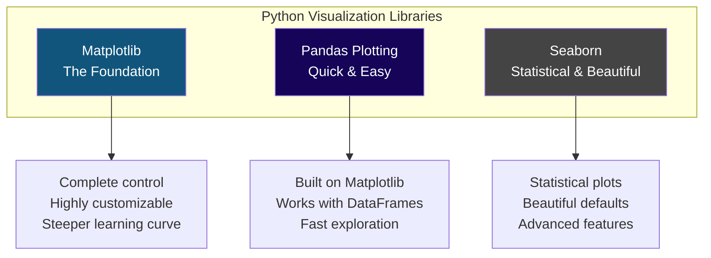
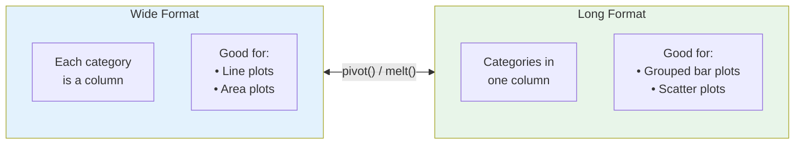
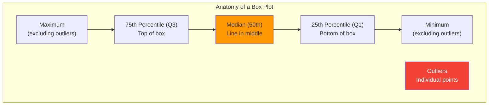
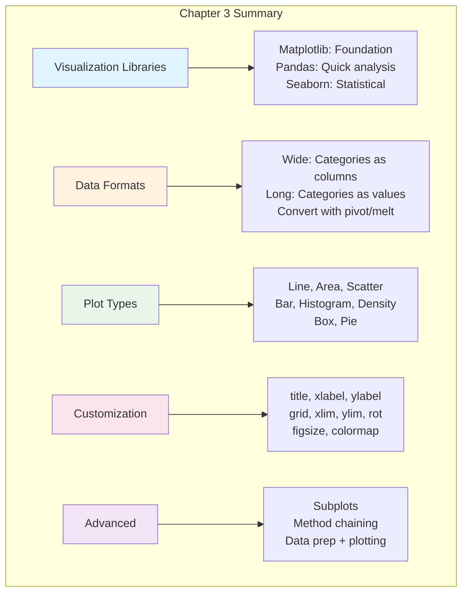

# Chapter 3: The Pandas Essentials for Data Visualization

---

## The Power of Seeing Your Data

Imagine you're Maria, our food truck entrepreneur from the earlier chapters. You've been collecting sales data for months—revenue, customer counts, weather conditions, locations. The numbers are all there in your spreadsheet, but staring at rows and columns of data isn't giving you the insights you need.

Then you create your first chart. Suddenly, the pattern jumps off the screen: sales spike every Tuesday and Wednesday, crash during spring break, and correlate strongly with partly cloudy weather. In seconds, a visualization communicates what would take paragraphs of text to explain.

That's the power of data visualization. It transforms raw numbers into stories.

In this chapter, you'll learn to create professional visualizations using Pandas' built-in plotting capabilities. These skills will help you explore your data, discover patterns, and communicate findings to others.

---

## Learning Objectives

After completing this chapter, you will be able to:

**Applied Skills:**
- Use the Pandas `plot()` method to create these types of plots: line plot, area plot, scatter plot, bar plot, histogram, density plot, box plot, and pie plot
- Use the parameters of the Pandas `plot()` method to enhance a plot: add a title, x and y labels, and grid lines; rotate tick labels; set x- and y-axis limits
- Use the parameters of the Pandas `plot()` method to create subplots
- Chain the Pandas `plot()` method to methods that prepare the data for plotting

**Knowledge:**
- List three data visualization libraries for Python
- Distinguish between long data and wide data and describe their effects on the Pandas `plot()` method
- Describe the way the Pandas `plot()` method works when no parameters are coded
- Describe these types of plots: line plot, scatter plot, bar plot, histogram, box plot

---

## 3.1 Introduction to Data Visualization in Python

### Three Visualization Libraries for Python

Python offers several powerful libraries for creating visualizations. Here are the three most important:



**Matplotlib** is the grandfather of Python visualization. It gives you complete control over every aspect of your plot, but requires more code. Think of it as the professional camera with manual settings—powerful, but you need to know what you're doing.

**Pandas Plotting** is built on top of Matplotlib but integrates directly with DataFrames. It's perfect for quick exploratory analysis. Think of it as your smartphone camera—point and shoot, great results with minimal effort.

**Seaborn** (which we'll cover in Chapter 4) specializes in statistical visualizations. It creates publication-ready plots with beautiful default styling. Think of it as a camera with smart modes that automatically adjust for portraits, landscapes, or action shots.

In this chapter, we focus on **Pandas Plotting** because:
- It works directly with your DataFrames
- It requires minimal code
- It's perfect for exploratory data analysis
- It covers most common visualization needs

### How the Pandas plot() Method Works

Every Pandas DataFrame and Series has a built-in `plot()` method. When you call it, Pandas:

1. Looks at your data structure
2. Uses the **index** as the x-axis (by default)
3. Plots each **column** as a separate line (for DataFrames)
4. Creates a Matplotlib figure behind the scenes

```python
import pandas as pd
import matplotlib.pyplot as plt

# Create sample data
sales = pd.DataFrame({
    'FIU': [850, 920, 780, 1050, 900],
    'Brickell': [920, 1100, 850, 1200, 980],
    'Wynwood': [750, 820, 700, 950, 880]
}, index=['Mon', 'Tue', 'Wed', 'Thu', 'Fri'])

# Simplest possible plot - just call .plot()
sales.plot()
plt.show()
```

With no parameters, Pandas:
- Creates a **line plot** (the default)
- Uses the index (Mon, Tue, Wed...) as the x-axis
- Plots each column (FIU, Brickell, Wynwood) as a separate line
- Automatically adds a legend
- Chooses colors automatically

### Long Data vs Wide Data

Understanding the difference between **long** and **wide** data formats is crucial for effective visualization.



#### Wide Format

In wide format, each category gets its own column:

```python
# Wide format - categories as columns
sales_wide = pd.DataFrame({
    'FIU': [850, 920, 780, 1050, 900],
    'Brickell': [920, 1100, 850, 1200, 980],
    'Wynwood': [750, 820, 700, 950, 880]
}, index=['Mon', 'Tue', 'Wed', 'Thu', 'Fri'])

print(sales_wide)
```

Output:
```
      FIU  Brickell  Wynwood
Mon   850       920      750
Tue   920      1100      820
Wed   780       850      700
Thu  1050      1200      950
Fri   900       980      880
```

When you call `sales_wide.plot()`, each column becomes a separate line.

#### Long Format

In long format, categories are values in a single column:

```python
# Long format - categories as values
sales_long = pd.DataFrame({
    'day': ['Mon', 'Mon', 'Mon', 'Tue', 'Tue', 'Tue', 'Wed', 'Wed', 'Wed'],
    'location': ['FIU', 'Brickell', 'Wynwood', 'FIU', 'Brickell', 'Wynwood', 
                 'FIU', 'Brickell', 'Wynwood'],
    'revenue': [850, 920, 750, 920, 1100, 820, 780, 850, 700]
})

print(sales_long)
```

Output:
```
   day  location  revenue
0  Mon       FIU      850
1  Mon  Brickell      920
2  Mon   Wynwood      750
3  Tue       FIU      920
4  Tue  Brickell     1100
5  Tue   Wynwood      820
...
```

Long format is often better for certain operations (groupby, statistical analysis), but for simple line plots, you typically need to pivot to wide format first.

#### Converting Between Formats

```python
# Long to Wide
sales_wide = sales_long.pivot(index='day', columns='location', values='revenue')

# Wide to Long
sales_long = sales_wide.reset_index().melt(
    id_vars=['day'], 
    var_name='location', 
    value_name='revenue'
)
```

---

## 3.2 Creating Different Types of Plots

Let's explore each plot type with practical examples. First, let's set up our data:

```python
import pandas as pd
import numpy as np
import matplotlib.pyplot as plt

# Set a clean style
plt.style.use('seaborn-v0_8-whitegrid')

# Create our sample datasets
np.random.seed(42)

# Daily sales data (wide format)
days = ['Mon', 'Tue', 'Wed', 'Thu', 'Fri', 'Sat', 'Sun']
sales_wide = pd.DataFrame({
    'FIU': [850, 920, 780, 1050, 900, 1100, 650],
    'Brickell': [920, 1100, 850, 1200, 980, 1350, 780],
    'Wynwood': [750, 820, 700, 950, 880, 1050, 600]
}, index=days)

# Monthly trend data
months = pd.date_range('2023-01-01', periods=12, freq='M')
monthly_sales = pd.DataFrame({
    'revenue': [28500, 31200, 35800, 38500, 42000, 45500, 
                48000, 46500, 41000, 38000, 35500, 42000],
    'customers': [1450, 1580, 1720, 1850, 2100, 2250,
                  2380, 2300, 2050, 1900, 1780, 2100]
}, index=months)
```

### Line Plots

**What they show**: Trends over time or continuous data

**When to use**: When you want to see how values change across a sequence (usually time)

**In Miami terms**: Perfect for tracking sales trends across weeks, months, or years

```python
# Basic line plot
sales_wide.plot()
plt.title('Daily Revenue by Location')
plt.ylabel('Revenue ($)')
plt.show()

# Line plot with kind parameter (explicit)
sales_wide.plot(kind='line')
plt.show()

# Plot specific columns only
sales_wide.plot(y=['FIU', 'Brickell'])
plt.show()

# Plot from a Series
sales_wide['FIU'].plot()
plt.title('FIU Location Daily Revenue')
plt.show()
```

### Area Plots

**What they show**: Cumulative totals and proportions over time

**When to use**: When you want to show how parts contribute to a whole over a sequence

**In Miami terms**: Great for showing how each location contributes to total revenue

```python
# Stacked area plot (default)
sales_wide.plot.area()
plt.title('Revenue by Location (Stacked)')
plt.ylabel('Revenue ($)')
plt.show()

# Unstacked area plot
sales_wide.plot.area(stacked=False, alpha=0.5)
plt.title('Revenue by Location (Unstacked)')
plt.ylabel('Revenue ($)')
plt.show()
```

The `alpha=0.5` parameter makes the areas semi-transparent so you can see overlapping regions.

### Scatter Plots

**What they show**: Relationship between two numeric variables

**When to use**: When you want to see if two variables are correlated

**In Miami terms**: Does higher temperature mean more ice cream sales? A scatter plot will show you.

```python
# Create data with two numeric variables
np.random.seed(42)
weather_sales = pd.DataFrame({
    'temperature': np.random.uniform(75, 95, 50),
    'humidity': np.random.uniform(60, 90, 50),
    'revenue': np.random.uniform(600, 1400, 50)
})

# Add some correlation
weather_sales['revenue'] = weather_sales['revenue'] - (weather_sales['humidity'] - 75) * 10

# Basic scatter plot - MUST specify x and y
weather_sales.plot.scatter(x='temperature', y='revenue')
plt.title('Temperature vs Revenue')
plt.show()

# Scatter plot with color based on third variable
weather_sales.plot.scatter(x='temperature', y='revenue', c='humidity', 
                           colormap='coolwarm', alpha=0.7)
plt.title('Temperature vs Revenue (colored by humidity)')
plt.show()
```

**Important**: Scatter plots REQUIRE the `x` and `y` parameters. Unlike line plots, Pandas can't guess what you want on each axis.

**Note**: If your x-axis variable is in the index (not a column), you'll get an error. Reset the index first: `df.reset_index().plot.scatter(x='old_index', y='value')`

### Bar Plots

**What they show**: Comparison of values across categories

**When to use**: When you want to compare discrete categories

**In Miami terms**: Comparing sales across different locations, or revenue by cuisine type

```python
# Sample data for bar plots
restaurants = pd.DataFrame({
    'revenue': [125000, 98000, 87000, 72000, 65000],
    'reviews': [12500, 8200, 6100, 4500, 3200]
}, index=['Versailles', 'La Carreta', "Sergio's", 'El Palacio', 'Havana Harry\'s'])

# Vertical bar plot
restaurants['revenue'].plot.bar()
plt.title('Restaurant Revenue Comparison')
plt.ylabel('Annual Revenue ($)')
plt.show()

# Horizontal bar plot (great for long category names)
restaurants['revenue'].plot.barh()
plt.title('Restaurant Revenue Comparison')
plt.xlabel('Annual Revenue ($)')
plt.show()

# Grouped bar plot (multiple columns)
restaurants.plot.bar()
plt.title('Restaurant Metrics')
plt.show()

# Stacked bar plot
restaurants.plot.bar(stacked=True)
plt.title('Restaurant Metrics (Stacked)')
plt.show()
```

### Histograms

**What they show**: Distribution of a single numeric variable

**When to use**: When you want to understand how values are spread out—where most values fall, if there are outliers, if the distribution is symmetric

**In Miami terms**: What's the typical daily revenue? Are there many high-revenue days or just a few?

```python
# Create sample revenue data
np.random.seed(42)
daily_revenue = pd.DataFrame({
    'revenue': np.random.normal(900, 150, 200)  # Mean=900, Std=150, n=200
})

# Basic histogram
daily_revenue.plot.hist(y='revenue')
plt.title('Distribution of Daily Revenue')
plt.xlabel('Revenue ($)')
plt.show()

# Histogram with custom bins
daily_revenue.plot.hist(y='revenue', bins=15)
plt.title('Distribution of Daily Revenue (15 bins)')
plt.xlabel('Revenue ($)')
plt.show()

# Histogram with bin edges specified
daily_revenue.plot.hist(y='revenue', bins=[500, 700, 800, 900, 1000, 1100, 1300])
plt.title('Distribution of Daily Revenue (Custom Bins)')
plt.xlabel('Revenue ($)')
plt.show()
```

**Understanding histograms:**
- The x-axis shows value ranges (bins)
- The y-axis shows frequency (count) or density
- Tall bars = many values in that range
- The shape reveals the distribution: symmetric, skewed, bimodal, etc.

### Density Plots

**What they show**: Smoothed version of a histogram (probability distribution)

**When to use**: When you want a cleaner view of distribution shape, or to compare multiple distributions

**In Miami terms**: Comparing the revenue distributions of different locations

```python
# Basic density plot (KDE - Kernel Density Estimation)
daily_revenue.plot.density(y='revenue')
plt.title('Revenue Distribution (Density)')
plt.xlabel('Revenue ($)')
plt.show()

# Compare distributions across locations
location_revenue = pd.DataFrame({
    'FIU': np.random.normal(850, 120, 200),
    'Brickell': np.random.normal(1050, 150, 200),
    'Wynwood': np.random.normal(800, 100, 200)
})

location_revenue.plot.density()
plt.title('Revenue Distribution by Location')
plt.xlabel('Revenue ($)')
plt.show()
```

### Box Plots

**What they show**: Summary statistics and outliers in a compact format

**When to use**: When you want to compare distributions across categories, especially to identify outliers

**In Miami terms**: Comparing revenue variability across locations or days of the week

```python
# Box plot comparing locations
location_revenue.plot.box()
plt.title('Revenue Distribution by Location')
plt.ylabel('Revenue ($)')
plt.show()
```

**Reading a box plot:**



- **Box**: Shows the interquartile range (IQR) - the middle 50% of data
- **Line in the box**: The median
- **Whiskers**: Extend to show the range (usually 1.5 × IQR)
- **Points beyond whiskers**: Outliers

### Pie Plots

**What they show**: Proportions of a whole

**When to use**: When you want to show how parts add up to 100%

**In Miami terms**: What percentage of total revenue comes from each location?

```python
# Calculate total revenue by location
total_by_location = sales_wide.sum()

# Basic pie plot
total_by_location.plot.pie()
plt.title('Revenue Share by Location')
plt.ylabel('')  # Remove default ylabel
plt.show()

# Pie plot with percentages
total_by_location.plot.pie(autopct='%.1f%%')
plt.title('Revenue Share by Location')
plt.ylabel('')
plt.show()
```

**Pie chart caution**: Pie charts are often overused. They work well for:
- Showing parts of a whole (percentages that sum to 100%)
- Small number of categories (3-6)
- When the exact comparison isn't critical

For precise comparisons, bar charts are usually better.

---

## 3.3 Enhancing Plots with Parameters

The `plot()` method accepts many parameters to customize your visualizations.

### Adding Titles and Labels

```python
sales_wide.plot(
    title='Daily Revenue by Food Truck Location',
    xlabel='Day of Week',
    ylabel='Revenue ($)'
)
plt.show()
```

### Adding Grid Lines

```python
sales_wide.plot(
    title='Daily Revenue by Food Truck Location',
    grid=True
)
plt.show()
```

### Setting Axis Limits

```python
sales_wide.plot(
    title='Daily Revenue by Food Truck Location',
    ylim=(0, 1500)  # Set y-axis from 0 to 1500
)
plt.show()

# For x-axis limits (less common)
monthly_sales['revenue'].plot(
    xlim=('2023-03-01', '2023-09-01')
)
plt.show()
```

### Rotating Tick Labels

When category names are long, rotate them to prevent overlap:

```python
restaurants['revenue'].plot.bar(
    title='Restaurant Revenue',
    rot=45  # Rotate x-axis labels 45 degrees
)
plt.tight_layout()  # Adjust spacing to fit labels
plt.show()

# For very long labels, use horizontal bar instead
restaurants['revenue'].plot.barh(
    title='Restaurant Revenue'
)
plt.tight_layout()
plt.show()
```

### Setting Figure Size

```python
sales_wide.plot(
    title='Daily Revenue by Location',
    figsize=(12, 6)  # Width=12 inches, Height=6 inches
)
plt.show()
```

### Customizing Colors and Styles

```python
# Using a colormap
sales_wide.plot(
    title='Daily Revenue by Location',
    colormap='viridis'  # Try: 'plasma', 'coolwarm', 'Set2', 'tab10'
)
plt.show()

# Specifying exact colors
sales_wide.plot(
    title='Daily Revenue by Location',
    color=['#FF6B6B', '#4ECDC4', '#45B7D1']  # Custom hex colors
)
plt.show()

# Line styles
sales_wide.plot(
    style=['--', '-.', ':']  # Dashed, dash-dot, dotted
)
plt.show()
```

### Complete Example with Multiple Parameters

```python
sales_wide.plot(
    kind='line',
    title='Weekly Revenue by Food Truck Location\nMiami-Dade County, 2024',
    xlabel='Day of Week',
    ylabel='Revenue ($)',
    figsize=(10, 6),
    grid=True,
    ylim=(0, 1500),
    style=['o-', 's--', '^:'],  # Different markers and line styles
    colormap='Set2',
    legend=True
)
plt.tight_layout()
plt.show()
```

---

## 3.4 Creating Subplots

Sometimes you want to display multiple related plots together. Subplots let you do this.

### Using the subplots Parameter

The simplest way to create subplots in Pandas is with the `subplots=True` parameter:

```python
# Each column becomes its own subplot
sales_wide.plot(
    subplots=True,
    figsize=(10, 8),
    title='Revenue by Location'
)
plt.tight_layout()
plt.show()
```

### Controlling Subplot Layout

```python
# Arrange subplots in a specific layout
sales_wide.plot(
    subplots=True,
    layout=(1, 3),  # 1 row, 3 columns
    figsize=(14, 4),
    sharey=True  # Share the y-axis scale
)
plt.tight_layout()
plt.show()

# 3 rows, 1 column
sales_wide.plot(
    subplots=True,
    layout=(3, 1),
    figsize=(8, 10),
    sharex=True
)
plt.tight_layout()
plt.show()
```

### Multiple Plot Types in Subplots

For more control, create the subplot grid first with Matplotlib:

```python
# Create a figure with 2x2 subplots
fig, axes = plt.subplots(2, 2, figsize=(12, 10))

# Plot 1: Line plot
sales_wide.plot(ax=axes[0, 0], title='Daily Trends')

# Plot 2: Bar plot
sales_wide.sum().plot.bar(ax=axes[0, 1], title='Total by Location')

# Plot 3: Box plot  
sales_wide.plot.box(ax=axes[1, 0], title='Distribution')

# Plot 4: Area plot
sales_wide.plot.area(ax=axes[1, 1], title='Stacked Revenue')

plt.tight_layout()
plt.show()
```

The key is the `ax` parameter, which tells Pandas which subplot to use.

---

## 3.5 Chaining Plot Methods with Data Preparation

One of Pandas' most powerful features is method chaining—combining data preparation and plotting in a single expression.

### Basic Chaining Pattern

```python
# Instead of this:
grouped = sales_long.groupby('day')['revenue'].mean()
grouped.plot.bar()

# You can chain like this:
sales_long.groupby('day')['revenue'].mean().plot.bar()
plt.title('Average Revenue by Day')
plt.show()
```

### Common Chaining Patterns

#### Filter then Plot

```python
# Plot only weekdays
sales_wide.loc[['Mon', 'Tue', 'Wed', 'Thu', 'Fri']].plot()
plt.title('Weekday Revenue')
plt.show()

# Using query for long-form data
sales_long.query('location == "FIU"').plot.scatter(x='day', y='revenue')
plt.show()
```

#### Group, Aggregate, then Plot

```python
# Average by category
(sales_long
 .groupby('location')['revenue']
 .mean()
 .plot.bar(title='Average Revenue by Location'))
plt.show()

# Multiple aggregations
(sales_long
 .groupby('location')['revenue']
 .agg(['mean', 'std'])
 .plot.bar(title='Revenue: Mean and Std Dev'))
plt.show()
```

#### Sort then Plot

```python
# Sort values before plotting bar chart
(restaurants['revenue']
 .sort_values(ascending=True)
 .plot.barh(title='Restaurants by Revenue'))
plt.show()

# Top N values
(restaurants['revenue']
 .nlargest(3)
 .plot.bar(title='Top 3 Restaurants'))
plt.show()
```

#### Pivot then Plot

```python
# Convert long to wide, then plot
(sales_long
 .pivot(index='day', columns='location', values='revenue')
 .plot(title='Revenue by Day and Location'))
plt.show()
```

### Complex Chaining Example

Here's a realistic analysis workflow in a single chain:

```python
# Load data, filter, group, aggregate, sort, and plot
(pd.read_csv('food_truck_sales.csv')
 .query('year == 2024')
 .groupby('location')['revenue']
 .sum()
 .sort_values(ascending=False)
 .plot.bar(
     title='2024 Total Revenue by Location',
     ylabel='Total Revenue ($)',
     color='steelblue'
 ))
plt.tight_layout()
plt.show()
```

This single statement:
1. Reads a CSV file
2. Filters to 2024 data only
3. Groups by location
4. Sums the revenue
5. Sorts highest to lowest
6. Creates a bar plot with customizations

---

## 3.6 Summary of Plot Types

Here's a quick reference for when to use each plot type:

| Plot Type | Use For | Example |
|-----------|---------|---------|
| **Line** | Trends over time | Sales over months |
| **Area** | Cumulative trends, parts of whole | Location contributions over time |
| **Scatter** | Relationship between 2 variables | Temperature vs. sales |
| **Bar** | Comparing categories | Revenue by location |
| **Histogram** | Distribution of one variable | How are sales values spread? |
| **Density** | Smooth distribution shape | Compare multiple distributions |
| **Box** | Distribution summary with outliers | Compare location variability |
| **Pie** | Parts of a whole (use sparingly) | Market share |

### Quick Reference: Plot Methods

```python
# All these are equivalent:
df.plot()                    # Default line plot
df.plot(kind='line')         # Explicit line plot
df.plot.line()               # Accessor syntax

# Other plot types:
df.plot.area()               # Area plot
df.plot.scatter(x='a', y='b')  # Scatter (x, y required!)
df.plot.bar()                # Vertical bars
df.plot.barh()               # Horizontal bars
df.plot.hist()               # Histogram
df.plot.density()            # Density (KDE)
df.plot.box()                # Box plot
df.plot.pie()                # Pie chart
```

---

## Chapter Summary



### Key Takeaways

1. **Three visualization libraries**: Matplotlib (foundation), Pandas plotting (quick analysis), and Seaborn (statistical).

2. **Wide vs Long data**: Wide format (categories as columns) works best for line and area plots. Long format is better for grouped analysis.

3. **Default behavior**: `plot()` with no parameters creates a line plot using the index as x-axis and columns as separate lines.

4. **Plot types for different purposes**:
   - **Line/Area**: Trends over time
   - **Scatter**: Relationships between variables
   - **Bar**: Category comparisons
   - **Histogram/Density/Box**: Distributions

5. **Key parameters**: `title`, `xlabel`, `ylabel`, `grid`, `xlim`, `ylim`, `rot`, `figsize`, `colormap`

6. **Subplots**: Use `subplots=True` or create a grid with `plt.subplots()` and pass `ax` parameter.

7. **Method chaining**: Combine data preparation (filter, group, aggregate, sort) with plotting in elegant single expressions.

---

## Practice Exercises

### Exercise 1: Basic Plots

```python
# Given this data:
sales = pd.DataFrame({
    'Week1': [850, 920, 780, 1050, 900],
    'Week2': [920, 1100, 850, 1200, 980],
    'Week3': [880, 950, 800, 1100, 920]
}, index=['Mon', 'Tue', 'Wed', 'Thu', 'Fri'])

# Create:
# 1. A basic line plot
# 2. An area plot
# 3. A bar plot showing totals for each week
```

### Exercise 2: Scatter Plots

```python
# Given data with temperature and sales:
weather_data = pd.DataFrame({
    'temperature': [75, 80, 85, 90, 95, 78, 82, 88, 92, 77],
    'humidity': [65, 70, 75, 80, 85, 68, 72, 78, 82, 66],
    'sales': [1200, 1150, 1050, 950, 800, 1180, 1100, 1000, 900, 1190]
})

# Create:
# 1. A scatter plot of temperature vs sales
# 2. A scatter plot colored by humidity
```

### Exercise 3: Distribution Plots

```python
# Given daily revenue data:
np.random.seed(42)
revenue_data = pd.DataFrame({
    'Location_A': np.random.normal(1000, 150, 100),
    'Location_B': np.random.normal(850, 200, 100),
    'Location_C': np.random.normal(1100, 100, 100)
})

# Create:
# 1. A histogram for Location_A
# 2. Overlapping density plots for all locations
# 3. Box plots comparing all locations
```

### Exercise 4: Customization

```python
# Using the sales data from Exercise 1:
# Create a line plot with:
# - Title: "Weekly Sales Performance"
# - X-axis label: "Day of Week"
# - Y-axis label: "Revenue ($)"
# - Y-axis limits: 0 to 1500
# - Grid lines enabled
# - Figure size: 10 x 6 inches
```

### Exercise 5: Subplots

```python
# Create a 2x2 subplot figure showing:
# 1. Top-left: Line plot of sales
# 2. Top-right: Bar plot of weekly totals
# 3. Bottom-left: Box plot of daily distributions
# 4. Bottom-right: Area plot
```

### Exercise 6: Method Chaining

```python
# Given long-format sales data:
sales_long = pd.DataFrame({
    'day': ['Mon', 'Mon', 'Tue', 'Tue', 'Wed', 'Wed'] * 4,
    'location': ['FIU', 'Brickell'] * 12,
    'week': [1, 1, 1, 1, 1, 1, 2, 2, 2, 2, 2, 2,
             3, 3, 3, 3, 3, 3, 4, 4, 4, 4, 4, 4],
    'revenue': np.random.uniform(700, 1200, 24)
})

# Use method chaining to:
# 1. Group by location and calculate mean revenue, then create a bar plot
# 2. Filter to FIU only, group by day, calculate sum, and create a bar plot
# 3. Pivot to wide format and create a line plot
```

---

## Quick Reference: Chapter 3 Code Patterns

```python
# === BASIC PLOTTING ===
df.plot()                           # Line plot (default)
df.plot(kind='bar')                 # Specify plot type
df.plot.bar()                       # Accessor syntax
series.plot()                       # Plot a Series

# === PLOT TYPES ===
df.plot.line()                      # Line
df.plot.area()                      # Area
df.plot.scatter(x='col1', y='col2') # Scatter (x,y required!)
df.plot.bar()                       # Vertical bar
df.plot.barh()                      # Horizontal bar
df.plot.hist(bins=10)               # Histogram
df.plot.density()                   # Density/KDE
df.plot.box()                       # Box plot
series.plot.pie()                   # Pie chart

# === COMMON PARAMETERS ===
df.plot(
    title='My Title',               # Plot title
    xlabel='X Label',               # X-axis label
    ylabel='Y Label',               # Y-axis label
    xlim=(0, 100),                  # X-axis limits
    ylim=(0, 100),                  # Y-axis limits
    grid=True,                      # Show grid
    rot=45,                         # Rotate x labels
    figsize=(10, 6),                # Figure size (w, h)
    colormap='viridis',             # Color scheme
    legend=True                     # Show legend
)

# === SUBPLOTS ===
df.plot(subplots=True)              # Each column separate
df.plot(subplots=True, layout=(2,2)) # Specific layout
fig, axes = plt.subplots(2, 2)      # Manual grid
df.plot(ax=axes[0,0])               # Plot to specific subplot

# === METHOD CHAINING ===
df.groupby('cat')['val'].mean().plot.bar()
df.query('col > 5').plot()
df.sort_values('col').plot.barh()
df.pivot(index='a', columns='b', values='c').plot()

# === FINISHING ===
plt.tight_layout()                  # Adjust spacing
plt.savefig('plot.png', dpi=150)    # Save to file
plt.show()                          # Display plot
```

---

## Glossary

| Term | Definition |
|------|------------|
| **Area Plot** | A plot where the area between the line and axis is filled |
| **Bar Plot** | A plot using rectangular bars to compare categories |
| **Box Plot** | A plot showing distribution through quartiles and outliers |
| **Colormap** | A predefined set of colors for visualization |
| **Density Plot** | A smoothed histogram showing probability distribution |
| **Histogram** | A plot showing the frequency distribution of numeric data |
| **KDE** | Kernel Density Estimation - the method behind density plots |
| **Line Plot** | A plot connecting data points with lines to show trends |
| **Long Format** | Data where categories are stored as values in a column |
| **Method Chaining** | Calling multiple methods in sequence on the same object |
| **Pie Plot** | A circular plot showing proportions of a whole |
| **Scatter Plot** | A plot showing the relationship between two numeric variables |
| **Subplot** | One of multiple plots arranged in a grid |
| **Wide Format** | Data where each category is a separate column |

---

*"The greatest value of a picture is when it forces us to notice what we never expected to see."* — John Tukey
