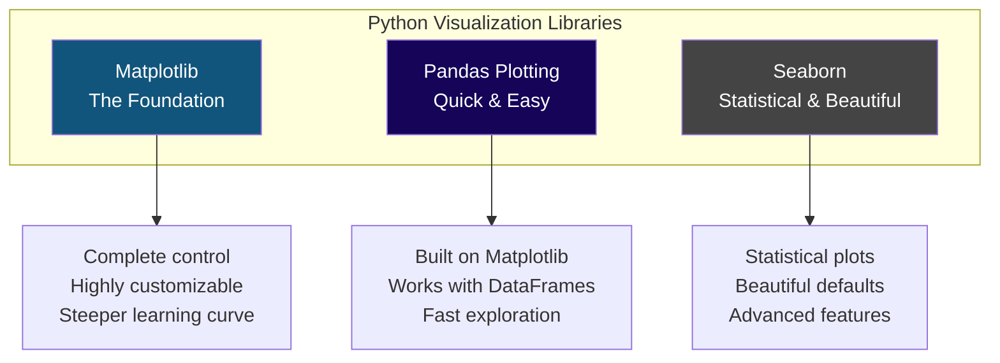
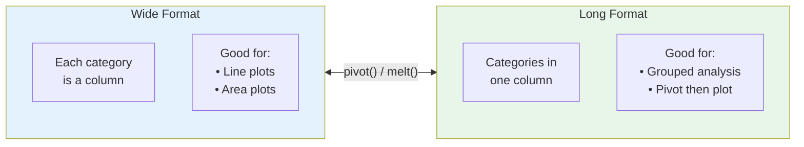
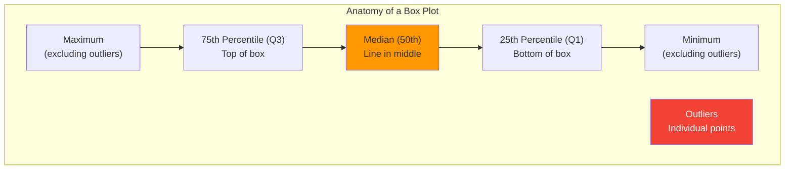
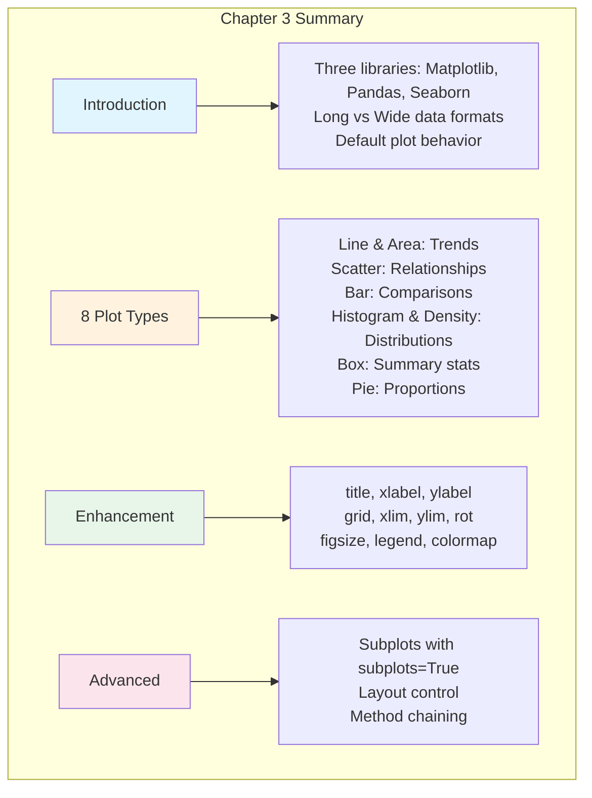

# Chapter 3: The Pandas Essentials for Data Visualization

---

## Welcome to Data Visualization

Numbers tell stories, but visualizations bring them to life. Think about Maria, our food truck entrepreneur from the earlier chapters. She's been collecting sales data for months—revenue, customer counts, weather conditions, locations. The numbers are all there in her spreadsheet, but staring at rows and columns of data isn't giving her the insights she needs.

Then she creates her first chart. Suddenly, the pattern jumps off the screen: sales spike every Tuesday and Wednesday, crash during spring break, and correlate strongly with partly cloudy weather. In seconds, a visualization communicates what would take paragraphs of text to explain.

That's the power of data visualization. It transforms raw numbers into stories that anyone can understand.

In this chapter, you'll learn to create professional visualizations using Pandas' built-in plotting capabilities. These skills will help you explore your data, discover patterns, and communicate findings to others.

---

## Learning Objectives

After completing this chapter, you will be able to:

**Applied Skills:**
- Use the Pandas `plot()` method to create these types of plots: line plot, area plot, scatter plot, bar plot, histogram, density plot, box plot, and pie plot
- Use the parameters of the Pandas `plot()` method to enhance a plot: add a title, x and y labels, and grid lines; rotate tick labels; set x- and y-axis limits
- Use the parameters of the Pandas `plot()` method to create subplots
- Chain the Pandas `plot()` method to methods that prepare the data for plotting

**Knowledge:**
- List three data visualization libraries for Python
- Distinguish between long data and wide data and describe their effects on the Pandas `plot()` method
- Describe the way the Pandas `plot()` method works when no parameters are coded
- Describe these types of plots: line plot, scatter plot, bar plot, histogram, box plot

---

## 3.1 Introduction to Data Visualization

### The Python Libraries for Data Visualization

Python offers several powerful libraries for creating visualizations. Here are the three most important:



**Matplotlib** is the grandfather of Python visualization. It gives you complete control over every aspect of your plot, but requires more code. Think of it as the professional camera with manual settings—powerful, but you need to know what you're doing.

**Pandas Plotting** is built on top of Matplotlib but integrates directly with DataFrames. It's perfect for quick exploratory analysis. Think of it as your smartphone camera—point and shoot, great results with minimal effort.

**Seaborn** (which we'll cover in Chapter 4) specializes in statistical visualizations. It creates publication-ready plots with beautiful default styling. Think of it as a camera with smart modes that automatically adjust for portraits, landscapes, or action shots.

In this chapter, we focus on **Pandas Plotting** because:
- It works directly with your DataFrames
- It requires minimal code
- It's perfect for exploratory data analysis
- It covers most common visualization needs

### Long vs. Wide Data for Data Visualization

Understanding the difference between **long** and **wide** data formats is crucial for effective visualization. The format of your data directly affects how Pandas creates plots.



#### Wide Format

In wide format, each category gets its own column. This is the format Pandas plotting prefers for most plots:

```python
import pandas as pd

# Wide format - categories as columns
sales_wide = pd.DataFrame({
    'FIU': [850, 920, 780, 1050, 900],
    'Brickell': [920, 1100, 850, 1200, 980],
    'Wynwood': [750, 820, 700, 950, 880]
}, index=['Mon', 'Tue', 'Wed', 'Thu', 'Fri'])

print(sales_wide)
```

Output:
```
      FIU  Brickell  Wynwood
Mon   850       920      750
Tue   920      1100      820
Wed   780       850      700
Thu  1050      1200      950
Fri   900       980      880
```

When you call `sales_wide.plot()`, each column becomes a separate line on the chart.

#### Long Format

In long format, categories are values in a single column. This format is common for data storage and certain types of analysis:

```python
# Long format - categories as values
sales_long = pd.DataFrame({
    'day': ['Mon', 'Mon', 'Mon', 'Tue', 'Tue', 'Tue', 'Wed', 'Wed', 'Wed'],
    'location': ['FIU', 'Brickell', 'Wynwood', 'FIU', 'Brickell', 'Wynwood', 
                 'FIU', 'Brickell', 'Wynwood'],
    'revenue': [850, 920, 750, 920, 1100, 820, 780, 850, 700]
})

print(sales_long)
```

Output:
```
   day  location  revenue
0  Mon       FIU      850
1  Mon  Brickell      920
2  Mon   Wynwood      750
3  Tue       FIU      920
4  Tue  Brickell     1100
5  Tue   Wynwood      820
...
```

To plot long-format data effectively, you typically need to pivot it to wide format first:

```python
# Convert long to wide for plotting
sales_wide = sales_long.pivot(index='day', columns='location', values='revenue')
sales_wide.plot()
```

### How the Pandas plot() Method Works by Default

The Pandas `plot()` method is smart about creating visualizations. When you call it with no parameters, it:

1. Creates a **line plot** (the default plot type)
2. Uses the **index** as the x-axis
3. Plots each **numeric column** as a separate line
4. Automatically adds a **legend** with column names
5. Chooses **colors** automatically

```python
import pandas as pd
import matplotlib.pyplot as plt

# Create sample data in wide format
sales_wide = pd.DataFrame({
    'FIU': [850, 920, 780, 1050, 900],
    'Brickell': [920, 1100, 850, 1200, 980],
    'Wynwood': [750, 820, 700, 950, 880]
}, index=['Mon', 'Tue', 'Wed', 'Thu', 'Fri'])

# Simplest possible plot - just call .plot()
sales_wide.plot()
plt.show()
```

The result: a line chart with the days of the week on the x-axis, three lines (one for each location), and a legend identifying each line.

### The Three Basic Parameters for the Pandas plot() Method

While `plot()` works with no parameters, three basic parameters give you quick control:

| Parameter | Purpose | Example |
|-----------|---------|---------|
| `kind` | Type of plot | `kind='bar'`, `kind='scatter'` |
| `x` | Column for x-axis | `x='temperature'` |
| `y` | Column for y-axis | `y='revenue'` |

```python
# Change plot type with kind
sales_wide.plot(kind='bar')

# For scatter plots, x and y are required
weather_data.plot(kind='scatter', x='temperature', y='revenue')

# Or use the accessor syntax
sales_wide.plot.bar()
weather_data.plot.scatter(x='temperature', y='revenue')
```

---

## 3.2 How to Create 8 Types of Plots

Let's explore each plot type with practical examples. First, let's set up our data:

```python
import pandas as pd
import numpy as np
import matplotlib.pyplot as plt

# Create sample datasets for our examples
np.random.seed(42)

# Daily sales data (wide format) for line/area plots
days = ['Mon', 'Tue', 'Wed', 'Thu', 'Fri', 'Sat', 'Sun']
sales_wide = pd.DataFrame({
    'FIU': [850, 920, 780, 1050, 900, 1100, 650],
    'Brickell': [920, 1100, 850, 1200, 980, 1350, 780],
    'Wynwood': [750, 820, 700, 950, 880, 1050, 600]
}, index=days)
```

### How to Create a Line Plot or an Area Plot

#### Line Plots

**What they show**: Trends over time or continuous data

**When to use**: When you want to see how values change across a sequence (usually time)

**In Miami terms**: Perfect for tracking sales trends across weeks, months, or years

```python
# Basic line plot - uses index as x-axis, each column as a line
sales_wide.plot()
plt.title('Daily Revenue by Location')
plt.ylabel('Revenue ($)')
plt.show()

# Explicit line plot
sales_wide.plot(kind='line')

# Or using accessor syntax
sales_wide.plot.line()

# Plot only specific columns
sales_wide.plot.line(y=['FIU', 'Brickell'])
```

#### Area Plots

**What they show**: Cumulative totals and proportions over time

**When to use**: When you want to show how parts contribute to a whole over a sequence

**In Miami terms**: Great for showing how each location contributes to total revenue

```python
# Stacked area plot (default)
sales_wide.plot.area()
plt.title('Revenue by Location (Stacked)')
plt.ylabel('Revenue ($)')
plt.show()

# The stacked area shows cumulative totals at each point
```

### How to Create a Scatter Plot

**What they show**: Relationship between two numeric variables

**When to use**: When you want to see if two variables are correlated

**In Miami terms**: Does higher temperature mean more ice cream sales? A scatter plot will show you.

**Important**: Scatter plots REQUIRE the `x` and `y` parameters—Pandas can't guess what you want on each axis.

```python
# Create data with two numeric variables
weather_sales = pd.DataFrame({
    'temperature': [75, 80, 85, 90, 95, 78, 82, 88, 92, 77],
    'humidity': [65, 70, 75, 80, 85, 68, 72, 78, 82, 66],
    'revenue': [1200, 1150, 1050, 950, 800, 1180, 1100, 1000, 900, 1190]
})

# Basic scatter plot - MUST specify x and y
weather_sales.plot.scatter(x='temperature', y='revenue')
plt.title('Temperature vs Revenue')
plt.show()

# This will cause an error:
# weather_sales.plot.scatter()  # Error: must have x and y parameters

# Note: If x is in the index, you'll get an error. Reset index first:
# df.reset_index().plot.scatter(x='Year', y='Value')
```

### How to Create a Bar Plot

**What they show**: Comparison of values across categories

**When to use**: When you want to compare discrete categories

**In Miami terms**: Comparing sales across different locations, or revenue by cuisine type

```python
# Sample data for bar plots
restaurants = pd.DataFrame({
    'revenue': [125000, 98000, 87000, 72000, 65000],
}, index=['Versailles', 'La Carreta', "Sergio's", 'El Palacio', 'Havana Harry\'s'])

# Vertical bar plot
restaurants.plot.bar()
plt.title('Restaurant Revenue Comparison')
plt.ylabel('Annual Revenue ($)')
plt.show()

# Horizontal bar plot (great for long category names)
restaurants.plot.barh()
plt.title('Restaurant Revenue Comparison')
plt.xlabel('Annual Revenue ($)')
plt.show()
```

For comparing multiple years or categories:

```python
# Multi-column bar data
comparison = pd.DataFrame({
    '1900': [1983.8, 466.0, 312.5, 484.5],
    '2018': [23.0, 11.5, 13.5, 42.6]
}, index=['01-04 Years', '05-09 Years', '10-14 Years', '15-19 Years'])

# Grouped bar plot
comparison.plot.bar()
plt.title('Mortality Rates: 1900 vs 2018')
plt.ylabel('Deaths per 100,000')
plt.show()
```

### How to Create a Histogram or a Density Plot

#### Histograms

**What they show**: Distribution of a single numeric variable

**When to use**: When you want to understand how values are spread out—where most values fall, if there are outliers, if the distribution is symmetric

**In Miami terms**: What's the typical daily revenue? Are there many high-revenue days or just a few?

```python
# Create sample revenue data
np.random.seed(42)
daily_data = pd.DataFrame({
    'revenue': np.random.normal(900, 150, 200)  # Mean=900, Std=150, n=200
})

# Basic histogram
daily_data.plot.hist(y='revenue')
plt.title('Distribution of Daily Revenue')
plt.xlabel('Revenue ($)')
plt.show()

# Histogram with custom number of bins
daily_data.plot.hist(y='revenue', bins=15)
plt.title('Distribution of Daily Revenue (15 bins)')
plt.xlabel('Revenue ($)')
plt.show()
```

**Understanding histograms:**
- The x-axis shows value ranges (bins)
- The y-axis shows frequency (count)
- Tall bars = many values in that range
- The shape reveals the distribution: symmetric, skewed, bimodal, etc.

#### Density Plots

**What they show**: Smoothed version of a histogram (probability distribution)

**When to use**: When you want a cleaner view of distribution shape, or to compare multiple distributions

```python
# Basic density plot (KDE - Kernel Density Estimation)
daily_data.plot.density(y='revenue')
plt.title('Revenue Distribution (Density)')
plt.xlabel('Revenue ($)')
plt.show()

# Compare distributions across locations
location_revenue = pd.DataFrame({
    'FIU': np.random.normal(850, 120, 200),
    'Brickell': np.random.normal(1050, 150, 200),
    'Wynwood': np.random.normal(800, 100, 200)
})

# Multiple density curves on same plot
location_revenue.plot.density()
plt.title('Revenue Distribution by Location')
plt.xlabel('Revenue ($)')
plt.show()
```

### How to Create a Box Plot or a Pie Plot

#### Box Plots

**What they show**: Summary statistics and outliers in a compact format

**When to use**: When you want to compare distributions across categories, especially to identify outliers

**In Miami terms**: Comparing revenue variability across locations or days of the week

```python
# Box plot comparing locations
location_revenue.plot.box()
plt.title('Revenue Distribution by Location')
plt.ylabel('Revenue ($)')
plt.show()
```

**Reading a box plot:**



- **Box**: Shows the interquartile range (IQR) - the middle 50% of data
- **Line in the box**: The median (50th percentile)
- **Whiskers**: Extend to show the range (usually 1.5 × IQR from the box)
- **Points beyond whiskers**: Outliers

#### Pie Plots

**What they show**: Proportions of a whole

**When to use**: When you want to show how parts add up to 100%

**In Miami terms**: What percentage of total revenue comes from each location?

```python
# Calculate total revenue by location
total_by_location = sales_wide.sum()

# Basic pie plot
total_by_location.plot.pie()
plt.title('Revenue Share by Location')
plt.ylabel('')  # Remove default ylabel
plt.show()
```

**Pie chart caution**: Pie charts are often overused and can be hard to read. They work best for:
- Showing parts of a whole (percentages that sum to 100%)
- Small number of categories (3-6)
- When exact comparison isn't critical

For precise comparisons, bar charts are usually better.

---

## 3.3 How to Enhance a Plot

### How to Improve the Appearance of a Plot

The `plot()` method accepts many parameters to customize your visualizations. Here are the most important ones:

#### Adding Titles and Labels

```python
sales_wide.plot(
    title='Daily Revenue by Food Truck Location',
    xlabel='Day of Week',
    ylabel='Revenue ($)'
)
plt.show()
```

#### Adding Grid Lines

```python
sales_wide.plot(
    title='Daily Revenue by Food Truck Location',
    grid=True
)
plt.show()
```

#### Rotating Tick Labels

When category names are long, rotate them to prevent overlap:

```python
restaurants.plot.bar(
    title='Restaurant Revenue',
    rot=45  # Rotate x-axis labels 45 degrees
)
plt.tight_layout()  # Adjust spacing to fit labels
plt.show()
```

#### Setting Axis Limits

```python
sales_wide.plot(
    title='Daily Revenue by Food Truck Location',
    xlim=(0, 6),      # X-axis limits
    ylim=(0, 1500)    # Y-axis limits
)
plt.show()
```

#### Complete Example with Multiple Parameters

```python
sales_wide.plot(
    kind='line',
    title='Weekly Revenue by Food Truck Location\nMiami-Dade County, 2024',
    xlabel='Day of Week',
    ylabel='Revenue ($)',
    grid=True,
    ylim=(0, 1500),
    rot=0,
    legend=True
)
plt.tight_layout()
plt.show()
```

### Common Enhancement Parameters

| Parameter | Purpose | Example Values |
|-----------|---------|----------------|
| `title` | Plot title | `'My Title'` |
| `xlabel` | X-axis label | `'Day of Week'` |
| `ylabel` | Y-axis label | `'Revenue ($)'` |
| `xlim` | X-axis limits | `(0, 100)` |
| `ylim` | Y-axis limits | `(0, 1500)` |
| `grid` | Show grid lines | `True`, `False` |
| `rot` | Rotate x labels | `0`, `45`, `90` |
| `figsize` | Figure size | `(10, 6)` |
| `legend` | Show legend | `True`, `False` |
| `colormap` | Color scheme | `'viridis'`, `'Set2'` |

### How to Work with Subplots

Sometimes you want to display multiple related plots together. Subplots let you do this.

#### Using the subplots Parameter

The simplest way to create subplots in Pandas is with the `subplots=True` parameter:

```python
# Each column becomes its own subplot
sales_wide.plot(
    subplots=True,
    figsize=(10, 8),
    title='Revenue by Location'
)
plt.tight_layout()
plt.show()
```

#### Controlling Subplot Layout

```python
# Arrange subplots in a specific layout
sales_wide.plot(
    subplots=True,
    layout=(1, 3),  # 1 row, 3 columns
    figsize=(14, 4),
    sharey=True  # Share the y-axis scale
)
plt.tight_layout()
plt.show()

# 3 rows, 1 column
sales_wide.plot(
    subplots=True,
    layout=(3, 1),
    figsize=(8, 10),
    sharex=True
)
plt.tight_layout()
plt.show()
```

#### Multiple Plot Types Using ax Parameter

For more control, create the subplot grid first with Matplotlib:

```python
# Create a figure with 2x2 subplots
fig, axes = plt.subplots(2, 2, figsize=(12, 10))

# Plot 1: Line plot
sales_wide.plot(ax=axes[0, 0], title='Daily Trends')

# Plot 2: Bar plot
sales_wide.sum().plot.bar(ax=axes[0, 1], title='Total by Location')

# Plot 3: Box plot  
sales_wide.plot.box(ax=axes[1, 0], title='Distribution')

# Plot 4: Area plot
sales_wide.plot.area(ax=axes[1, 1], title='Stacked Revenue')

plt.tight_layout()
plt.show()
```

The key is the `ax` parameter, which tells Pandas which subplot to use.

### How to Use Chaining to Get the Plots You Want

One of Pandas' most powerful features is method chaining—combining data preparation and plotting in a single expression.

#### Basic Chaining Pattern

```python
# Instead of this:
grouped = sales_long.groupby('day')['revenue'].mean()
grouped.plot.bar()

# You can chain like this:
sales_long.groupby('day')['revenue'].mean().plot.bar()
plt.title('Average Revenue by Day')
plt.show()
```

#### Common Chaining Patterns

**Query then Plot:**
```python
# Filter to specific years and create scatter plot
mortality_data.query('AgeGroup == "01-04 Years"') \
    .plot.scatter(x='Year', y='DeathRate')
plt.show()
```

**Pivot then Plot:**
```python
# Convert long to wide, then plot
mortality_data.pivot(index='Year', columns='AgeGroup', values='DeathRate') \
    .plot()
plt.title('Death Rates by Age Group Over Time')
plt.show()
```

**Query, Pivot, then Plot:**
```python
# Complex chain: filter years, pivot, then horizontal bar
mortality_data.query('Year in (1900, 2018)') \
    .pivot(index='AgeGroup', columns='Year', values='DeathRate') \
    .plot.barh()
plt.title('Mortality Comparison: 1900 vs 2018')
plt.show()
```

**Group, Aggregate, then Plot:**
```python
# Average by category then plot
sales_long.groupby('location')['revenue'] \
    .mean() \
    .plot.bar(title='Average Revenue by Location')
plt.show()

# Multiple aggregations then plot
mortality_data.groupby('Year')['DeathRate'] \
    .agg(['mean', 'median', 'std']) \
    .plot(ylabel='Deaths per 100,000')
plt.show()
```

#### Chaining Best Practices

1. **Use backslash `\` for line continuation** to keep chains readable
2. **Start simple**, then add more steps
3. **Check intermediate results** by breaking the chain
4. **Name complex chains** when reusing

```python
# Complex workflow in a single chain
(mortality_data
 .query('Year >= 2000')
 .pivot(index='Year', columns='AgeGroup', values='DeathRate')
 .plot(
     title='Child Mortality: 2000-2018',
     xlabel='Year',
     ylabel='Deaths per 100,000',
     grid=True,
     xlim=(2000, 2018)
 ))
plt.tight_layout()
plt.show()
```

---

## Chapter Summary



### Key Takeaways

1. **Three visualization libraries**: Matplotlib (foundation), Pandas plotting (quick analysis), and Seaborn (statistical visualizations).

2. **Wide vs Long data**: Wide format (categories as columns) works directly with `plot()`. Long format needs to be pivoted first.

3. **Default behavior**: `plot()` with no parameters creates a line plot using the index as x-axis and columns as separate lines.

4. **8 plot types for different purposes**:
   - **Line/Area**: Trends over time
   - **Scatter**: Relationships between two variables (requires x and y)
   - **Bar/Barh**: Category comparisons
   - **Histogram/Density**: Distributions
   - **Box**: Summary statistics with outliers
   - **Pie**: Parts of a whole

5. **Key enhancement parameters**: `title`, `xlabel`, `ylabel`, `grid`, `xlim`, `ylim`, `rot`

6. **Subplots**: Use `subplots=True` or create a grid with `plt.subplots()` and pass `ax` parameter.

7. **Method chaining**: Combine `query()`, `pivot()`, `groupby()`, and `plot()` in elegant single expressions.

---

## Practice Exercises

### Exercise 1: Basic Plots

```python
# Given this data:
sales = pd.DataFrame({
    'Week1': [850, 920, 780, 1050, 900],
    'Week2': [920, 1100, 850, 1200, 980],
    'Week3': [880, 950, 800, 1100, 920]
}, index=['Mon', 'Tue', 'Wed', 'Thu', 'Fri'])

# Create:
# 1. A basic line plot
# 2. An area plot
# 3. A bar plot showing totals for each week
```

### Exercise 2: Scatter Plots

```python
# Given data with temperature and sales:
weather_data = pd.DataFrame({
    'temperature': [75, 80, 85, 90, 95, 78, 82, 88, 92, 77],
    'humidity': [65, 70, 75, 80, 85, 68, 72, 78, 82, 66],
    'sales': [1200, 1150, 1050, 950, 800, 1180, 1100, 1000, 900, 1190]
})

# Create:
# 1. A scatter plot of temperature vs sales
# 2. Why would this fail: weather_data.plot.scatter()
```

### Exercise 3: Distribution Plots

```python
# Given daily revenue data:
np.random.seed(42)
revenue_data = pd.DataFrame({
    'Location_A': np.random.normal(1000, 150, 100),
    'Location_B': np.random.normal(850, 200, 100),
    'Location_C': np.random.normal(1100, 100, 100)
})

# Create:
# 1. A histogram for Location_A with 10 bins
# 2. Overlapping density plots for all locations
# 3. Box plots comparing all locations
```

### Exercise 4: Customization

```python
# Using the sales data from Exercise 1:
# Create a line plot with:
# - Title: "Weekly Sales Performance"
# - X-axis label: "Day of Week"
# - Y-axis label: "Revenue ($)"
# - Y-axis limits: 0 to 1500
# - Grid lines enabled
```

### Exercise 5: Subplots

```python
# Create a figure with 4 subplots (2x2) showing:
# 1. Top-left: Line plot of sales
# 2. Top-right: Bar plot of weekly totals
# 3. Bottom-left: Box plot of daily distributions
# 4. Bottom-right: Area plot
```

### Exercise 6: Method Chaining

```python
# Given long-format data:
sales_long = pd.DataFrame({
    'day': ['Mon', 'Mon', 'Tue', 'Tue', 'Wed', 'Wed'] * 2,
    'location': ['FIU', 'Brickell'] * 6,
    'week': [1, 1, 1, 1, 1, 1, 2, 2, 2, 2, 2, 2],
    'revenue': [850, 920, 920, 1100, 780, 850, 880, 950, 900, 1050, 800, 900]
})

# Use method chaining to:
# 1. Group by location and calculate mean revenue, then create a bar plot
# 2. Filter to FIU only, group by day, and create a bar plot
# 3. Pivot to wide format and create a line plot
```

---

## Quick Reference: Chapter 3 Code Patterns

```python
# === BASIC PLOTTING ===
df.plot()                           # Line plot (default)
df.plot(kind='bar')                 # Specify plot type
df.plot.bar()                       # Accessor syntax
series.plot()                       # Plot a Series

# === 8 PLOT TYPES ===
df.plot.line()                      # Line plot
df.plot.area()                      # Area plot
df.plot.scatter(x='col1', y='col2') # Scatter (x, y required!)
df.plot.bar()                       # Vertical bar
df.plot.barh()                      # Horizontal bar
df.plot.hist(bins=10)               # Histogram
df.plot.density()                   # Density (KDE)
df.plot.box()                       # Box plot
series.plot.pie()                   # Pie chart

# === ENHANCEMENT PARAMETERS ===
df.plot(
    title='My Title',               # Plot title
    xlabel='X Label',               # X-axis label
    ylabel='Y Label',               # Y-axis label
    xlim=(0, 100),                  # X-axis limits
    ylim=(0, 100),                  # Y-axis limits
    grid=True,                      # Show grid
    rot=45,                         # Rotate x labels
    figsize=(10, 6),                # Figure size (w, h)
    legend=True                     # Show legend
)

# === SUBPLOTS ===
df.plot(subplots=True)              # Each column separate
df.plot(subplots=True, layout=(2,2)) # Specific layout
df.plot(subplots=True, sharey=True)  # Shared y-axis

# Manual subplot grid:
fig, axes = plt.subplots(2, 2)      
df.plot(ax=axes[0,0])               # Plot to specific subplot

# === METHOD CHAINING ===
df.query('col > 5').plot()
df.pivot(index='a', columns='b', values='c').plot()
df.groupby('cat')['val'].mean().plot.bar()
df.groupby('cat')['val'].agg(['mean','std']).plot()

# === FINISHING ===
plt.tight_layout()                  # Adjust spacing
plt.savefig('plot.png', dpi=150)    # Save to file
plt.show()                          # Display plot
```

---

## Glossary

| Term | Definition |
|------|------------|
| **Area Plot** | A plot where the area between the line and axis is filled, often stacked |
| **Bar Plot** | A plot using rectangular bars to compare categories |
| **Box Plot** | A plot showing distribution through quartiles and outliers |
| **Density Plot** | A smoothed histogram showing probability distribution (KDE) |
| **Histogram** | A plot showing the frequency distribution of numeric data using bins |
| **KDE** | Kernel Density Estimation - the statistical method behind density plots |
| **Line Plot** | A plot connecting data points with lines to show trends |
| **Long Format** | Data where categories are stored as values in a column |
| **Method Chaining** | Calling multiple methods in sequence on the same object |
| **Pie Plot** | A circular plot showing proportions of a whole |
| **Scatter Plot** | A plot showing the relationship between two numeric variables |
| **Subplot** | One of multiple plots arranged in a grid |
| **Wide Format** | Data where each category is a separate column |

---

*"The greatest value of a picture is when it forces us to notice what we never expected to see."* — John Tukey
