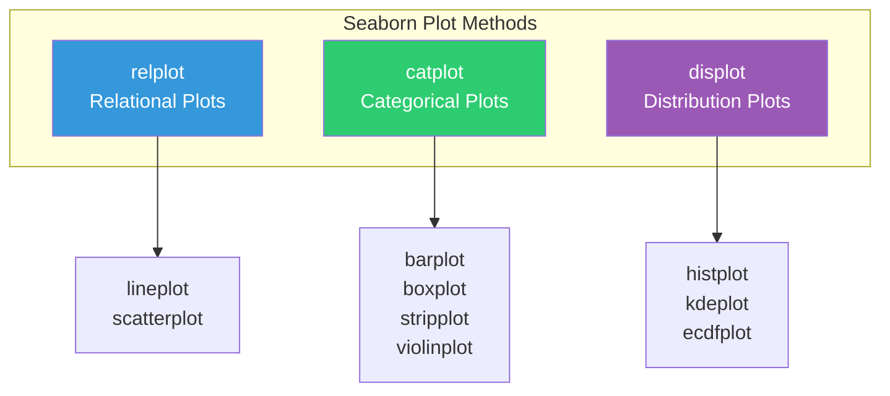
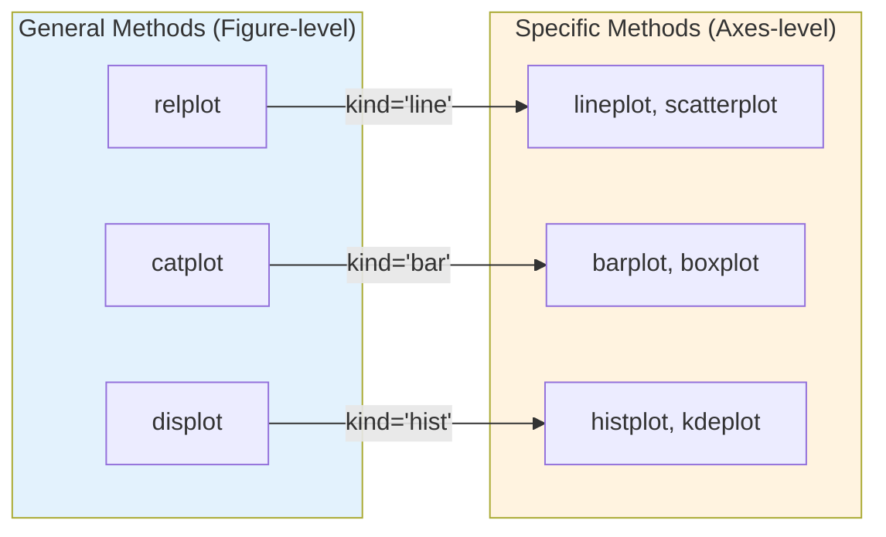
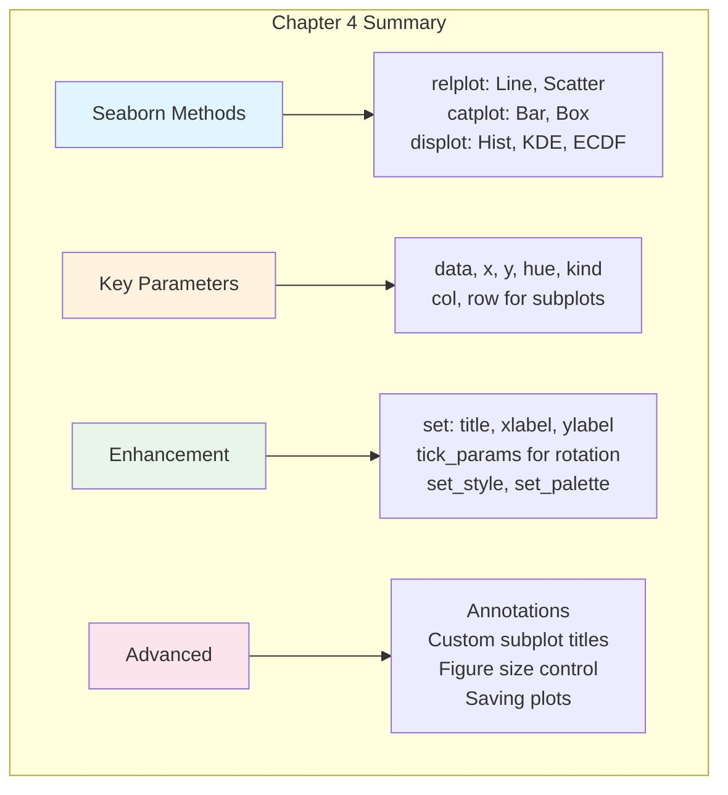

# Chapter 4: The Seaborn Essentials for Data Visualization

---

## Welcome to Seaborn: Statistical Visualization Made Beautiful

In Chapter 3, we learned to create visualizations using Pandas' built-in plotting. While Pandas plotting is great for quick exploration, **Seaborn** takes visualization to the next level with beautiful defaults, statistical capabilities, and powerful options for showing relationships in your data.

Think of the difference like this: Pandas plotting is your reliable smartphone camera—great for everyday shots. Seaborn is a professional camera with intelligent auto-modes—it understands what kind of photo you're taking and adjusts settings to make it look amazing.

Seaborn excels at:
- Creating publication-ready visualizations with minimal code
- Showing relationships between multiple variables using color, size, and facets
- Statistical plots that automatically compute and display aggregations
- Consistent, attractive styling across all your plots

By the end of this chapter, you'll be able to create sophisticated visualizations that reveal patterns in your data and communicate your findings effectively.

---

## Learning Objectives

After completing this chapter, you will be able to:

**Applied Skills:**
- Use the Seaborn methods for plotting: `relplot()`, `catplot()`, `displot()`
- Distinguish between general methods and specific methods
- Use the basic Seaborn parameters: `data`, `x`, `y`, `hue`, `kind`
- Use Seaborn parameters for working with subplots: `col`, `row`
- Enhance plots with titles, labels, ticks, and limits
- Set the background style and color palette
- Work with subplots and customize their titles and sizes
- Save plots to files

**Knowledge:**
- Understand the difference between relational, categorical, and distribution plots
- Know when to use general methods vs. specific methods
- Understand how Seaborn uses long-format data

---

## 4.1 Introduction to Seaborn

### The Seaborn Methods for Plotting

Seaborn organizes its plotting functions into three main categories based on what you want to visualize:



| Method | Purpose | Plot Types |
|--------|---------|------------|
| `relplot()` | Show relationships between numeric variables | Line plots, scatter plots |
| `catplot()` | Compare values across categories | Bar plots, box plots, strip plots |
| `displot()` | Show distribution of values | Histograms, KDE plots, ECDF plots |

```python
import pandas as pd
import seaborn as sns
import matplotlib.pyplot as plt

# Load sample data
sales_data = pd.DataFrame({
    'day': ['Mon', 'Tue', 'Wed', 'Thu', 'Fri'] * 3,
    'location': ['FIU'] * 5 + ['Brickell'] * 5 + ['Wynwood'] * 5,
    'revenue': [850, 920, 780, 1050, 900, 920, 1100, 850, 1200, 980, 
                750, 820, 700, 950, 880]
})

# Relational plot - show relationship over days
sns.relplot(data=sales_data, x='day', y='revenue', hue='location', kind='line')
plt.show()

# Categorical plot - compare categories
sns.catplot(data=sales_data, x='location', y='revenue', kind='bar')
plt.show()

# Distribution plot - show distribution
sns.displot(data=sales_data, x='revenue', kind='hist')
plt.show()
```

### The General Methods vs. the Specific Methods

Seaborn provides two ways to create each type of plot:

1. **General methods** (`relplot`, `catplot`, `displot`) - More flexible, support faceting (subplots)
2. **Specific methods** (`lineplot`, `barplot`, `histplot`, etc.) - Simpler, return an Axes object



**When to use general methods:**
- When you want to create subplots (facets) using `col` or `row`
- When you want consistent figure-level control
- When you might change the plot type later (just change `kind`)

**When to use specific methods:**
- When you want to add a plot to an existing Matplotlib figure
- When you need direct access to the Axes object
- For simpler, single plots

```python
# General method - returns FacetGrid, supports col/row
g = sns.relplot(data=sales_data, x='day', y='revenue', 
                hue='location', kind='line', col='location')

# Specific method - returns Axes, simpler for single plots
ax = sns.lineplot(data=sales_data, x='day', y='revenue', hue='location')
```

### How to Use the Basic Seaborn Parameters

Seaborn uses a consistent set of parameters across all its plotting functions:

| Parameter | Purpose | Example |
|-----------|---------|---------|
| `data` | The DataFrame to plot | `data=sales_data` |
| `x` | Column for x-axis | `x='day'` |
| `y` | Column for y-axis | `y='revenue'` |
| `hue` | Column to color by | `hue='location'` |
| `kind` | Type of plot | `kind='line'`, `kind='bar'` |

```python
# Basic parameters
sns.relplot(
    data=sales_data,      # The DataFrame
    x='day',              # X-axis column
    y='revenue',          # Y-axis column
    hue='location',       # Color by this column
    kind='line'           # Type: 'line' or 'scatter'
)
plt.show()
```

**Important**: Seaborn works best with **long-format data** (also called "tidy data"). Each row should be one observation, with columns for different variables. This is unlike Pandas plotting, which often prefers wide format.

### How to Use the Seaborn Parameters for Working with Subplots

One of Seaborn's most powerful features is automatic faceting—creating subplots based on data values:

| Parameter | Purpose | Example |
|-----------|---------|---------|
| `col` | Create columns of subplots | `col='location'` |
| `row` | Create rows of subplots | `row='year'` |
| `col_wrap` | Wrap columns after n plots | `col_wrap=2` |

```python
# Create a column of subplots for each location
sns.relplot(
    data=sales_data, 
    x='day', y='revenue',
    kind='line',
    col='location'  # One subplot per location
)
plt.show()

# Create a grid: rows by year, columns by location
sns.relplot(
    data=sales_data, 
    x='day', y='revenue',
    kind='line',
    col='location',
    row='week'
)
plt.show()

# Wrap columns to avoid too-wide figures
sns.relplot(
    data=sales_data, 
    x='day', y='revenue',
    kind='line',
    col='location',
    col_wrap=2  # Start new row after 2 columns
)
plt.show()
```

---

## 4.2 How to Enhance and Save Plots

### How to Set the Title, X Label, and Y Label

Seaborn plots return objects that you can use to customize the visualization:

```python
# For general methods (relplot, catplot, displot) - returns FacetGrid
g = sns.relplot(data=sales_data, x='day', y='revenue', kind='line')
g.set(
    title='Daily Revenue Trend',
    xlabel='Day of Week',
    ylabel='Revenue ($)'
)
plt.show()

# For specific methods (lineplot, barplot, etc.) - returns Axes
ax = sns.lineplot(data=sales_data, x='day', y='revenue')
ax.set(
    title='Daily Revenue Trend',
    xlabel='Day of Week', 
    ylabel='Revenue ($)'
)
plt.show()
```

### How to Set the Ticks, X Limits, and Y Limits

You can control the axis ticks and limits using the `set()` method:

```python
ax = sns.lineplot(data=sales_data, x='day', y='revenue', hue='location')
ax.set(
    title='Daily Revenue by Location',
    ylabel='Revenue ($)',
    ylim=(0, 1500)  # Set y-axis limits
)
plt.show()

# For more control over ticks
ax = sns.lineplot(data=mortality_data, x='Year', y='DeathRate', hue='AgeGroup')
ax.set(
    title='Deaths by Age Group (1910-1930)',
    ylabel='Deaths per 100,000',
    xticks=[x for x in range(1910, 1931, 2)],  # Custom tick positions
    xlim=(1910, 1930),
    ylim=(0, 1750)
)
plt.show()
```

### Rotating Tick Labels

For long labels, rotate them to prevent overlap:

```python
ax = sns.lineplot(data=mortality_data, x='Year', y='DeathRate', hue='AgeGroup')
ax.set(title='Deaths by Age Group', ylabel='Deaths per 100,000')
ax.tick_params('x', labelrotation=45)  # Rotate x-axis labels
plt.show()
```

### How to Set the Background Style

Seaborn provides several built-in styles that change the overall appearance:

```python
# Available styles: 'darkgrid', 'whitegrid', 'dark', 'white', 'ticks'

# Set style before creating plot
sns.set_style('whitegrid')
sns.relplot(data=sales_data, x='day', y='revenue', kind='line')
plt.show()

sns.set_style('darkgrid')
sns.relplot(data=sales_data, x='day', y='revenue', kind='line')
plt.show()

sns.set_style('ticks')
sns.relplot(data=sales_data, x='day', y='revenue', kind='line')
plt.show()
```

| Style | Description |
|-------|-------------|
| `darkgrid` | Gray background with white grid lines (default) |
| `whitegrid` | White background with gray grid lines |
| `dark` | Gray background, no grid |
| `white` | White background, no grid |
| `ticks` | White background with tick marks |

### How to Work with Subplots

When using `col` or `row` parameters, you get multiple subplots. Here's how to work with them:

```python
# Create subplots and get the FacetGrid object
g = sns.relplot(
    data=sales_data, 
    x='day', y='revenue',
    kind='line',
    col='location'
)

# Access all axes and modify them
for ax in g.axes.flat:
    ax.set(ylim=(0, 1500))
    ax.tick_params('x', labelrotation=45)

plt.show()
```

### How to Save a Plot

Save your plots to files using `savefig()`:

```python
# For general methods - use the FacetGrid object
g = sns.relplot(data=sales_data, x='day', y='revenue', kind='line')
g.savefig('revenue_plot.png')

# For specific methods - use plt.savefig()
ax = sns.lineplot(data=sales_data, x='day', y='revenue')
plt.savefig('revenue_line.png', dpi=150, bbox_inches='tight')

# Common parameters for savefig:
# dpi=150         - Resolution (dots per inch)
# bbox_inches='tight'  - Crop whitespace
# format='png'    - File format (png, pdf, svg, jpg)
```

---

## 4.3 How to Create Relational Plots

Relational plots show relationships between numeric variables. Use `relplot()` with `kind='line'` or `kind='scatter'`.

### How to Create a Line Plot

**When to use**: Show trends over time or continuous sequences

```python
# Basic line plot
sns.relplot(data=sales_data, x='day', y='revenue', kind='line')
plt.show()

# Line plot with hue (color by category)
sns.relplot(
    data=sales_data, 
    x='day', y='revenue', 
    hue='location',
    kind='line'
)
plt.show()

# Using the specific method
ax = sns.lineplot(data=sales_data, x='day', y='revenue', hue='location')
ax.set(title='Daily Revenue by Location', ylabel='Revenue ($)')
plt.show()
```

### How to Create a Scatter Plot

**When to use**: Show relationships between two numeric variables

```python
# Basic scatter plot
sns.relplot(data=weather_sales, x='temperature', y='revenue', kind='scatter')
plt.show()

# Scatter plot with hue and size
sns.relplot(
    data=weather_sales,
    x='temperature', y='revenue',
    hue='location',           # Color by location
    size='customers',         # Size by customer count
    sizes=(20, 200),          # Min and max point sizes
    kind='scatter'
)
plt.show()

# Scatter plot with facets
sns.relplot(
    data=sales_data,
    x='day', y='revenue',
    hue='location',
    kind='scatter',
    col='location'  # Separate subplot for each location
)
plt.show()
```

---

## 4.4 How to Create Categorical Plots

Categorical plots compare values across discrete categories. Use `catplot()` with different `kind` values.

### How to Create a Bar Plot

**When to use**: Compare mean values (or other statistics) across categories

```python
# Basic bar plot - shows mean with confidence interval
sns.catplot(
    data=sales_data,
    x='location', y='revenue',
    kind='bar'
)
plt.show()

# Bar plot with hue
sns.catplot(
    data=sales_data,
    x='day', y='revenue',
    hue='location',
    kind='bar'
)
plt.show()

# Horizontal bar plot
sns.catplot(
    data=sales_data,
    x='revenue', y='location',
    kind='bar',
    orient='h'
)
plt.show()
```

**Note**: Seaborn bar plots automatically show **mean values** with **confidence intervals** (the black lines). This is different from Pandas bar plots which show raw values.

### How to Create a Box Plot

**When to use**: Show distribution and identify outliers across categories

```python
# Basic box plot
sns.catplot(
    data=sales_data,
    x='location', y='revenue',
    kind='box'
)
plt.show()

# Box plot with hue
sns.catplot(
    data=sales_data,
    x='day', y='revenue',
    hue='location',
    kind='box'
)
plt.show()
```

---

## 4.5 How to Create Distribution Plots

Distribution plots show how values are distributed. Use `displot()` with different `kind` values.

### How to Create a Histogram

**When to use**: See the frequency distribution of a numeric variable

```python
# Basic histogram
sns.displot(data=sales_data, x='revenue', kind='hist')
plt.show()

# Histogram with custom bins
sns.displot(data=sales_data, x='revenue', kind='hist', bins=8)
plt.show()

# Histogram with hue
sns.displot(
    data=sales_data, 
    x='revenue', 
    kind='hist',
    hue='location'
)
plt.show()
```

### How to Create a KDE or ECDF Plot

**KDE (Kernel Density Estimate)**: Smoothed version of a histogram

```python
# KDE plot
sns.displot(data=sales_data, x='revenue', kind='kde')
plt.show()

# KDE with hue
sns.displot(
    data=sales_data,
    x='revenue',
    kind='kde',
    hue='location'
)
plt.show()
```

**ECDF (Empirical Cumulative Distribution Function)**: Shows the proportion of data at or below each value

```python
# ECDF plot
sns.displot(data=sales_data, x='revenue', kind='ecdf')
plt.show()

# ECDF with hue
sns.displot(
    data=sales_data,
    x='revenue',
    kind='ecdf',
    hue='location'
)
plt.show()
```

### How to Enhance a Distribution Plot

Add statistical information to your distribution plots:

```python
# Histogram with KDE overlay
sns.displot(
    data=sales_data,
    x='revenue',
    kind='hist',
    kde=True  # Add KDE curve on top
)
plt.show()

# KDE with fill and multiple distributions
sns.displot(
    data=sales_data,
    x='revenue',
    kind='kde',
    hue='location',
    fill=True,       # Fill under the curve
    alpha=0.5        # Transparency
)
plt.show()
```

---

## 4.6 Other Techniques for Enhancing a Plot

### How to Use Other Axes Methods to Enhance a Plot

Access the underlying Matplotlib Axes object for more customization:

```python
ax = sns.lineplot(data=sales_data, x='day', y='revenue', hue='location')

# Use Matplotlib Axes methods
ax.set_title('Daily Revenue', fontsize=14, fontweight='bold')
ax.set_xlabel('Day of Week', fontsize=12)
ax.set_ylabel('Revenue ($)', fontsize=12)
ax.legend(title='Location', loc='upper right')
ax.grid(True, alpha=0.3)

plt.show()
```

### How to Annotate a Plot

Add text annotations to highlight specific points:

```python
ax = sns.lineplot(data=sales_data, x='day', y='revenue', hue='location')

# Add annotation
ax.annotate(
    'Peak Sales',                    # Text
    xy=('Thu', 1200),                # Point to annotate
    xytext=('Wed', 1300),            # Text position
    arrowprops=dict(arrowstyle='->', color='red'),
    fontsize=10
)
plt.show()
```

### How to Set the Color Palette

Seaborn offers many color palettes:

```python
# Use a built-in palette
sns.set_palette('Set2')
sns.relplot(data=sales_data, x='day', y='revenue', hue='location', kind='line')
plt.show()

# Use a custom palette
colors = ['#FF6B6B', '#4ECDC4', '#45B7D1']
sns.set_palette(sns.color_palette(colors))
sns.relplot(data=sales_data, x='day', y='revenue', hue='location', kind='line')
plt.show()

# Reset to default
sns.set_palette(sns.color_palette('tab10'))
```

**Popular palettes**: `'deep'`, `'muted'`, `'pastel'`, `'bright'`, `'dark'`, `'colorblind'`, `'Set1'`, `'Set2'`, `'tab10'`

### How to Enhance a Plot That Has Subplots

When working with faceted plots:

```python
g = sns.relplot(
    data=sales_data,
    x='day', y='revenue',
    hue='location',
    kind='line',
    col='location',
    col_wrap=2
)

# Set overall title
g.fig.suptitle('Revenue Analysis by Location', y=1.02)

# Modify all axes
for ax in g.axes.flat:
    ax.set_ylim(0, 1500)
    ax.tick_params('x', labelrotation=45)

plt.tight_layout()
plt.show()
```

### How to Customize the Titles for Subplots

```python
g = sns.relplot(
    data=sales_data,
    x='day', y='revenue',
    kind='line',
    col='location'
)

# Set custom subplot titles
g.set_titles("{col_name} Location")  # Uses column value

# Or set them individually
# g.axes[0, 0].set_title('Custom Title')

plt.show()
```

### How to Set the Size of a Specific Plot

Control figure size using different approaches:

```python
# For general methods - use height and aspect
g = sns.relplot(
    data=sales_data,
    x='day', y='revenue',
    kind='line',
    height=5,      # Height of each facet in inches
    aspect=1.5     # Width = height * aspect
)
plt.show()

# For specific methods - create figure first
import matplotlib.pyplot as plt
fig, ax = plt.subplots(figsize=(10, 7.5))
sns.lineplot(data=sales_data, x='day', y='revenue', hue='location', ax=ax)
ax.set(title='Daily Revenue', ylabel='Revenue ($)')
plt.show()

# Save with specific size
fig.savefig('revenue_plot.png', dpi=150)
```

---

## Chapter Summary



### Key Takeaways

1. **Three main plot types**: `relplot()` for relationships, `catplot()` for categories, `displot()` for distributions.

2. **General vs Specific methods**: General methods (`relplot`, `catplot`, `displot`) support faceting; specific methods (`lineplot`, `barplot`, `histplot`) return Axes objects.

3. **Long format data**: Seaborn works best with tidy/long-format data where each row is an observation.

4. **Key parameters**: `data`, `x`, `y`, `hue`, `kind` are consistent across methods. Add `col` and `row` for faceting.

5. **Enhancement**: Use `.set()` for titles and labels, `.tick_params()` for rotation, `set_style()` and `set_palette()` for appearance.

6. **Saving**: Use `.savefig()` on the figure or grid object.

---

## Practice Exercises

### Exercise 1: Basic Plots

```python
# Given this data:
sales = pd.DataFrame({
    'day': ['Mon', 'Tue', 'Wed', 'Thu', 'Fri'] * 3,
    'location': ['FIU'] * 5 + ['Brickell'] * 5 + ['Wynwood'] * 5,
    'revenue': [850, 920, 780, 1050, 900, 920, 1100, 850, 1200, 980, 
                750, 820, 700, 950, 880]
})

# Create:
# 1. A line plot showing revenue by day, colored by location
# 2. A bar plot comparing average revenue by location
# 3. A histogram of revenue distribution
```

### Exercise 2: Faceted Plots

```python
# Using the same data:
# 1. Create a line plot with separate subplots for each location (use col)
# 2. Create a histogram with subplots for each location using col_wrap=2
```

### Exercise 3: Enhancement

```python
# Create a line plot and:
# 1. Add a title, x-label, and y-label
# 2. Set y-axis limits from 0 to 1500
# 3. Rotate x-axis labels 45 degrees
# 4. Use the 'whitegrid' style
# 5. Save to a file called 'sales_plot.png'
```

### Exercise 4: Distribution Plots

```python
# Using the sales data:
# 1. Create a KDE plot with separate colors for each location
# 2. Create an ECDF plot with hue by location
# 3. Create a box plot comparing locations
```

---

## Quick Reference: Chapter 4 Code Patterns

```python
# === SETUP ===
import pandas as pd
import seaborn as sns
import matplotlib.pyplot as plt

# === THREE MAIN METHODS ===
sns.relplot(data=df, x='col1', y='col2', kind='line')   # or 'scatter'
sns.catplot(data=df, x='cat', y='val', kind='bar')      # or 'box'
sns.displot(data=df, x='col', kind='hist')              # or 'kde', 'ecdf'

# === KEY PARAMETERS ===
# data, x, y, hue, kind       - Basic parameters
# col, row, col_wrap          - Faceting (subplots)
# height, aspect              - Size control

# === ENHANCEMENT ===
# General methods (return FacetGrid g):
g = sns.relplot(...)
g.set(title='Title', xlabel='X', ylabel='Y')
g.set_titles("{col_name}")     # Subplot titles
g.savefig('plot.png')

# Specific methods (return Axes ax):
ax = sns.lineplot(...)
ax.set(title='Title', xlabel='X', ylabel='Y', xlim=(), ylim=())
ax.tick_params('x', labelrotation=45)
plt.savefig('plot.png')

# === STYLES AND PALETTES ===
sns.set_style('whitegrid')     # 'darkgrid', 'white', 'dark', 'ticks'
sns.set_palette('Set2')        # 'deep', 'muted', 'bright', 'tab10'

# === WORKING WITH FACETS ===
g = sns.relplot(data=df, x='x', y='y', col='cat', col_wrap=2)
for ax in g.axes.flat:
    ax.set_ylim(0, 100)
    ax.tick_params('x', labelrotation=45)

# === FIGURE SIZE ===
# General methods:
sns.relplot(..., height=5, aspect=1.5)

# Specific methods:
fig, ax = plt.subplots(figsize=(10, 7.5))
sns.lineplot(data=df, x='x', y='y', ax=ax)

# === SAVING ===
plt.savefig('plot.png', dpi=150, bbox_inches='tight')
```

---

## Glossary

| Term | Definition |
|------|------------|
| **catplot** | Seaborn figure-level function for categorical plots |
| **displot** | Seaborn figure-level function for distribution plots |
| **ECDF** | Empirical Cumulative Distribution Function |
| **Faceting** | Creating multiple subplots based on data values |
| **FacetGrid** | Seaborn object returned by figure-level functions |
| **hue** | Parameter to color elements by a categorical variable |
| **KDE** | Kernel Density Estimation - smoothed histogram |
| **Long Format** | Data structure where each row is one observation |
| **relplot** | Seaborn figure-level function for relational plots |
| **Tidy Data** | Data format where each variable is a column, each observation is a row |

---

*"The purpose of visualization is insight, not pictures."* — Ben Shneiderman
