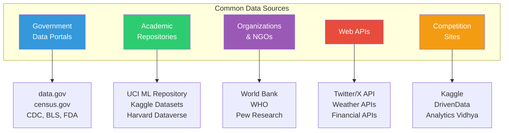
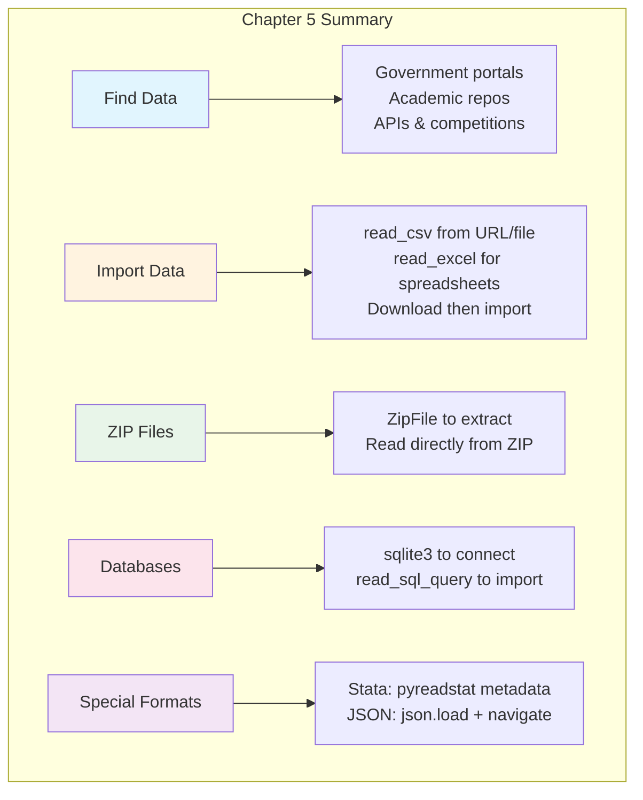

# Chapter 5: How to Get the Data

---

## Welcome to the Real World of Data

In the previous chapters, we worked with neat, ready-to-use datasets. But in the real world, data doesn't come packaged in perfect DataFrames. It lives in CSV files on government websites, Excel spreadsheets emailed by colleagues, SQL databases behind corporate firewalls, and JSON files from web APIs.

Think of yourself as a chef. Before you can cook (analyze), you need to source ingredients (data). And just like a chef might visit the fish market, the produce stand, and the specialty grocer, you'll need to know how to get data from multiple sources.

This chapter teaches you the essential skills for acquiring data from anywhere. By the end, you'll be able to find public datasets, import them directly into DataFrames, work with databases, and handle specialized file formats like Stata and JSON.

---

## Learning Objectives

After completing this chapter, you will be able to:

**Applied Skills:**
- Find and select data from common data sources
- Import CSV and Excel files directly into a DataFrame from URLs or local files
- Download files to disk before importing them
- Work with ZIP files containing data
- Connect to a SQLite database and run queries
- Use SQL queries to import data into a DataFrame
- Work with Stata files to explore metadata and import data
- Download and parse JSON files into DataFrames

**Knowledge:**
- Identify common sources for public data
- Understand when to import directly vs. download first
- Know the difference between file formats and their use cases

---

## 5.1 How to Find the Data That You Want to Analyze

### Common Data Sources

Before you can analyze data, you need to find it. Here are the most valuable sources for public data:



#### Government Data Portals

| Source | URL | What You'll Find |
|--------|-----|------------------|
| Data.gov | data.gov | US federal datasets (250,000+) |
| Census Bureau | census.gov | Demographics, economics, population |
| CDC | cdc.gov/data | Health, mortality, disease data |
| Bureau of Labor Statistics | bls.gov | Employment, wages, inflation |
| FDA | fda.gov | Drug approvals, food safety |
| Data.gov.uk | data.gov.uk | UK government data |

#### Academic & Research Repositories

| Source | URL | What You'll Find |
|--------|-----|------------------|
| UCI ML Repository | archive.ics.uci.edu/ml | Classic ML datasets |
| Kaggle Datasets | kaggle.com/datasets | Diverse, well-documented data |
| Harvard Dataverse | dataverse.harvard.edu | Research data across disciplines |
| ICPSR | icpsr.umich.edu | Social science data |
| Google Dataset Search | datasetsearch.research.google.com | Search across repositories |

#### Organization Data

| Source | What You'll Find |
|--------|------------------|
| World Bank | Global development indicators |
| WHO | Global health statistics |
| Pew Research | Surveys, polling data |
| FiveThirtyEight | Politics, sports, economics |

### How to Find and Select the Data That You Want

Finding data involves several steps:

1. **Define your question**: What are you trying to learn?
2. **Identify potential sources**: Which organizations collect this type of data?
3. **Evaluate data quality**: Is it recent? Complete? Well-documented?
4. **Check the format**: Can you easily import it?
5. **Review the license**: Can you use it for your purpose?

**Tips for evaluating datasets:**
- Look for data dictionaries or codebooks explaining variables
- Check the date range and update frequency
- Review sample size and geographic coverage
- Understand missing data patterns
- Read any methodology documentation

**Miami Example**: If you wanted to analyze food truck popularity:
- City of Miami Open Data Portal has business licenses
- Yelp API provides reviews and ratings
- Census data shows neighborhood demographics
- Weather data from NOAA shows daily conditions

---

## 5.2 How to Import Data into a DataFrame

### How to Import Data Directly into a DataFrame

The simplest way to get data is to import it directly from a URL or local file.

#### Importing CSV Files

```python
import pandas as pd

# Import CSV directly from a URL
mortality_url = "https://data.cdc.gov/api/views/v6ab-adf5/rows.csv?accessType=DOWNLOAD"
mortality_data = pd.read_csv(mortality_url)

# View the first few rows
print(mortality_data.head())
print(mortality_data.shape)
print(mortality_data.columns.tolist())
```

#### Importing Excel Files

```python
# Import the first sheet of an Excel file
jobs = pd.read_excel("employment_data.xlsx")

# Import a specific sheet
jobs = pd.read_excel("employment_data.xlsx", sheet_name="2023_Data")

# Import multiple sheets
all_sheets = pd.read_excel("employment_data.xlsx", sheet_name=None)
# Returns a dictionary: {'Sheet1': df1, 'Sheet2': df2, ...}
```

#### Common read_csv Parameters

| Parameter | Purpose | Example |
|-----------|---------|---------|
| `sep` | Column separator | `sep='\t'` for tab-separated |
| `header` | Row number for column names | `header=0` (default) |
| `names` | Custom column names | `names=['A', 'B', 'C']` |
| `usecols` | Columns to read | `usecols=['Name', 'Age']` |
| `dtype` | Data types for columns | `dtype={'ID': str}` |
| `na_values` | Values to treat as NaN | `na_values=['N/A', '']` |
| `parse_dates` | Columns to parse as dates | `parse_dates=['Date']` |
| `encoding` | File encoding | `encoding='utf-8'` |

```python
# Example with multiple parameters
sales = pd.read_csv(
    'sales_data.csv',
    usecols=['date', 'location', 'revenue'],
    parse_dates=['date'],
    dtype={'location': 'category'},
    na_values=['N/A', 'missing', '']
)
```

### How to Download a File to Disk Before Importing It

Sometimes you need to download a file first—for large files, when you want to keep a local copy, or when direct import doesn't work.

```python
from urllib import request

# Download a file to disk
polls_url = 'http://projects.fivethirtyeight.com/general-model/president_general_polls_2016.csv'
request.urlretrieve(polls_url, filename='president_polls_2016.csv')

# Now import from the local file
polls = pd.read_csv('president_polls_2016.csv')
polls.head()
```

**When to download first:**
- Very large files (avoid timeouts)
- Files you'll use repeatedly
- Files behind authentication
- When you need to inspect the file first
- ZIP files that need extraction

### How to Work with a ZIP File on Disk

Many datasets come compressed in ZIP files. Here's how to handle them:

```python
from urllib import request
from zipfile import ZipFile

# Download the ZIP file
zip_url = 'https://www.bls.gov/oes/special.requests/oesm18all.zip'
request.urlretrieve(zip_url, filename='oesm18all.zip')

# Extract files and list their names
file_names = []
with ZipFile('oesm18all.zip', mode='r') as zip_file:
    zip_file.extractall()  # Extract to current directory
    for file in zip_file.infolist():
        file_names.append(file.filename)
        print(f"{file.filename}: {file.compress_size:,} → {file.file_size:,} bytes")

# Now read an extracted file
jobs = pd.read_excel(file_names[0])
jobs.head()
```

**ZipFile Methods:**

| Method | Purpose |
|--------|---------|
| `extractall()` | Extract all files to directory |
| `extract(filename)` | Extract single file |
| `namelist()` | List filenames in archive |
| `infolist()` | List with file metadata |
| `read(filename)` | Read file without extracting |

```python
# Read directly from ZIP without extracting
with ZipFile('data.zip', 'r') as z:
    # Read CSV directly from ZIP
    df = pd.read_csv(z.open('data.csv'))
```

---

## 5.3 How to Get Database Data into a DataFrame

### How to Run Queries Against a Database

Many organizations store data in databases. Python's `sqlite3` module lets you connect to SQLite databases (single-file databases common for data analysis).

```python
import sqlite3

# Connect to database
fires_con = sqlite3.connect('FPA_FOD_20170508.sqlite')
fires_cur = fires_con.cursor()

# List all tables in the database
tables = fires_cur.execute(
    "SELECT name FROM sqlite_master WHERE type='table'"
).fetchall()
print("Tables:", tables)

# Get information about a table's columns
columns = fires_cur.execute('PRAGMA table_info(Fires)').fetchall()
for col in columns:
    print(f"Column: {col[1]}, Type: {col[2]}")
```

### How to Use a SQL Query to Import Data into a DataFrame

The `pd.read_sql_query()` function is the bridge between SQL databases and Pandas:

```python
import pandas as pd
import sqlite3

# Connect to database
con = sqlite3.connect('FPA_FOD_20170508.sqlite')

# Import data using a SQL query
fires = pd.read_sql_query('''
    SELECT 
        STATE, 
        FIRE_YEAR, 
        DATETIME(DISCOVERY_DATE) AS DISCOVERY_DATE,
        FIRE_NAME, 
        FIRE_SIZE, 
        LATITUDE, 
        LONGITUDE
    FROM Fires
    WHERE STATE = 'FL'
    ORDER BY FIRE_SIZE DESC
    LIMIT 1000
''', con)

fires.head()
```

**SQL Query Basics:**

```sql
-- Select specific columns
SELECT column1, column2 FROM table_name

-- Filter rows
SELECT * FROM table_name WHERE condition

-- Sort results
SELECT * FROM table_name ORDER BY column DESC

-- Limit results
SELECT * FROM table_name LIMIT 100

-- Aggregate data
SELECT category, COUNT(*), AVG(value)
FROM table_name
GROUP BY category
```

**Example: Florida Wildfires Analysis**

```python
# Get fires in Miami-Dade County
miami_fires = pd.read_sql_query('''
    SELECT 
        FIRE_YEAR,
        FIRE_NAME,
        FIRE_SIZE,
        STAT_CAUSE_DESCR as CAUSE,
        LATITUDE,
        LONGITUDE
    FROM Fires
    WHERE STATE = 'FL' 
      AND FIPS_NAME = 'Miami-Dade'
    ORDER BY FIRE_YEAR DESC
''', con)

print(f"Found {len(miami_fires)} fires in Miami-Dade County")
print(miami_fires.head())

# Don't forget to close the connection when done
con.close()
```

---

## 5.4 How to Work with a Stata File

Stata is a statistical software package popular in economics and social sciences. Many research datasets are distributed in Stata format (.dta files).

### How to Get and Explore the Metadata of a Stata File

Stata files contain rich metadata—variable labels, value labels, and documentation. The `pyreadstat` library lets you access this metadata:

```python
import pyreadstat

# Read only the metadata (fast, even for large files)
gss_stata_filename = 'GSS7218_R3.DTA'
_, gss_meta = pyreadstat.read_dta(
    gss_stata_filename,
    metadataonly=True
)

# Explore the metadata
print("Number of columns:", gss_meta.number_columns)
print("Number of rows:", gss_meta.number_rows)
print("Column names:", gss_meta.column_names[:10])  # First 10
```

**Metadata Attributes:**

| Attribute | What It Contains |
|-----------|------------------|
| `number_columns` | Count of variables |
| `number_rows` | Count of observations |
| `column_names` | List of variable names |
| `column_labels` | Descriptions of each variable |
| `value_labels` | Category labels for coded values |

### How to Build DataFrames for the Metadata and the Data

```python
import pandas as pd
import pyreadstat

# Read metadata
_, gss_meta = pyreadstat.read_dta('GSS7218_R3.DTA', metadataonly=True)

# Build a DataFrame describing the columns
meta_cols = pd.DataFrame(
    data=gss_meta.column_labels,
    index=gss_meta.column_names,
    columns=['description']
)
print(meta_cols.head(10))

# Search for variables about work
work_vars = meta_cols[meta_cols['description'].str.contains('work', case=False)]
print(work_vars)
```

**Importing Specific Columns:**

```python
# Import only the columns you need (much faster for large files)
gss_data = pd.read_stata(
    'GSS7218_R3.DTA',
    columns=['year', 'id', 'wrkstat', 'hrs1', 'hrs2', 'evwork', 'wrkslf', 'wrkgovt']
)

print(gss_data.shape)
print(gss_data.head())
```

---

## 5.5 How to Work with a JSON File

JSON (JavaScript Object Notation) is common for web APIs and modern data exchange. It's hierarchical, flexible, and human-readable.

### How to Download a JSON File to Disk

```python
import json
from urllib import request

# Download JSON file
shots_url = 'https://www.murach.com/python_analysis/shots.json'
request.urlretrieve(shots_url, filename='shots.json')
```

### How to Open a JSON File in JupyterLab

Before parsing, it helps to understand the structure. In JupyterLab, you can open JSON files directly to see their structure.

### How to Drill Down into the Data

JSON files often have nested structures. You need to navigate to find the actual data:

```python
import json

# Load the JSON file
with open('shots.json') as json_file:
    shots = json.load(json_file)

# Explore the structure
print("Top-level keys:", shots.keys())
print("Type of data:", type(shots))

# If it's a dictionary, explore each key
if isinstance(shots, dict):
    for key in shots.keys():
        print(f"\n{key}: {type(shots[key])}")
        if isinstance(shots[key], list):
            print(f"  Length: {len(shots[key])}")
            if len(shots[key]) > 0:
                print(f"  First item type: {type(shots[key][0])}")
```

### How to Build a DataFrame for the Data

Once you understand the structure, extract the data into a DataFrame:

```python
import pandas as pd
import json

# Load JSON
with open('shots.json') as json_file:
    shots = json.load(json_file)

# Navigate to the actual data
# Structure: {'resultSets': [{'headers': [...], 'rowSet': [[...], [...]]}]}
result_set = shots['resultSets'][0]
headers = [h.lower() for h in result_set['headers']]
rows = result_set['rowSet']

# Build DataFrame
shots_df = pd.DataFrame(data=rows, columns=headers)
print(shots_df.head())
print(shots_df.shape)
```

**Common JSON Structures:**

```python
# 1. Array of objects (most common, easiest)
# [{"name": "A", "value": 1}, {"name": "B", "value": 2}]
df = pd.read_json('data.json')

# 2. Nested with data key
# {"data": [{"name": "A"}, {"name": "B"}]}
with open('data.json') as f:
    data = json.load(f)
df = pd.DataFrame(data['data'])

# 3. Deeply nested (like NBA stats API)
# {"resultSets": [{"headers": [...], "rowSet": [[...]]}]}
with open('data.json') as f:
    data = json.load(f)
df = pd.DataFrame(
    data['resultSets'][0]['rowSet'],
    columns=data['resultSets'][0]['headers']
)
```

**Using pd.json_normalize() for Nested JSON:**

```python
# For semi-structured JSON with nested objects
import pandas as pd

data = {
    'name': 'Maria',
    'business': {
        'name': 'Miami Food Truck',
        'location': {'city': 'Miami', 'state': 'FL'}
    },
    'revenue': [1000, 1200, 950]
}

# Flatten nested structure
df = pd.json_normalize(data)
print(df)
# Columns: name, business.name, business.location.city, business.location.state, revenue
```

---

## Chapter Summary



### Key Takeaways

1. **Find data first**: Government portals (data.gov, CDC), academic repositories (Kaggle, UCI), and APIs are your best sources.

2. **Direct import is simplest**: `pd.read_csv(url)` works for most CSV files; `pd.read_excel()` for spreadsheets.

3. **Download when needed**: Use `urllib.request.urlretrieve()` for large files, ZIP archives, or when you need local copies.

4. **ZIP files require extraction**: Use `ZipFile` to extract or read directly from the archive.

5. **SQL databases are powerful**: Connect with `sqlite3`, query with SQL, import with `pd.read_sql_query()`.

6. **Stata files have metadata**: Use `pyreadstat` to explore variable labels before importing specific columns.

7. **JSON requires navigation**: Load with `json.load()`, explore the structure, then build a DataFrame from the nested data.

---

## Practice Exercises

### Exercise 1: Import from URL

```python
# Import the CDC mortality data directly from this URL:
url = "https://data.cdc.gov/api/views/v6ab-adf5/rows.csv?accessType=DOWNLOAD"

# Tasks:
# 1. Import the data into a DataFrame
# 2. Display the shape and column names
# 3. Show the first 5 rows
```

### Exercise 2: Download and Extract

```python
# Download a ZIP file and extract its contents:
# 1. Download from a URL using urlretrieve
# 2. Extract all files using ZipFile
# 3. List the extracted filenames
# 4. Import one of the files into a DataFrame
```

### Exercise 3: Database Query

```python
# Connect to a SQLite database and:
# 1. List all tables
# 2. Get column information for a table
# 3. Write a SQL query to select specific columns with a WHERE clause
# 4. Import the results into a DataFrame
```

### Exercise 4: JSON Parsing

```python
# Given a nested JSON file:
# 1. Load it with json.load()
# 2. Explore its structure (keys, types, lengths)
# 3. Navigate to the actual data
# 4. Build a DataFrame with appropriate column names
```

---

## Quick Reference: Chapter 5 Code Patterns

```python
# === IMPORTING DATA ===
import pandas as pd

# CSV from URL or file
df = pd.read_csv('https://example.com/data.csv')
df = pd.read_csv('local_file.csv')

# Excel file
df = pd.read_excel('data.xlsx')
df = pd.read_excel('data.xlsx', sheet_name='Sheet2')
all_sheets = pd.read_excel('data.xlsx', sheet_name=None)

# === DOWNLOADING FILES ===
from urllib import request
request.urlretrieve(url, filename='local_name.csv')

# === ZIP FILES ===
from zipfile import ZipFile

with ZipFile('archive.zip', 'r') as z:
    z.extractall()                    # Extract all
    z.extract('specific_file.csv')    # Extract one
    df = pd.read_csv(z.open('file.csv'))  # Read without extracting

# === DATABASE (SQLite) ===
import sqlite3

con = sqlite3.connect('database.sqlite')
cur = con.cursor()

# List tables
cur.execute("SELECT name FROM sqlite_master WHERE type='table'").fetchall()

# Get column info
cur.execute('PRAGMA table_info(TableName)').fetchall()

# Import with query
df = pd.read_sql_query('SELECT * FROM TableName WHERE condition', con)
con.close()

# === STATA FILES ===
import pyreadstat

# Metadata only
_, meta = pyreadstat.read_dta('file.dta', metadataonly=True)
print(meta.column_names, meta.column_labels)

# Import specific columns
df = pd.read_stata('file.dta', columns=['col1', 'col2'])

# === JSON FILES ===
import json

with open('data.json') as f:
    data = json.load(f)

# Navigate and build DataFrame
df = pd.DataFrame(data['key']['nested_key'])

# Or use json_normalize for nested structures
df = pd.json_normalize(data)
```

---

## Glossary

| Term | Definition |
|------|------------|
| **API** | Application Programming Interface - a way to request data from web services |
| **CSV** | Comma-Separated Values - simple text format for tabular data |
| **JSON** | JavaScript Object Notation - hierarchical data format common in web APIs |
| **Metadata** | Data about data - descriptions, labels, data types |
| **SQL** | Structured Query Language - language for querying databases |
| **SQLite** | Lightweight, file-based database engine |
| **Stata** | Statistical software; .dta is its file format |
| **ZIP** | Compressed archive format containing multiple files |

---

*"Data is the new oil. It's valuable, but if unrefined it cannot really be used."* — Clive Humby
