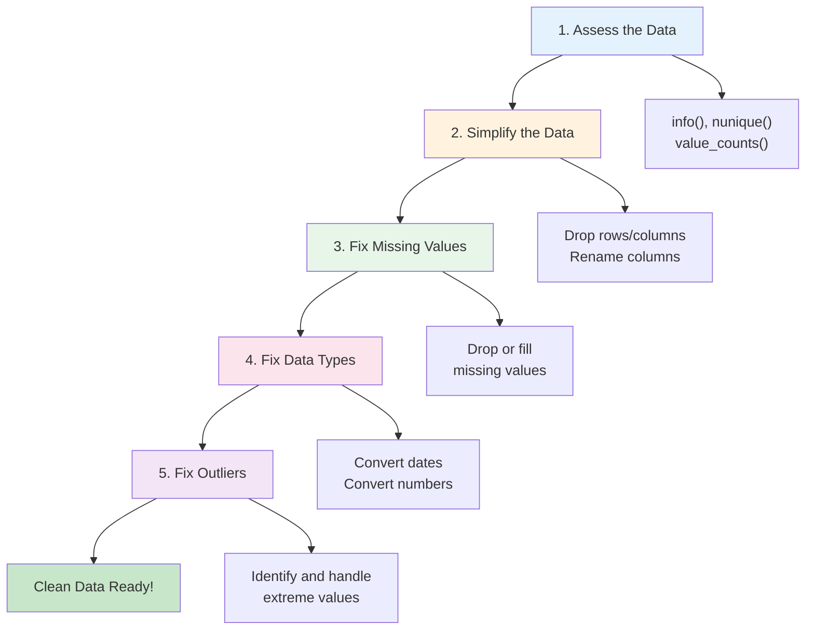
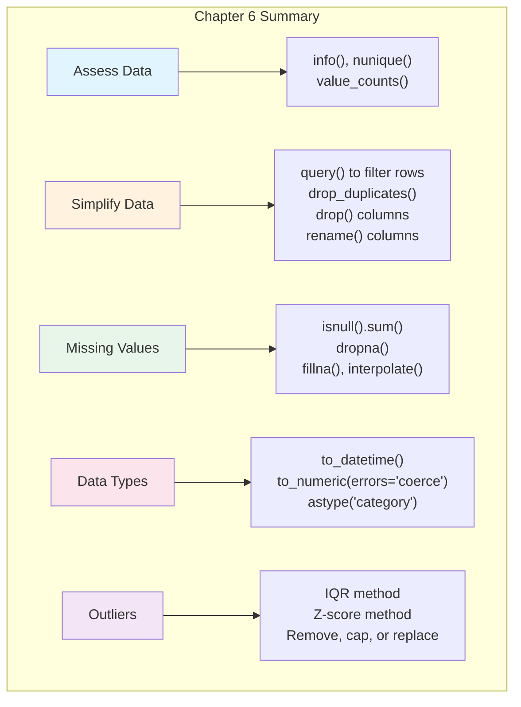

# Chapter 6: How to Clean the Data

---

## Welcome to Data Cleaning: The Essential Skill

Here's a truth every data professional learns: **80% of your time will be spent cleaning data**. The remaining 20% goes to analysis, visualization, and drawing conclusions. That ratio might seem frustrating, but here's another truth: **clean data is the foundation of trustworthy analysis**.

Think of it like cooking. You can have the best recipe and the finest cooking skills, but if your ingredients are spoiled, your dish will fail. Similarly, the most sophisticated analysis is worthless if built on dirty data.

Data cleaning involves:
- Removing irrelevant or duplicate records
- Handling missing values
- Fixing data type problems
- Correcting invalid entries
- Identifying and addressing outliers

By the end of this chapter, you'll have a systematic approach to transforming messy, real-world data into clean, analysis-ready datasets.

---

## Learning Objectives

After completing this chapter, you will be able to:

**Applied Skills:**
- Use `info()`, `nunique()`, and `value_counts()` to assess data quality
- Drop rows based on conditions, duplicates, and missing values
- Drop and rename columns
- Find and handle missing values using `dropna()` and `fillna()`
- Convert data types: strings to dates, objects to numbers
- Work with the category data type
- Fix data type problems during import
- Find and fix outliers

**Knowledge:**
- Describe a general plan for cleaning data
- Explain why data cleaning is essential for analysis
- Understand the trade-offs between different missing value strategies

---

## 6.1 Introduction to Data Cleaning

### A General Plan for Cleaning the Data

Data cleaning isn't random—it follows a logical sequence. Here's a systematic approach:



**Step 1: Assess** - Understand what you're working with before making changes.

**Step 2: Simplify** - Remove what you don't need: irrelevant rows, duplicate records, unnecessary columns.

**Step 3: Fix Missing Values** - Decide what to do with gaps in your data.

**Step 4: Fix Data Types** - Ensure dates are dates, numbers are numbers.

**Step 5: Fix Outliers** - Identify and handle extreme values that could skew your analysis.

### What the info() Method Can Tell You

The `info()` method is your first stop for data assessment. It reveals:
- Number of rows and columns
- Column names and data types
- Non-null counts (how many values are present)
- Memory usage

```python
import pandas as pd

# Load the data
polls = pd.read_csv('president_polls_2016.csv')

# Get comprehensive information
polls.info(verbose=True, memory_usage='deep', show_counts=True)
```

Output:
```
<class 'pandas.core.frame.DataFrame'>
RangeIndex: 12624 entries, 0 to 12623
Data columns (total 27 columns):
 #   Column            Non-Null Count  Dtype  
---  ------            --------------  -----  
 0   cycle             12624 non-null  int64  
 1   branch            12624 non-null  object 
 2   type              12624 non-null  object 
 ...
 9   grade             11337 non-null  object   # <- Missing values!
 10  samplesize        12621 non-null  float64  # <- Missing values!
 ...
 21  multiversions     36 non-null     object   # <- Mostly missing!
...
dtypes: float64(10), int64(3), object(14)
memory usage: 12.9 MB
```

**What to look for:**
- Columns with fewer non-null counts than total rows → missing values
- `object` dtype for columns that should be dates or numbers → type problems
- High memory usage → consider converting to category type

### What the Unique Values Can Tell You

Use `nunique()` to see how many unique values each column has:

```python
# Count unique values in each column
polls.nunique()
```

Output:
```
cycle                   1    # <- Only one value! Probably drop it
branch                  1    # <- Only one value! Probably drop it
type                    3
matchup                 1    # <- Only one value! Probably drop it
forecastdate            1    # <- Only one value! Probably drop it
state                  57
pollster              196
grade                  10
samplesize           1766
...
```

**Red flags:**
- Columns with only 1 unique value provide no analytical value—consider dropping
- Columns with very high unique counts relative to row count may be identifiers
- Unexpected counts might indicate data problems

To see the actual unique values:

```python
# See unique values for each column
polls.apply(pd.unique)

# Or for a specific column
polls['population'].unique()
# Output: ['lv', 'rv', 'a', 'v']
```

### What the Value Counts Can Tell You

`value_counts()` shows the distribution of values in a column:

```python
# Basic value counts
polls.state.value_counts().head(4)
```

Output:
```
U.S.              3318
Florida            444
North Carolina     375
Pennsylvania       375
Name: state, dtype: int64
```

**Useful variations:**

```python
# As proportions (percentages)
polls.state.value_counts(normalize=True).head(4)
# Output shows: U.S. is 26.3% of data

# Include NaN values in counts
polls.multiversions.value_counts(dropna=False)
# Output:
# NaN    12588
# *         36

# Value counts for multiple columns
polls[['state', 'grade']].value_counts()
```

---

## 6.2 How to Simplify the Data

### How to Drop Rows Based on Conditions

Often you need to filter your data to focus on specific subsets:

```python
# Method 1: Boolean indexing
polls = polls[polls.type == 'now-cast']

# Method 2: query() - often cleaner for complex conditions
polls = polls.query('type == "now-cast"')

# Multiple conditions
polls = polls.query('type == "now-cast" and state == "Florida"')

# Using variables in query
poll_type = 'now-cast'
polls = polls.query('type == @poll_type')
```

### How to Drop Duplicate Rows

Duplicate rows can skew your analysis. Here's how to find and remove them:

```python
# Find duplicates (shows all rows that have duplicates)
polls[polls.duplicated(keep=False)]

# Count duplicates
print(f"Duplicate rows: {polls.duplicated().sum()}")

# Drop duplicates, keeping the first occurrence
polls.drop_duplicates(keep='first', inplace=True)

# Drop duplicates based on specific columns only
# (useful when some columns like timestamps differ but core data is same)
polls.drop_duplicates(subset=['state', 'pollster', 'startdate', 'enddate'], 
                      keep='first', inplace=True)
```

**Parameters for `drop_duplicates()`:**

| Parameter | Options | Description |
|-----------|---------|-------------|
| `keep` | `'first'`, `'last'`, `False` | Which duplicate to keep (or none) |
| `subset` | List of columns | Only consider these columns |
| `inplace` | `True`/`False` | Modify in place or return new DataFrame |

### How to Drop Columns

Remove columns that don't add value to your analysis:

```python
# Check which columns have only one unique value
polls.nunique()
# cycle: 1, forecastdate: 1 <- candidates for dropping

# Method 1: drop() with column names
polls = polls.drop(columns=['cycle', 'forecastdate'])

# Method 2: drop() with inplace
polls.drop(columns=['cycle', 'forecastdate'], errors='raise', inplace=True)

# Drop columns by position
polls = polls.drop(polls.columns[[0, 4]], axis=1)

# Keep only specific columns
polls = polls[['state', 'pollster', 'samplesize', 'rawpoll_clinton', 'rawpoll_trump']]
```

### How to Rename Columns

Clear, consistent column names make analysis easier:

```python
# Rename specific columns with a dictionary
polls = polls.rename(columns={
    'rawpoll_clinton': 'clinton_pct',
    'rawpoll_trump': 'trump_pct'
})

# Rename using a dictionary variable
name_mapping = {
    'rawpoll_clinton': 'clinton_pct',
    'rawpoll_trump': 'trump_pct'
}
polls.rename(columns=name_mapping, inplace=True)

# Rename all columns using string methods
polls.columns = polls.columns.str.replace('_pct', '')
polls.columns = polls.columns.str.lower()
polls.columns = polls.columns.str.replace(' ', '_')

# Complex renaming with regex
jobs.columns = jobs.columns \
    .str.replace('^a_', 'annual_', regex=True) \
    .str.replace('^h_', 'hourly_', regex=True)
```

---

## 6.3 How to Find and Fix Missing Values

### How to Find Missing Values

Missing values (NaN) can appear for many reasons: data wasn't collected, it was lost in processing, or it doesn't apply to certain records.

```python
# Load data with missing values
mortality_data = pd.read_csv('mortality_missing_values.csv')
mortality_data.head()
```

Output:
```
     Year     AgeGroup  DeathRate
0  1900.0  01-04 Years     1983.8
1     NaN  01-04 Years     1695.0   # <- Missing Year
2  1902.0  01-04 Years        NaN   # <- Missing DeathRate
3  1903.0  01-04 Years     1542.1
4     NaN  01-04 Years        NaN   # <- Both missing!
```

**Methods to find missing values:**

```python
# Count missing values per column
missing_count = mortality_data.shape[0] - mortality_data.count()
print(missing_count)
# Year         3
# AgeGroup     0
# DeathRate    4

# Alternative: using isna()
mortality_data.isna().sum()

# Find rows with ANY missing values
mortality_data[mortality_data.isnull().any(axis=1)]

# Find rows where a specific column is missing
mortality_data[mortality_data.DeathRate.isnull()]

# Find rows where a specific column is NOT missing
mortality_data[mortality_data.DeathRate.notnull()]
```

### How to Drop Rows with Missing Values

Sometimes the best approach is to remove rows with missing data:

```python
# Drop rows with ANY missing values
mortality_data = mortality_data.dropna()

# Drop rows only if ALL values are missing
mortality_data.dropna(how='all', inplace=True)

# Require at least N non-null values to keep a row
mortality_data.dropna(thresh=2, inplace=True)

# Drop rows only if specific columns have missing values
mortality_data.dropna(subset=['DeathRate'], inplace=True)

# Drop rows if specific columns have missing values (multiple columns)
mortality_data.dropna(subset=['Year', 'DeathRate'], inplace=True)
```

**When to drop missing values:**
- Missing data is a small percentage of total
- The missing data appears random
- You have enough remaining data for analysis
- Imputing would introduce more bias than dropping

### How to Fill Missing Values

Instead of dropping, you can fill missing values with reasonable substitutes:

```python
# Reload data with missing values
mortality_data = pd.read_csv('mortality_missing_values.csv')

# Fill with a constant value
mortality_data['DeathRate'].fillna(0, inplace=True)

# Fill with the mean
mortality_data['DeathRate'].fillna(mortality_data['DeathRate'].mean(), inplace=True)

# Fill with the median (more robust to outliers)
mortality_data['DeathRate'].fillna(mortality_data['DeathRate'].median(), inplace=True)

# Forward fill (use previous value)
mortality_data.fillna(method='ffill', inplace=True)

# Backward fill (use next value)
mortality_data.fillna(method='bfill', inplace=True)

# Forward fill with a limit
mortality_data.fillna(method='ffill', limit=2, inplace=True)

# Interpolate (estimate based on surrounding values)
mortality_data = mortality_data.interpolate()
```

**Choosing a fill strategy:**

| Strategy | When to Use |
|----------|-------------|
| Mean | Normally distributed data, no outliers |
| Median | Skewed data or when outliers present |
| Mode | Categorical data |
| Forward/Backward fill | Time series, ordered data |
| Interpolate | Time series with steady trends |
| Constant (0, "Unknown") | When absence is meaningful |

---

## 6.4 How to Fix Data Type Problems

### How to Find Dates and Numbers That Are Imported as Objects

Pandas often imports dates and numbers as strings (object dtype) when the data contains inconsistencies or special characters:

```python
# Check data types
polls.info()
# startdate, enddate, createddate show as 'object' but should be dates

# View only object columns
polls.select_dtypes('object').head(2)

# Examine specific columns that look like dates
date_cols = ['startdate', 'enddate', 'createddate', 'timestamp']
polls[date_cols].head(2)
```

Output:
```
      startdate    enddate createddate             timestamp
4208  11/3/2016  11/6/2016     11/7/16  09:24:53  8 Nov 2016
4209  11/1/2016  11/7/2016     11/7/16  09:24:53  8 Nov 2016
```

### How to Convert Date and Time Strings to the datetime Data Type

```python
# Convert a single column
polls['startdate'] = pd.to_datetime(polls['startdate'])

# Convert multiple columns at once
date_cols = ['startdate', 'enddate', 'createddate', 'timestamp']
polls[date_cols] = polls[date_cols].apply(pd.to_datetime)

# Check the results
polls[date_cols].head(2)
```

Output:
```
      startdate    enddate createddate           timestamp
4208 2016-11-03 2016-11-06  2016-11-07 2016-11-08 09:24:53
4209 2016-11-01 2016-11-07  2016-11-07 2016-11-08 09:24:53
```

**Formatting dates for output:**

```python
# Convert datetime to specific string format
polls['startdate'] = polls.startdate.dt.strftime("%m/%d/%Y")
polls['enddate'] = polls.enddate.dt.strftime("%m-%d-%y")
```

### How to Convert Object Columns to Numeric Data Types

Sometimes numeric columns are imported as strings because they contain special characters:

```python
# This will fail if there are non-numeric values
# pd.to_numeric(jobs.tot_emp)  # Error!

# Check what's causing the problem
jobs.tot_emp.tail(3)
# Output:
# 403892    170
# 403893    130
# 403894     **   <- Special character!

# Use errors='coerce' to convert invalid values to NaN
jobs['tot_emp'] = pd.to_numeric(jobs['tot_emp'], errors='coerce')
jobs.tot_emp.tail(3)
# Output:
# 403892    170.0
# 403893    130.0
# 403894      NaN   <- Converted to NaN
```

**Options for `errors` parameter:**

| Value | Behavior |
|-------|----------|
| `'raise'` | Raise an error on invalid input (default) |
| `'coerce'` | Convert invalid values to NaN |
| `'ignore'` | Return input unchanged on error |

### How to Work with the Category Data Type

The `category` dtype saves memory and enables special operations for columns with repeated string values:

```python
# Convert to category
polls['state'] = polls['state'].astype('category')
polls['grade'] = polls['grade'].astype('category')

# Check memory savings
polls.info(memory_usage='deep')

# Category operations
polls['state'].cat.categories  # List all categories
polls['state'].cat.codes       # Get numeric codes
polls['grade'].cat.add_categories(['A++'])  # Add new categories
polls['grade'].cat.remove_unused_categories()  # Clean up
```

**When to use category:**
- Columns with limited unique values (e.g., states, grades, status codes)
- Large datasets where memory matters
- When you need ordered categories (e.g., 'low' < 'medium' < 'high')

### How to Replace Invalid Values and Convert a Column's Data Type

Sometimes you need to fix values before converting:

```python
# Replace special characters then convert
jobs['h_pct90'] = jobs['h_pct90'].replace('#', None)
jobs['h_pct90'] = pd.to_numeric(jobs['h_pct90'])

# Or combine in one step
jobs['h_pct90'] = pd.to_numeric(jobs['h_pct90'].replace('#', None))

# Replace multiple values
jobs['tot_emp'] = jobs['tot_emp'].replace({'**': None, '*': None, '#': None})
jobs['tot_emp'] = pd.to_numeric(jobs['tot_emp'])
```

### How to Fix Data Type Problems When You Import the Data

The best approach is to handle type conversion during import:

```python
# Parse dates during import
date_cols = ['startdate', 'enddate', 'createddate', 'timestamp']
polls = pd.read_csv('president_polls_2016.csv', parse_dates=date_cols)

# Specify dtypes during import
dtype_dict = {
    'state': 'category',
    'grade': 'category',
    'population': 'category'
}
polls = pd.read_csv('president_polls_2016.csv', dtype=dtype_dict)

# Specify values to treat as NA
polls = pd.read_csv('president_polls_2016.csv', 
                    na_values=['**', '#', 'N/A', ''])
```

---

## 6.5 How to Find and Fix Outliers

### How to Find Outliers

Outliers are extreme values that differ significantly from other observations. They can be legitimate (record-breaking events) or errors (data entry mistakes).

```python
# Load and filter data
mortality_data = pd.read_pickle('mortality_cleaned.pkl')
mortality_group = mortality_data.query('AgeGroup == "15-19 Years"')

# Use describe() to spot potential outliers
mortality_group.describe().T
```

Output:
```
           count        mean         std     min      25%     50%      75%     max
Year       119.0  1959.00000   34.496377  1900.0  1929.50  1959.0  1988.50  2018.0
DeathRate  119.0   177.37479  138.362290    44.8    85.45   106.9   283.65   777.4
```

Notice: max DeathRate (777.4) is much higher than 75th percentile (283.65). This might be an outlier.

**Methods to identify outliers:**

```python
# Method 1: IQR (Interquartile Range) method
Q1 = mortality_group['DeathRate'].quantile(0.25)
Q3 = mortality_group['DeathRate'].quantile(0.75)
IQR = Q3 - Q1

lower_bound = Q1 - 1.5 * IQR
upper_bound = Q3 + 1.5 * IQR

outliers = mortality_group[
    (mortality_group['DeathRate'] < lower_bound) | 
    (mortality_group['DeathRate'] > upper_bound)
]
print(f"Outliers found: {len(outliers)}")

# Method 2: Z-score method (values more than 3 standard deviations from mean)
from scipy import stats
z_scores = stats.zscore(mortality_group['DeathRate'])
outliers = mortality_group[abs(z_scores) > 3]

# Method 3: Visual inspection with box plot
mortality_group.plot.box(y='DeathRate')
plt.title('Death Rate Distribution')
plt.show()
```

### How to Fix Outliers

Once identified, you have several options:

```python
# Option 1: Remove outliers
mortality_clean = mortality_group[
    (mortality_group['DeathRate'] >= lower_bound) & 
    (mortality_group['DeathRate'] <= upper_bound)
]

# Option 2: Cap outliers (winsorization)
mortality_group['DeathRate'] = mortality_group['DeathRate'].clip(
    lower=lower_bound, 
    upper=upper_bound
)

# Option 3: Replace with NaN and then fill
mortality_group.loc[
    mortality_group['DeathRate'] > upper_bound, 
    'DeathRate'
] = None
mortality_group = mortality_group.interpolate()

# Option 4: For known anomalies (like 1918 flu), replace specific values
mortality_group.loc[
    mortality_group.Year.isin([1917, 1918, 1919, 1920]),
    'DeathRate'
] = None
mortality_group = mortality_group.interpolate()
mortality_group.plot(x='Year', y='DeathRate')
```

**Choosing an outlier strategy:**

| Strategy | When to Use |
|----------|-------------|
| Remove | Clear data errors, enough remaining data |
| Cap | Want to reduce impact but keep record |
| Replace with NaN | Known anomalies, will interpolate |
| Keep | Legitimate extreme values (document them!) |

**Important**: Always investigate outliers before removing them. The 1918 flu pandemic spike in mortality data isn't an error—it's history!

---

## Chapter Summary



### Key Takeaways

1. **Follow a systematic plan**: Assess → Simplify → Fix Missing → Fix Types → Fix Outliers

2. **Assessment tools**: `info()` shows types and missing counts; `nunique()` shows variety; `value_counts()` shows distribution

3. **Simplify first**: Drop unnecessary rows and columns; rename for clarity

4. **Missing values**: Either drop with `dropna()` or fill with `fillna()` / `interpolate()`

5. **Type conversion**: Use `pd.to_datetime()` for dates, `pd.to_numeric(errors='coerce')` for numbers

6. **Categories save memory**: Convert repeated string columns to category dtype

7. **Handle type problems at import**: Use `parse_dates`, `dtype`, and `na_values` parameters

8. **Investigate outliers**: They might be errors or legitimate extreme values

---

## Practice Exercises

### Exercise 1: Assessment

```python
# Load a dataset and:
# 1. Use info() to check for missing values and data types
# 2. Use nunique() to find columns with only one value
# 3. Use value_counts() to examine the distribution of a categorical column
```

### Exercise 2: Simplification

```python
# Given a DataFrame:
# 1. Filter to keep only rows where type == 'A'
# 2. Remove duplicate rows
# 3. Drop columns that have only one unique value
# 4. Rename columns to snake_case
```

### Exercise 3: Missing Values

```python
# Given a DataFrame with missing values:
# 1. Count missing values per column
# 2. Show all rows with any missing values
# 3. Fill numeric missing values with the median
# 4. Drop rows where a critical column is missing
```

### Exercise 4: Data Types

```python
# Given a DataFrame where dates are strings:
# 1. Convert date columns to datetime
# 2. Convert numeric columns that have special characters to numbers
# 3. Convert a low-cardinality column to category
```

### Exercise 5: Outliers

```python
# Given a DataFrame with a numeric column:
# 1. Calculate the IQR bounds
# 2. Identify outliers
# 3. Cap outliers at the IQR bounds
```

---

## Quick Reference: Chapter 6 Code Patterns

```python
# === ASSESSMENT ===
df.info(verbose=True, memory_usage='deep', show_counts=True)
df.nunique()
df['col'].value_counts(normalize=True, dropna=False)
df.apply(pd.unique)
df.select_dtypes('object')

# === DROP ROWS ===
df = df.query('condition == "value"')
df = df[df.column == value]
df.drop_duplicates(keep='first', inplace=True)

# === DROP & RENAME COLUMNS ===
df.drop(columns=['col1', 'col2'], inplace=True)
df.rename(columns={'old': 'new'}, inplace=True)
df.columns = df.columns.str.lower().str.replace(' ', '_')

# === MISSING VALUES ===
df.isnull().sum()                    # Count missing
df[df.isnull().any(axis=1)]         # Rows with missing
df.dropna(subset=['col'])            # Drop if col is missing
df['col'].fillna(df['col'].median(), inplace=True)
df = df.interpolate()                # Interpolate missing

# === DATA TYPE CONVERSION ===
df['date_col'] = pd.to_datetime(df['date_col'])
df['num_col'] = pd.to_numeric(df['num_col'], errors='coerce')
df['cat_col'] = df['cat_col'].astype('category')

# === IMPORT WITH TYPES ===
df = pd.read_csv('file.csv',
    parse_dates=['date_col'],
    dtype={'cat_col': 'category'},
    na_values=['**', '#', 'N/A'])

# === OUTLIERS ===
Q1, Q3 = df['col'].quantile([0.25, 0.75])
IQR = Q3 - Q1
lower, upper = Q1 - 1.5*IQR, Q3 + 1.5*IQR
df = df[(df['col'] >= lower) & (df['col'] <= upper)]  # Remove
df['col'] = df['col'].clip(lower=lower, upper=upper)  # Cap
```

---

## Glossary

| Term | Definition |
|------|------------|
| **Category dtype** | Pandas data type for columns with limited unique values |
| **Coerce** | Convert invalid values to NaN instead of raising an error |
| **Dropna** | Remove rows or columns with missing values |
| **Fillna** | Replace missing values with specified values |
| **Imputation** | Filling missing values with estimates |
| **Interpolate** | Estimate missing values based on surrounding values |
| **IQR** | Interquartile Range - difference between 75th and 25th percentiles |
| **NaN** | Not a Number - Pandas representation of missing values |
| **Outlier** | A value that differs significantly from other observations |
| **Winsorization** | Capping outliers at specified percentiles |

---

*"In God we trust. All others must bring data."* — W. Edwards Deming

*"...but first, clean that data."* — Every Data Analyst Ever
