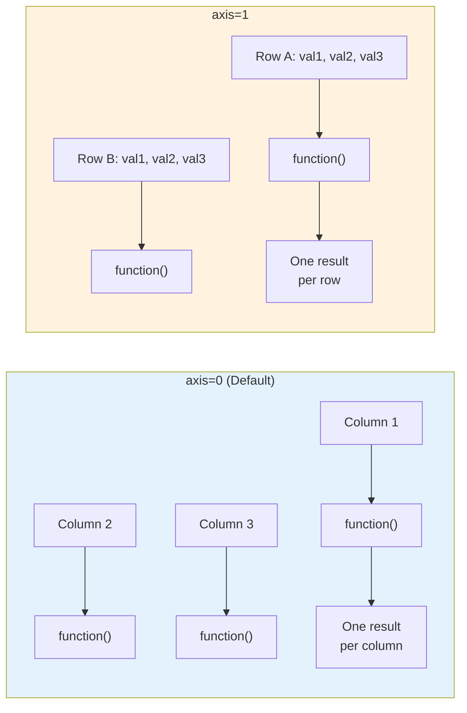
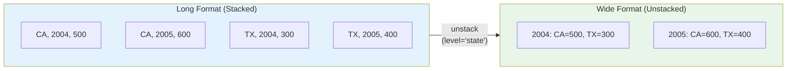
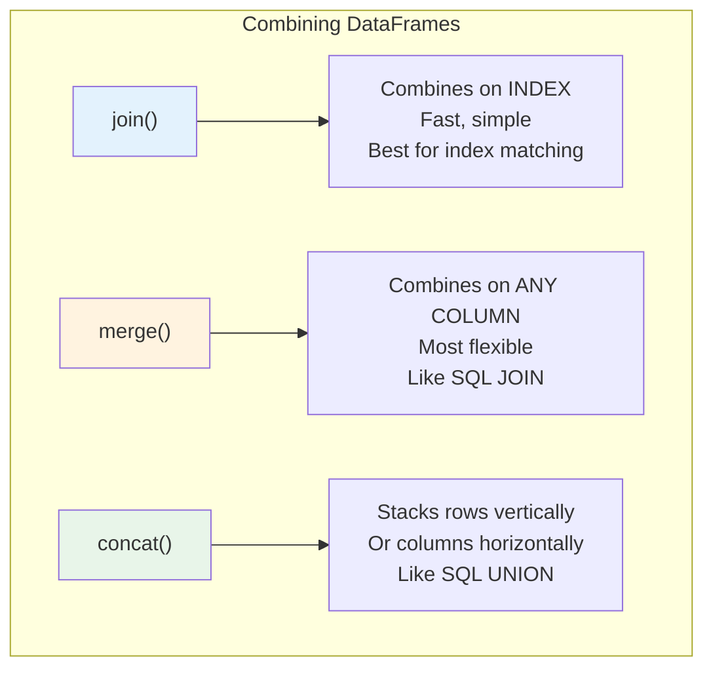
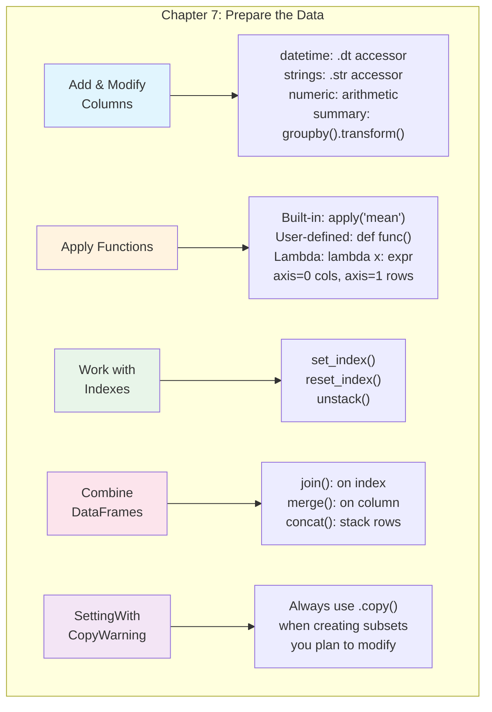

# Chapter 7: How to Prepare the Data

---

## From Clean to Ready: The Next Step

In Chapter 6, you learned to clean data—removing errors, handling missing values, and fixing data types. Now comes the next critical step: **preparing** that clean data for analysis.

Think of it like cooking. Cleaning was washing and inspecting your ingredients. Preparing is the chopping, slicing, marinating, and combining that transforms raw ingredients into something ready to cook. You might need to extract the month from a date, combine first and last names, calculate new metrics, or join data from multiple sources.

By the end of this chapter, you'll be able to transform clean DataFrames into analysis-ready datasets with exactly the columns, formats, and structure your questions require.

---

## Learning Objectives

After completing this chapter, you will be able to:

**Applied Skills:**
- Create new columns from datetime, string, and numeric columns
- Add summary columns using `groupby()` with `transform()`
- Apply built-in, user-defined, and lambda functions to rows and columns
- Set, remove, and work with single and multi-level indexes
- Unstack indexed data from long to wide format
- Combine DataFrames using join, merge, and concat
- Recognize and fix the SettingWithCopyWarning

**Knowledge:**
- Explain the difference between `apply()` with `axis=0` vs `axis=1`
- Describe when to use join vs merge vs concat
- Understand why the SettingWithCopyWarning matters for data integrity

---

## 7.1 How to Add and Modify Columns

### How to Work with Datetime Columns

Once dates are stored as proper datetime types (as you learned in Chapter 6), you can extract useful components and perform date arithmetic:

```python
import pandas as pd

# Load cleaned fire data
fires = pd.read_pickle('fires_cleaned.pkl')
fires.head()
```

Output:
```
       fire_name  fire_year state discovery_date contain_date  acres_burned
16         POWER       2004    CA     2004-10-06   2004-10-21       16823.0
17         FREDS       2004    CA     2004-10-13   2004-10-17        7700.0
25      BACHELOR       2004    NM     2004-07-20   2004-07-20          10.0
37    HOWARD GAP       2005    NC     2005-01-27   2005-01-28          50.3
39  AUSTIN CREEK       2005    NC     2005-02-12   2005-02-13         125.0
```

**Extract datetime components using the `.dt` accessor:**

```python
# Extract the month from the discovery date
fires['fire_month'] = fires.discovery_date.dt.month
```

**Calculate durations by subtracting dates:**

```python
# Calculate how many days each fire burned
fires['days_burning'] = (fires.contain_date - fires.discovery_date).dt.days
```

The subtraction of two datetime columns produces a Timedelta object. The `.dt.days` accessor extracts just the number of days as an integer.

```python
fires.head()
```

Output:
```
       fire_name  fire_year state discovery_date contain_date  acres_burned  fire_month  days_burning
16         POWER       2004    CA     2004-10-06   2004-10-21       16823.0          10          15.0
17         FREDS       2004    CA     2004-10-13   2004-10-17        7700.0          10           4.0
25      BACHELOR       2004    NM     2004-07-20   2004-07-20          10.0           7           0.0
37    HOWARD GAP       2005    NC     2005-01-27   2005-01-28          50.3           1           1.0
39  AUSTIN CREEK       2005    NC     2005-02-12   2005-02-13         125.0           2           1.0
```

**Common `.dt` accessor properties:**

| Property | Returns | Example |
|----------|---------|---------|
| `.dt.year` | Year | 2004 |
| `.dt.month` | Month (1-12) | 10 |
| `.dt.day` | Day of month | 6 |
| `.dt.dayofweek` | Day of week (0=Mon) | 2 |
| `.dt.day_name()` | Day name | 'Wednesday' |
| `.dt.quarter` | Quarter (1-4) | 4 |
| `.dt.days` | Days from Timedelta | 15 |

### How to Work with String Columns

The `.str` accessor lets you perform string operations on entire columns:

```python
# Convert fire names from UPPERCASE to Title Case
fires['fire_name'] = fires.fire_name.str.title()
```

**Combine strings and other columns to create new columns:**

```python
# Build a descriptive name from multiple columns
fires['full_name'] = 'The ' + fires.fire_name + ' Fire ' \
                   + '(' + fires.fire_year.astype(str) + ')'
```

Notice that `fire_year` is an integer, so you must convert it to a string with `.astype(str)` before concatenating.

### How to Work with Numeric Columns

Create calculated columns from existing numeric data:

```python
# Calculate acres burned per day
fires['acres_per_day'] = fires.dropna().acres_burned / fires.dropna().days_burning
```

```python
fires[['fire_name', 'full_name', 'acres_burned', 'days_burning', 'acres_per_day']].head()
```

Output:
```
       fire_name                     full_name  acres_burned  days_burning  acres_per_day
16         Power         The Power Fire (2004)       16823.0          15.0    1121.533333
17         Freds         The Freds Fire (2004)        7700.0           4.0    1925.000000
25      Bachelor      The Bachelor Fire (2004)          10.0           0.0            inf
37    Howard Gap    The Howard Gap Fire (2005)          50.3           1.0      50.300000
39  Austin Creek  The Austin Creek Fire (2005)         125.0           1.0     125.000000
```

Notice that dividing by 0 days produces `inf` (infinity) rather than an error. You would want to handle this in a real analysis.

### How to Add a Summary Column to a DataFrame

Sometimes you need to add a column that summarizes group-level data back to individual rows. The `groupby().transform()` pattern does this:

```python
# Add the mean days_burning for each state as a new column
fires['mean_days'] = fires.groupby('state')['days_burning'].transform(func='mean')

fires[['state', 'days_burning', 'mean_days']].head()
```

Output:
```
   state  days_burning  mean_days
16    CA          15.0   5.387197
17    CA           4.0   5.387197
25    NM           0.0   6.085806
37    NC           1.0   1.015474
39    NC           1.0   1.015474
```

**How `transform()` differs from `agg()`:** The `agg()` method returns one row per group (a summary table). The `transform()` method returns a value for every row in the original DataFrame, broadcasting the group result back. This is useful when you want to compare individual values to their group average.

---

## 7.2 How to Apply Functions and Lambda Expressions

### How to Apply Functions to Rows or Columns

The `apply()` method runs a function across columns (axis=0) or rows (axis=1):

```python
# Load work survey data
workData = pd.read_pickle('workData.pkl')
workData.head(3)
```

Output:
```
    sex  region  wrkstat  hrs1  wkcontct  talkspvs  effctsup
id                                                          
2     2       1      1.0  40.0       3.0       4.0       4.0
4     2       1      2.0  20.0       1.0       4.0       4.0
14    2       2      1.0  37.0       1.0       4.0       3.0
```

**Apply a function to each column (axis=0, the default):**

```python
# Calculate the mean of each column
workData.apply('mean')
```

Output:
```
sex          1.529897
region       5.184536
wrkstat      1.163918
hrs1        42.083505
wkcontct     2.796907
talkspvs     3.291753
effctsup     3.253608
```

```python
# Apply to specific columns only
import numpy as np
workData[['sex', 'hrs1']].apply(np.mean)
```

**Apply a function to each row (axis=1):**

```python
# Calculate average rating across three columns for each row
workData['avg_rating'] = workData[
    ['wkcontct', 'talkspvs', 'effctsup']].apply(np.mean, axis=1)
workData.head(3)
```

Output:
```
    sex  region  wrkstat  hrs1  wkcontct  talkspvs  effctsup  avg_rating
id                                                                      
2     2       1      1.0  40.0       3.0       4.0       4.0    3.666667
4     2       1      2.0  20.0       1.0       4.0       4.0    3.000000
14    2       2      1.0  37.0       1.0       4.0       3.0    2.666667
```



### How to Apply User-Defined Functions

For complex logic that a built-in function can't handle, write your own function and apply it:

```python
# Convert numeric sex codes to descriptive labels
def convert_sex(row):
    if row.sex == 1:
        return 'male'
    elif row.sex == 2:
        return 'female'
    else:
        return 'non-binary'

workData['sex'] = workData.apply(convert_sex, axis=1)
workData.head()
```

Output:
```
       sex  region  wrkstat  hrs1  wkcontct  talkspvs  effctsup  avg_rating
id                                                                         
2   female       1      1.0  40.0       3.0       4.0       4.0    3.666667
4   female       1      2.0  20.0       1.0       4.0       4.0    3.000000
14  female       2      1.0  37.0       1.0       4.0       3.0    2.666667
19    male       1      1.0  50.0       1.0       3.0       4.0    2.666667
```

**A more complex example — deriving sports seasons from dates:**

```python
# Determine the NBA season from a game date
# (NBA seasons span two calendar years: Oct-Apr)
def get_season(row):
    if row.game_date.month > 6:
        season = f'{row.game_date.year}-{row.game_date.year + 1}'
    else:
        season = f'{row.game_date.year - 1}-{row.game_date.year}'
    return season

gameData['season'] = gameData.apply(get_season, axis=1)
```

Output:
```
      game_id  game_date     season
0  0020900015 2009-10-28  2009-2010
12 0020900030 2009-10-30  2009-2010
21 0020900069 2009-11-04  2009-2010
```

The function checks: if the month is after June (month > 6), the season starts in that year. Otherwise, the season started the previous year. The f-string builds labels like "2009-2010".

### How Lambda Expressions Work with DataFrames

A lambda expression is a small, anonymous (unnamed) function written in a single line:

```python
# Regular function:
def double_sum(x):
    return x.sum() * 2

# Equivalent lambda:
lambda x: x.sum() * 2
```

To understand how lambdas work with `apply()`, consider this small DataFrame:

```python
df = pd.DataFrame([[0, 1, 2], [3, 4, 5]], columns=['col1', 'col2', 'col3'])
```

```
   col1  col2  col3
0     0     1     2
1     3     4     5
```

**axis=0 (apply to each column):**

```python
df.apply(lambda x: x.sum() * 2, axis=0)
```

Output:
```
col1     6    # (0+3) * 2
col2    10    # (1+4) * 2
col3    14    # (2+5) * 2
```

**axis=1 (apply to each row):**

```python
df.apply(lambda x: x.sum() * 2, axis=1)
```

Output:
```
0     6     # (0+1+2) * 2
1    24     # (3+4+5) * 2
```

### How to Apply Lambda Expressions

Lambdas are perfect for simple transformations where a full function would be overkill:

```python
# Convert work status codes to labels
workData['wrkstat'] = workData.apply(
    lambda row: 'full-time' if row.wrkstat == 1.0 else 'part-time', axis=1)
```

```python
# Extract brand name from car name (first word)
carsData = pd.read_csv('cars.csv')
carsData['Brand'] = carsData.apply(lambda x: x.CarName.split()[0], axis=1)

carsData[['CarName', 'Brand']].head()
```

Output:
```
             CarName      Brand
0  alfa-romero giulia  alfa-romero
1  alfa-romero stelvio alfa-romero
2     audi 100 ls        audi
```

**When to use lambdas vs user-defined functions:** Use lambdas for simple, one-line logic. Use user-defined functions when you need multiple lines, if/elif/else logic, or want reusable code.

---

## 7.3 How to Work with Indexes

### How to Set and Remove an Index

An index provides fast lookup and enables powerful operations like joining and unstacking:

```python
fires_by_month = pd.read_pickle('fires_by_month.pkl')

# Set a single column as the index
fires_by_month.set_index('state', inplace=True)
fires_by_month.head(3)
```

**Set a multi-level (hierarchical) index:**

```python
fires_by_month = pd.read_pickle('fires_by_month.pkl')

# Set multiple columns as a multi-level index
fires_by_month.set_index(['state', 'fire_year', 'fire_month'], inplace=True)
fires_by_month.head(3)
```

**Remove an index (return index columns to regular columns):**

```python
fires_no_index = fires_by_month.reset_index()
fires_no_index.head(3)
```

### How to Unstack Indexed Data

Unstacking pivots one level of a multi-level index into columns, transforming data from "long" to "wide" format:

```python
# Load data with multi-level index (state, fire_year)
top5_states = pd.read_pickle('top_states.pkl')
top5_states.head(3)
```

**Unstack one level — turns index values into column headers:**

```python
# Unstack the state level for specific columns
top_wide = top5_states[['days_burning', 'fire_count']].unstack(level='state')
top_wide.head(3)
```

This transforms:
- **Before** (long): One row per state per year, with `state` in the index
- **After** (wide): One row per year, with separate columns for each state

**Variations:**

```python
# Unstack all columns
top_wide = top5_states.unstack(level='state')

# Unstack a single column
top_wide = top5_states.fire_count.unstack(level='state')
```



---

## 7.4 How to Combine DataFrames

### How to Join DataFrames with an Inner Join

The `join()` method combines DataFrames based on their indexes:

```python
# shots DataFrame (indexed by game_id)
#   game_id  |  player_name  |  shot_type  |  shot_distance
# 0020900015 |  Kobe Bryant  |  2PT        |  15
# 0020900015 |  Kobe Bryant  |  3PT        |  25

# points_by_game DataFrame (indexed by game_id)
#   game_id  |  player_name  |  pts
# 0020900015 |  Kobe Bryant  |  32
# 0020900030 |  Kobe Bryant  |  21

# Inner join: only matching game_ids from BOTH DataFrames
shots_joined = shots.join(points_by_game, how='inner')
```

An inner join keeps only rows where the index exists in **both** DataFrames.

### How to Join DataFrames with a Left or Outer Join

```python
# Left join: keep ALL rows from left DataFrame, match from right where possible
shots_joined = shots.join(points_by_game2, lsuffix='_1', rsuffix='_2', 
                          how='left')

# Outer join: keep ALL rows from BOTH DataFrames
shots_joined_outer = shots.join(points_by_game2, lsuffix='_1', 
                                rsuffix='_2', how='outer')
```

**The `lsuffix` and `rsuffix` parameters:** When both DataFrames have columns with the same name, you must specify suffixes to distinguish them.

**Join types summary:**

| Join Type | Keeps | Missing Values |
|-----------|-------|----------------|
| `inner` | Only matching rows | None |
| `left` | All left rows | NaN for unmatched right |
| `right` | All right rows | NaN for unmatched left |
| `outer` | All rows from both | NaN for any unmatched |

### How to Merge DataFrames

`merge()` is more flexible than `join()` because it can match on any column, not just the index:

```python
# Reset indexes to make game_id a regular column
shots2 = shots.reset_index()
points_by_game2 = points_by_game.reset_index()

# Merge on the game_id column
shots_merged = shots2.merge(points_by_game2, on='game_id', how='left')
```

**When to use `join()` vs `merge()`:**
- Use `join()` when combining on indexes (faster, simpler syntax)
- Use `merge()` when combining on regular columns or when you need more control

### How to Concatenate DataFrames

`concat()` stacks DataFrames vertically (adding rows) or horizontally (adding columns):

```python
# Get two subsets of fire data
fires_1 = top5_fires.iloc[:3]    # First 3 rows
fires_2 = top5_fires.iloc[3:]    # Remaining rows

# Concatenate vertically (stack rows)
fires_concat = pd.concat([fires_1, fires_2], ignore_index=True)
```

**The `ignore_index=True` parameter:** Creates a new sequential index (0, 1, 2, ...) instead of preserving original indexes.

**Important:** If the DataFrames have different columns, `concat()` fills missing columns with NaN. This is useful for combining data from different sources that have mostly—but not exactly—the same structure.



---

## 7.5 How to Handle the SettingWithCopyWarning

### What the Warning Is Telling You

The SettingWithCopyWarning is one of the most confusing messages in pandas. It appears when pandas can't determine whether you're modifying a **view** (connected to original data) or a **copy** (independent). This matters because modifying a view can silently change the original DataFrame.

```python
# Create a working copy
df = shots.copy(deep=True)
```

### What to Do When the Warning Is Displayed

**Scenario 1: Warning appears, but no data corruption**

```python
# Filter with query() then modify — triggers warning
dfSlice = df.query('game_id == "0020900015"')
dfSlice.loc[:, 'player_name'] = 'Curry'    # Warning!
```

In this case, `query()` returns a copy, so the original `df` is NOT changed. The warning is a false alarm, but you should still fix it.

**The fix — use `.copy()`:**

```python
# Adding .copy() makes the intent explicit and silences the warning
dfFixed = df.query('game_id == "0020900015"').copy()
dfFixed.loc[:, 'player_name'] = 'Curry'    # No warning!
```

**Scenario 2: Warning appears AND data IS corrupted**

```python
df = shots.copy(deep=True)
dfSlice = df.loc['0020900015', :]
dfSlice.loc[:, 'player_name'] = 'Curry'    # Warning!
df.head(2)  # Original df IS changed!
```

When `.loc[]` returns a view, modifying the slice also modifies the original. This is data corruption.

**The fix — use `.copy()`:**

```python
df = shots.copy(deep=True)
dfFixed = df.loc['0020900015', :].copy()
dfFixed.loc[:, 'player_name'] = 'Curry'
df.head(2)  # Original df is NOT changed
```

### What to Watch for When the Warning Isn't Displayed

Sometimes no warning appears, but data corruption still happens:

```python
df = shots.copy(deep=True)
dfSlice = df                # Simple assignment — NOT a copy!
dfSlice.loc[:, 'player_name'] = 'Curry'
df.head(2)  # Original df IS changed — and no warning!
```

Assigning a DataFrame to a new variable with `=` does NOT create a copy. Both variables point to the same data.

**The fix:**

```python
df = shots.copy(deep=True)
dfFixed = df.copy()          # Explicit copy
dfFixed.loc[:, 'player_name'] = 'Curry'
df.head(2)  # Original df is NOT changed
```

**The Golden Rule:** Whenever you create a subset of a DataFrame that you plan to modify, call `.copy()` on it immediately. This prevents both the warning and actual data corruption.

---

## Chapter Summary



### Key Takeaways

1. **Datetime columns** unlock date arithmetic and component extraction through the `.dt` accessor

2. **String columns** support text operations through the `.str` accessor; type conversion with `.astype(str)` is needed for concatenation with non-string columns

3. **`groupby().transform()`** broadcasts group-level calculations back to individual rows

4. **`apply()` with `axis=0`** processes columns; **`axis=1`** processes rows

5. **Lambda expressions** are compact, one-line functions ideal for simple transformations

6. **Indexes** enable fast lookups and are required for `join()` and `unstack()` operations

7. **join** works on indexes, **merge** works on any column, **concat** stacks DataFrames together

8. **Always use `.copy()`** when creating DataFrame subsets you intend to modify

---

## Practice Exercises

### Exercise 1: Column Engineering

```python
# Given a DataFrame with 'order_date' (datetime) and 'total_amount' (float):
# 1. Create a 'month' column from order_date
# 2. Create a 'year_month' column as a string like "2024-03"
# 3. Add a 'monthly_avg' column with each month's average total
```

### Exercise 2: Apply and Lambda

```python
# Given a DataFrame with 'first_name' and 'last_name':
# 1. Create a 'full_name' column using string concatenation
# 2. Use a lambda to create an 'initials' column (e.g., "J.S.")
# 3. Write a user-defined function that categorizes ages into groups
```

### Exercise 3: Indexes and Unstacking

```python
# Given sales data with 'region', 'quarter', and 'revenue':
# 1. Set a multi-level index on region and quarter
# 2. Unstack region to create a wide-format table
# 3. Reset the index back to a flat DataFrame
```

### Exercise 4: Combining DataFrames

```python
# Given a customers DataFrame and an orders DataFrame with a shared customer_id:
# 1. Merge them on customer_id with a left join
# 2. Concatenate two quarterly sales DataFrames vertically
```

---

## Quick Reference: Chapter 7 Code Patterns

```python
# === DATETIME COLUMNS ===
df['month'] = df.date_col.dt.month
df['year'] = df.date_col.dt.year
df['day_name'] = df.date_col.dt.day_name()
df['duration'] = (df.end_date - df.start_date).dt.days

# === STRING COLUMNS ===
df['col'] = df.col.str.title()           # Title Case
df['col'] = df.col.str.lower()           # lowercase
df['col'] = df.col.str.strip()           # Remove whitespace
df['new'] = df.col1 + ' ' + df.col2      # Concatenate
df['new'] = df.col.str.split(' ').str[0]  # First word

# === SUMMARY COLUMNS ===
df['group_mean'] = df.groupby('group')['value'].transform('mean')
df['group_sum'] = df.groupby('group')['value'].transform('sum')

# === APPLY FUNCTIONS ===
df.apply('mean')                          # Mean of each column
df.apply(np.mean, axis=1)                 # Mean of each row
df['new'] = df.apply(my_func, axis=1)     # User-defined per row
df['new'] = df.apply(lambda x: x.col * 2, axis=1)  # Lambda per row

# === INDEXES ===
df.set_index('col', inplace=True)         # Set single index
df.set_index(['col1', 'col2'], inplace=True)  # Multi-level
df = df.reset_index()                      # Remove index
df_wide = df.unstack(level='col')          # Pivot to wide

# === COMBINING ===
joined = df1.join(df2, how='inner')        # Join on index
merged = df1.merge(df2, on='key', how='left')  # Merge on column
stacked = pd.concat([df1, df2], ignore_index=True)  # Stack rows

# === COPY SAFETY ===
df_subset = df.query('condition').copy()   # Safe subset
df_copy = df.copy()                        # Full copy
```

---

## Glossary

| Term | Definition |
|------|------------|
| **Apply** | Method that runs a function across rows or columns of a DataFrame |
| **Concat** | Combining DataFrames by stacking rows or columns |
| **Index** | Row labels used for fast lookup and alignment in joins |
| **Inner join** | Combining two DataFrames keeping only rows present in both |
| **Lambda** | A small anonymous function defined in a single expression |
| **Left join** | Combining DataFrames keeping all rows from the left DataFrame |
| **Merge** | Combining DataFrames based on matching values in specified columns |
| **Multi-level index** | An index with two or more levels (also called hierarchical index) |
| **Outer join** | Combining DataFrames keeping all rows from both DataFrames |
| **Transform** | Groupby method that returns results aligned with the original DataFrame |
| **Unstack** | Converting a level of a row index into column headers |
| **View vs Copy** | A view shares memory with the original; a copy is independent |

---

*"The goal is to turn data into information, and information into insight."* — Carly Fiorina
