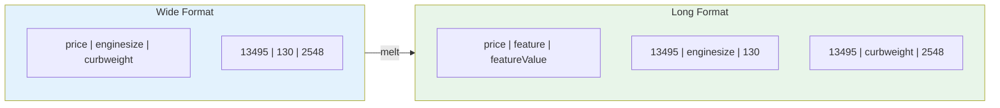
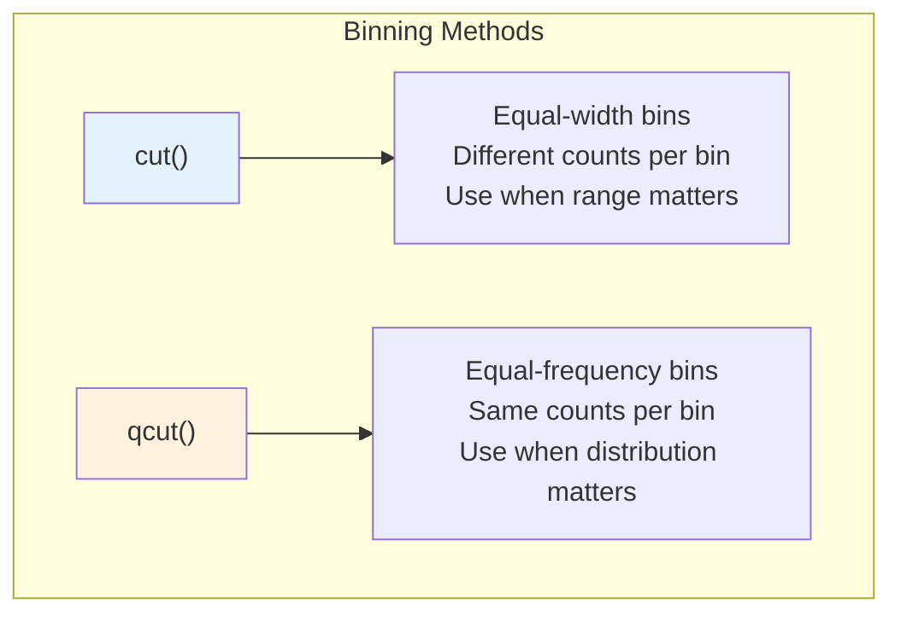
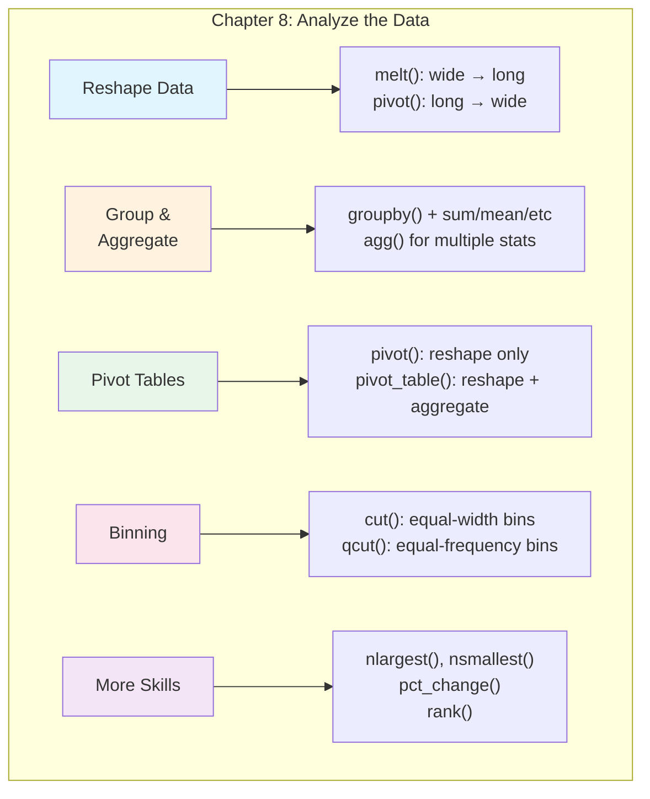

# Chapter 8: How to Analyze the Data

---

## From Preparation to Insight: The Analysis Phase

You've cleaned your data. You've prepared it with new columns, proper types, and the right structure. Now comes the exciting part: **analysis**. This is where you extract insights, discover patterns, and answer questions.

Analysis in pandas revolves around a few powerful techniques: reshaping data for visualization, grouping and aggregating to summarize patterns, pivoting for cross-tabular views, and binning continuous values into categories. These tools transform raw numbers into understanding.

By the end of this chapter, you'll be able to slice, dice, and summarize data from multiple angles to uncover the stories hidden within.

---

## Learning Objectives

After completing this chapter, you will be able to:

**Applied Skills:**
- Use `melt()` to reshape data from wide to long format
- Plot melted data with Seaborn's relational plots
- Group data and apply single or multiple aggregate methods
- Work with DataFrameGroupBy objects
- Create pivot tables using `pivot()` and `pivot_table()`
- Bin continuous data using `cut()` and `qcut()`
- Select rows with the largest values using `nlargest()`
- Calculate percent change with `pct_change()`
- Rank rows with the `rank()` method

**Knowledge:**
- Explain the difference between `pivot()` and `pivot_table()`
- Describe when to use equal-width bins (`cut`) vs equal-frequency bins (`qcut`)
- Understand what a DataFrameGroupBy object represents

---

## 8.1 How to Create and Plot Long Data

### How to Melt Columns to Create Long Data

"Wide" data has many columns, with each column representing a different variable or category. "Long" data has fewer columns, with values stacked vertically and a category column identifying what each value represents.

Many visualization tools prefer long data because it maps cleanly to plot aesthetics.

```python
import pandas as pd
import seaborn as sns

# Load car data (wide format)
cars = pd.read_pickle('cars.pkl')
cars.head()
```

Output:
```
  aspiration      carbody  enginesize  curbweight    price
0        std  convertible         130        2548  13495.0
1        std  convertible         130        2548  16500.0
2        std    hatchback         152        2823  16500.0
```

The `melt()` function transforms wide data to long:

```python
# Melt enginesize and curbweight into long format
cars_melted = pd.melt(cars, 
                      id_vars='price',
                      value_vars=['enginesize', 'curbweight'],
                      var_name='feature', 
                      value_name='featureValue')
cars_melted
```

Output:
```
       price     feature  featureValue
0    13495.0  enginesize           130
1    16500.0  enginesize           130
2    16500.0  enginesize           152
...
408  13495.0  curbweight          2548
409  16500.0  curbweight          2548
410  16500.0  curbweight          2823
```

**Parameters explained:**
- `id_vars` — Columns to keep as identifiers (not melted)
- `value_vars` — Columns to unpivot into rows
- `var_name` — Name for the new column containing former column names
- `value_name` — Name for the new column containing the values



### How to Plot Melted Columns

Long data enables powerful Seaborn visualizations:

```python
# Scatter plot with color by feature
sns.relplot(data=cars_melted, x='featureValue', y='price', 
            hue='feature')
```

The `hue` parameter colors points by the `feature` column, showing both enginesize and curbweight relationships on one plot.

**Faceted plots — separate panels for each category:**

```python
# Separate subplot for each feature
sns.relplot(data=cars_melted, x='featureValue', y='price', 
            col='feature', facet_kws={'sharex': False})
```

The `col='feature'` creates side-by-side plots. The `facet_kws={'sharex': False}` allows each subplot to have its own x-axis scale (important since enginesize and curbweight have very different ranges).

---

## 8.2 How to Group and Aggregate the Data

### How to Group and Apply a Single Aggregate Method

Grouping is the foundation of data analysis. You split data into groups, apply a calculation to each group, then combine the results.

```python
# Load fire data
fires = pd.read_pickle('fires_prepared.pkl')
fires = fires.reset_index(drop=True)
fires.head(3)
```

Output:
```
  fire_name  fire_year state discovery_date contain_date  acres_burned  fire_month  days_burning
0     Power       2004    CA     2004-10-06   2004-10-21       16823.0          10          15.0
1     Freds       2004    CA     2004-10-13   2004-10-17        7700.0          10           4.0
2  Bachelor       2004    NM     2004-07-20   2004-07-20          10.0           7           0.0
```

**Group by one column and calculate means:**

```python
fires.groupby('state').mean().head(3)
```

Output:
```
       fire_year  acres_burned  fire_month  days_burning
state                                                   
AK       2003.0      11379.22        6.54          28.3
AL       2003.5        42.31        3.21           0.1
AR       2003.8        50.12        2.89           0.1
```

**Group by multiple columns:**

```python
fires.groupby(['state', 'fire_year', 'fire_month']).max().head(3)
```

This returns the maximum value for each combination of state, year, and month.

### How to Work with a DataFrameGroupBy Object

When you call `groupby()`, pandas doesn't immediately calculate anything. Instead, it creates a **DataFrameGroupBy object**—a lazy container waiting for you to specify what calculation to perform.

```python
# Create the GroupBy object (no calculation yet)
yearly_group = fires.groupby('fire_year')

# Now perform the calculation
yearly_sums = yearly_group.sum()
yearly_sums.head(3)
```

Output:
```
           acres_burned  fire_month  days_burning
fire_year                                        
1992        1520437.0       10234       4521.0
1993        2104021.5       11432       5102.0
1994        1856332.2       10891       4832.0
```

**Keep the grouping column as a regular column:**

```python
# as_index=False keeps fire_year as a column, not the index
yearly_group = fires.groupby('fire_year', as_index=False)
yearly_sums = yearly_group.sum()
yearly_sums.head(3)
```

Output:
```
   fire_year  acres_burned  fire_month  days_burning
0       1992   1520437.0       10234       4521.0
1       1993   2104021.5       11432       5102.0
2       1994   1856332.2       10891       4832.0
```

### How to Apply Multiple Aggregate Methods

The `agg()` method lets you apply multiple aggregations at once:

```python
# Group by state, year, and month
monthly_group = fires.groupby(['state', 'fire_year', 'fire_month'])

# Apply multiple aggregate functions to all numeric columns
monthly_group.agg(['sum', 'count', 'mean']).head(3)
```

This creates a hierarchical column structure with each statistic for each numeric column.

**Apply aggregations to a specific column:**

```python
monthly_group.days_burning.agg(['sum', 'count', 'mean']).head(3)
```

**Apply different aggregations to different columns:**

```python
df = monthly_group.agg({
    'acres_burned': ['sum', 'max', 'min'],
    'days_burning': ['sum', 'mean'],
    'fire_name': 'count'  # Count fires
})
df.head(3)
```

Output shows a DataFrame with hierarchical columns: `acres_burned` has sum/max/min, `days_burning` has sum/mean, and `fire_name` has count.

---

## 8.3 How to Create and Use Pivot Tables

### How to Use the pivot() Method

The `pivot()` method reshapes data from long to wide format—the opposite of `melt()`:

```python
# Prepare data: sum acres by state and year
states = ['AK', 'CA', 'ID', 'TX']
top_states = fires.groupby(['state', 'fire_year'], as_index=False).sum()
top_states = top_states.query('state in @states')
top_states.head(2)
```

Output:
```
  state  fire_year  acres_burned  fire_month  days_burning
0    AK       1992      142444.7         234         892.0
1    AK       1993      686630.5         287        1204.0
```

**Pivot to create a wide table:**

```python
top_states.pivot(index='fire_year', columns='state', values='acres_burned').head(2)
```

Output:
```
state            AK        CA        ID        TX
fire_year                                        
1992       142444.7  289254.9  683495.2   31500.3
1993       686630.5  315011.1    7658.5  114265.5
```

**Pivoted data is perfect for line plots:**

```python
top_states.pivot(index='fire_year', columns='state', values='acres_burned').plot()
```

This creates a line chart with one line per state, showing acres burned over time.

### How to Use the pivot_table() Method

`pivot_table()` is more powerful than `pivot()` because it can aggregate data during the pivot:

```python
states = ['AK', 'CA', 'ID', 'TX']
fires_top_4 = fires.query('state in @states')

# Pivot AND aggregate in one step
fires_top_4 = fires_top_4.pivot_table(
    index='fire_year', 
    columns='state', 
    values='acres_burned', 
    aggfunc='sum'  # Sum the acres when there are multiple fires
)
fires_top_4.head(2)
```

**Key difference:**
- `pivot()` requires each index/column combination to have exactly one value
- `pivot_table()` can aggregate multiple values into one cell using `aggfunc`

```python
# Plot the pivot table
fires_top_4.plot()
```

---

## 8.4 How to Work with Bins

### How to Create Bins of Equal Size

Binning converts continuous data into categories. The `cut()` function creates bins of equal width:

```python
# Filter to fires in 2010 with positive days_burning
fires_filtered = fires.query('fire_year == 2010 and days_burning > 0').dropna()

# Create 4 equal-width bins
pd.cut(fires_filtered.acres_burned, bins=4)
```

Output shows categorical values like `(-407.34, 101836.5]`, `(101836.5, 203673.0]`, etc.

**Specify custom bin edges:**

```python
pd.cut(fires_filtered.acres_burned, bins=[0, 100000, 200000, 300000, 400000])
```

**Add meaningful labels:**

```python
pd.cut(fires_filtered.acres_burned, 
       bins=[0, 100000, 200000, 300000, 400000],
       labels=['small', 'medium', 'large', 'very large'])
```

**Count values in each bin:**

```python
pd.cut(fires_filtered.acres_burned, 
       bins=[0, 100000, 200000, 300000, 400000],
       labels=['small', 'medium', 'large', 'very large']).value_counts()
```

Output:
```
small         156
medium          2
large           1
very large      0
```

This reveals that most fires are small—the bins are equal in width, not equal in count.

### How to Create Bins with Equal Numbers of Values

The `qcut()` function creates bins with approximately equal numbers of observations (quantile-based):

```python
# Create 4 equal-frequency bins
pd.qcut(fires_filtered.acres_burned, q=4,
        labels=['small', 'medium', 'large', 'very large'])
```

**Count values — should be roughly equal:**

```python
pd.qcut(fires_filtered.acres_burned, q=4,
        labels=['small', 'medium', 'large', 'very large']).value_counts()
```

Output:
```
small         40
medium        40
large         40
very large    39
```

Each bin has about the same number of fires.

**Add binned column to DataFrame:**

```python
fires_filtered['fire_size'] = pd.qcut(
    fires_filtered.acres_burned, q=4,
    labels=['small', 'medium', 'large', 'very large']
)
```

**Handle duplicate bin edges:**

```python
# If there are many identical values, bins might have duplicate edges
# Use duplicates='drop' to handle this
pd.qcut(fires_filtered.days_burning, q=4,
        labels=['short', 'medium', 'long'], duplicates='drop').value_counts()
```

### How to Plot Binned Data

Binned data works beautifully with categorical plots:

```python
fires_filtered.head()
```

```python
# Count plot showing fire size distribution by month
sns.catplot(data=fires_filtered, kind='count', x='fire_month', hue='fire_size')
```

This shows how fire sizes vary by month—revealing seasonal patterns.



---

## 8.5 More Skills for Data Analysis

### How to Select the Rows with the Largest Values

The `nlargest()` method efficiently returns the top N rows by a column:

```python
# Get 6 cars with largest engine sizes
cars.nlargest(n=6, columns='enginesize')
```

Output:
```
   aspiration carbody  enginesize  curbweight    price
49        std   sedan         326        3950  36000.0
73        std   sedan         308        3900  40960.0
74        std hardtop         304        3715  45400.0
47        std   sedan         258        4066  32250.0
48        std   sedan         258        3950  34750.0
46        std   sedan         234        4107  28248.0
```

**Sort by multiple columns:**

```python
# Largest by enginesize, then by price within ties
cars.nlargest(n=6, columns=['enginesize', 'price'])
```

There's also `nsmallest()` for the opposite direction.

### How to Calculate the Percent Change

The `pct_change()` method calculates the percentage change from one row to the next:

```python
# Sum acres by state and year
df = fires[['state', 'fire_year', 'acres_burned']] \
    .groupby(['state', 'fire_year']).sum()
df.head()
```

Output:
```
                 acres_burned
state fire_year              
AK    1992           142444.7
      1993           686630.5
      1994           261604.7
      1995            43762.6
      1996           598407.2
```

```python
# Calculate year-over-year percent change
df.pct_change()
```

Output:
```
                 acres_burned
state fire_year              
AK    1992                NaN
      1993           3.820330   # 382% increase from 1992
      1994          -0.619002   # 62% decrease from 1993
      1995          -0.832715   # 83% decrease from 1994
      1996          12.673941   # 1267% increase from 1995
```

**Interpreting pct_change:**
- Positive values = increase (0.5 = 50% increase)
- Negative values = decrease (-0.5 = 50% decrease)
- First row is always NaN (no previous value to compare)

### How to Rank Rows

The `rank()` method assigns ranks based on values:

```python
# Total acres burned by state
df = fires.groupby('state').sum()[['acres_burned', 'fire_year', 'days_burning']]
df.head(3)
```

```python
# Rank states by acres burned (highest = rank 1)
df['acres_rank'] = df.acres_burned.rank(ascending=False)
df.head(3)
```

Output:
```
       acres_burned  fire_year  days_burning  acres_rank
state                                                   
AK     3.222601e+07    5683445       80268.0         1.0
AL     8.101628e+05   38336332        2886.0        23.0
AR     4.502221e+05   17960388        1132.0        27.0
```

Alaska has the most acres burned (rank 1).

**Handle ties with the `method` parameter:**

```python
# method='max' gives tied values the maximum rank they would receive
df['days_rank'] = df.days_burning.rank(method='max')
df.sort_values('days_burning').head(4)
```

Output:
```
       acres_burned  fire_year  days_burning  acres_rank  days_rank
state                                                              
RI           147.45      22092           0.0        51.0        1.0
VT           985.70      46240           6.0        50.0        3.0
CT          7358.20     364159           6.0        46.0        3.0
NH          1232.23      82240           9.0        49.0        4.0
```

Vermont and Connecticut both have 6.0 days_burning—with `method='max'`, they both get rank 3 (not 2 and 3).

**Rank method options:**

| Method | Behavior |
|--------|----------|
| `'average'` | Average rank of tied group (default) |
| `'min'` | Lowest rank in tied group |
| `'max'` | Highest rank in tied group |
| `'first'` | Ranks assigned in order they appear |
| `'dense'` | Like 'min' but ranks always increase by 1 |

### How to Find Other Methods for Analysis

Pandas provides many more analysis methods. Here are some useful ones:

| Method | Description |
|--------|-------------|
| `cumsum()` | Running cumulative sum |
| `cummax()` | Running cumulative maximum |
| `diff()` | Difference from previous row |
| `corr()` | Correlation matrix |
| `cov()` | Covariance matrix |
| `describe()` | Summary statistics |
| `quantile()` | Value at given percentile |
| `expanding()` | Expanding window calculations |
| `rolling()` | Rolling window calculations |

---

## Chapter Summary



### Key Takeaways

1. **`melt()` transforms wide to long** — essential for visualization with hue or facets

2. **`groupby()` is lazy** — it creates a GroupBy object that waits for an aggregation

3. **`agg()` applies multiple aggregations** — different stats to different columns

4. **`pivot()` vs `pivot_table()`** — pivot requires unique values; pivot_table can aggregate

5. **`cut()` for equal-width bins** — useful when range values have meaning

6. **`qcut()` for equal-frequency bins** — useful when you want balanced groups

7. **`nlargest()` and `nsmallest()`** — efficient ways to get top/bottom N rows

8. **`pct_change()` for growth rates** — calculates percent change row-to-row

9. **`rank()` for ordering** — assigns ranks with various tie-handling options

---

## Practice Exercises

### Exercise 1: Melting and Plotting

```python
# Given a DataFrame with columns: date, product_a_sales, product_b_sales
# 1. Melt to long format with a 'product' column
# 2. Create a line plot with a different color for each product
```

### Exercise 2: Grouping and Aggregating

```python
# Given sales data with columns: region, quarter, revenue, units
# 1. Group by region and calculate total revenue
# 2. Group by region and quarter, calculating sum and mean of revenue
# 3. Create different aggregations for revenue (sum) and units (mean, max)
```

### Exercise 3: Pivot Tables

```python
# Given the grouped data from Exercise 2:
# 1. Create a pivot table with regions as rows, quarters as columns, sum of revenue as values
# 2. Plot the pivot table as a line chart
```

### Exercise 4: Binning

```python
# Given customer data with a 'total_purchases' column:
# 1. Create 5 equal-width bins and count customers in each
# 2. Create 5 equal-frequency bins and count customers in each
# 3. Add a 'customer_tier' column using meaningful labels
```

---

## Quick Reference: Chapter 8 Code Patterns

```python
# === MELT (WIDE TO LONG) ===
df_long = pd.melt(df, 
                  id_vars='keep_col',
                  value_vars=['col1', 'col2'],
                  var_name='category', 
                  value_name='value')

# === GROUPBY ===
df.groupby('col').mean()                     # Single aggregate
df.groupby(['col1', 'col2']).sum()           # Multiple columns
df.groupby('col', as_index=False).sum()      # Keep grouping col

# === AGG (MULTIPLE AGGREGATIONS) ===
df.groupby('col').agg(['sum', 'mean', 'count'])
df.groupby('col').agg({
    'col1': ['sum', 'max'],
    'col2': 'mean',
    'col3': 'count'
})

# === PIVOT ===
df.pivot(index='row_col', columns='col_col', values='val_col')

# === PIVOT TABLE ===
df.pivot_table(index='row_col', columns='col_col', 
               values='val_col', aggfunc='sum')

# === BINNING ===
pd.cut(df.col, bins=4)                       # Equal-width bins
pd.cut(df.col, bins=[0, 10, 20, 30])        # Custom edges
pd.cut(df.col, bins=[0, 10, 20], labels=['low', 'high'])

pd.qcut(df.col, q=4)                         # Equal-frequency bins
pd.qcut(df.col, q=4, labels=['Q1', 'Q2', 'Q3', 'Q4'])
pd.qcut(df.col, q=4, duplicates='drop')     # Handle duplicate edges

# === TOP/BOTTOM ROWS ===
df.nlargest(n=10, columns='col')
df.nsmallest(n=10, columns='col')

# === PERCENT CHANGE ===
df.pct_change()

# === RANK ===
df['rank'] = df.col.rank(ascending=False)
df['rank'] = df.col.rank(method='dense')
```

---

## Glossary

| Term | Definition |
|------|------------|
| **Aggregate** | Combine multiple values into a single summary value |
| **Bin** | A range of values treated as a single category |
| **DataFrameGroupBy** | Object created by `groupby()` that holds grouped data awaiting aggregation |
| **Long format** | Data structure with fewer columns and more rows, values stacked vertically |
| **Melt** | Transform wide data to long format by unpivoting columns |
| **Pivot** | Transform long data to wide format by spreading values across columns |
| **Pivot table** | A table that summarizes data by rows and columns with aggregation |
| **Quantile** | A value below which a given percentage of observations fall |
| **qcut** | Quantile-based binning creating equal-frequency groups |
| **Rank** | A number indicating a value's position when sorted |
| **Wide format** | Data structure with many columns, each representing a variable |

---

*"The goal of data analysis is to discover useful information, suggest conclusions, and support decision-making."* — Every Data Analyst
